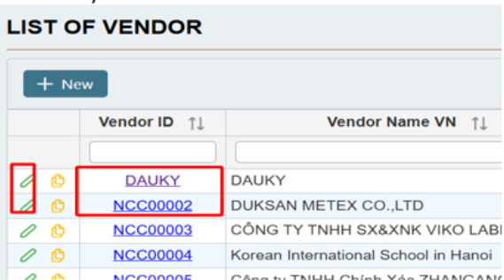

# 4.1 Vendor of List

This module provides the basic procedure to create a Purchase Order on S\&S ERP. The Purchase

order process includes these steps:

·     **Vendor Price List**

·     **Purchase order**

·    **Receipt Note**:  when receipt the inventory

·     **Update Unit Price PO**

·     **Return to Vendor (if any)**

·     **Material Quality Control**

·     **Matching Input Invoices**

### 4.1.  Vendor of List

The Vendor of List is where information related to suppliers is stored, including the business name,

tax ID, transaction currency, and accounting account number..

<figure><figcaption></figcaption></figure>

#### 4.1.1.                 Create a new vendor

To create a new vendor, go to **Menu -> Master Data -> Vendor of List**

The Vendor List window opens as the grid table and filter boxes. If you need to find a vendor on the

list, give the conditions in the filter boxes.

<figure><figcaption></figcaption></figure>

Select **New** to add new vendor information

<figure><figcaption></figcaption></figure>

_**General information**_

·     **Vendor code**: unique code for each vendor

·     **Vendor name (VN/EN/KR)**: vendor name in languages (business name or personal name)

·     **Label**: Lot number (if any)

·    **Purchase Order**:  Summary of all the purchase orders of that vendor (order quantity, amount, tax, discount…)

·     **Order Receiving**: List of receipt notes from that vendor

·     **Active**: The customer is still active and cooperating

_**Detail info**_

**·     Vendor tab**

&#x20;     o  **Vendor Representative**: General director or Manager or contact person

&#x20;     o  **Address**: Company address

&#x20;     o  **Phone**: company phone number (if any)

&#x20;     o  **Fax.**

&#x20;     o **Tax code**: Tax number or Company number (if any)

**·     Defaults tab**

&#x20;     o  **Currency code**: payment conditions (Cash/ Bank/ Due date)

&#x20;     o **Terms**: Payment conditions (press F3 for detail)

&#x20;     o  **Tax code:** VAT tax code

&#x20;     o  **AP account**: Payables account (if any)

&#x20;     o  **Advance account**: Prepaid account (if any)

&#x20;     o **Advance account name**: Prepaid account name (if any).

**·     Other Info tab**

&#x20;     o **Vendor bank account info.**

#### 4.1.2                 Import many vendors

If you have a list of many vendor, then import the excel file is a good solution.

<figure><figcaption></figcaption></figure>

\-     Select **Template**: to get the excel template. Input data by columns as the instructions

\-     Select **Import:** to upload the excel file.

o  Go to the file location -> choose the file -> **Open**

o  Usually, the file is read automatically, otherwise, click the file name.

o  Check the Error messages (if any) and adjust the wrong data.

o  **Import.**

#### 4.1.3                 Edit vendor information

If the vendor changes their business info, it is very easy to adjust them on S\&S ERP.

Similar to add a new vendor, Go to **Menu -> Master Data -> Customer List.**

\-     When the Customer List shows up, choose the particular client by select their code or edit icon.

\-     On the detail page, change the general info and/or detail info as you want (except the Vendor code).

<figure><figcaption></figcaption></figure>

#### 4.1.4                 Export vendor list

If you need an excel file of vendor list, select **Export**. The file will be saved on your local location.
