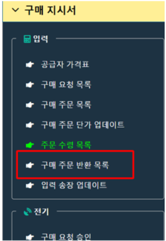

# 4.6	반품

상품이 회사의 요구에 맞지 않으면 공급업체에게 반품할 수 있습니다. 반품 내역은 이 사건을 기록하기 위해 반품 보고서로 생성됩니다.

<figure><figcaption></figcaption></figure>

#### 4.6.1     반품 전표 찾기

반품 전표 목록 열려, **메뉴 → 구매 → 반품**을 선택합니다.

창은 그리드 형식으로 열립니다. 필터 버튼을 선택하거나 각 필드의 필터 조건을 설정할 수 있습니다.

<figure><figcaption></figcaption></figure>

#### 4.6.2     반품 전표 생성

**반품 전표**를 새로 생성하는 경우, **신규** 버튼을 클릭하여 전표 생성 화면으로 이동합니다.

<figure><figcaption></figcaption></figure>

**기본 정보**

* **참조 번호(Reference No.)**: 자동 생성되며 수정할 수 없습니다.
* **입고일자(Receipt Date)**: 생성된 날짜
* **공급업체 ID(Vendor ID)**: F3 키를 눌러 드롭다운 목록에서 선택하거나 코드를 입력합니다. 시스템에서 관련 입고 전표를 불러오기 위해 필수로 입력해야 합니다.
* **창고(Warehouse)**
* **통화 ID(Currency ID)**
* **할인율(% Discount)**
* **비고(Note)**
* **설명 (베트남어/영어/한국어)**
* **입고 전표(Receipt Note)**: F3 키를 눌러 드롭다운 목록에서 선택
* **세금계산서 날짜(Invoice Date)** (해당되는 경우)
* **세금계산서 번호(Invoice No)** (해당되는 경우)

**세부 정보**\
입고 전표가 선택되면 해당 전표에 포함된 품목 목록이 자동으로 불러와집니다. 반품할 품목 코드를 선택한 후, 화면에서 수량을 조정합니다.

<figure><figcaption></figcaption></figure>

사용자는 **\[신규]** 버튼을 눌러 상세 입력 창을 열어, \*\*입고 전표(Receipt Note)\*\*와 연동되지 않은 품목 코드도 직접 생성할 수 있습니다.

<figure><figcaption></figcaption></figure>

#### 4.6.3     반품 전표 수정

\-        공급업체 반품은 보류 상태일 때만 수정할 수 있씁니다. 일단 확정 상태가 되면, 해당 데이터는 다른 모듈과 연동되어 잠기게 됩니다.

\-        공급업체 반품 정보를 수정하려면, 반품 번호 또는 수정 아이콘을 선택하여 세부 정보를 엽니다.

\-        기본 정보 및 세부 정보를 수정한 후 저장합니다.

<figure><figcaption></figcaption></figure>

#### 4.6.4     반품 전표 삭제/인쇄

\-         공급업체 반품을 삭제하려면, 삭제 아이콘을 선택하고 안내에 따라 진행합니다.

\-         여러 건을 한 번에 삭제하려면, 삭제할 반품 건 옆의 체크박스를 선택한 후 삭제를 클릭합니다.

\-         반품서를 출력하려면, 프린트 아이콘을 클릭합니다.

\-         엑셀 파일로 내보내려면, 해당 전표의 체크박스를 선택한 후 내보내기를 클릭합니다
