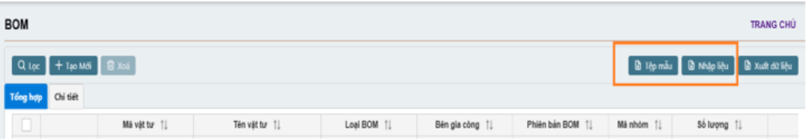

# 5.1 BOM (Cấu hình định mức nguyên vật liệu)

Phân hệ này giúp chúng ta có thể **quản lý quy trình sản xuất** của doanh nghiệp

### 5.1.       BOM (Cấu hình đinh mức nguyên vật liệu)

Trong phần này, bạn có thể tạo **BOM** cho quá trình sản xuất. Nó liên kết với **Lệnh sản xuất** và được sử dụng để so sánh số lượng nguyên vật liệu thực tế và kế hoạch.

<figure><figcaption></figcaption></figure>

#### 5.1.1.               Tìm kiếm BOM

Vào **Menu -> Sản xuất -> BOM** để mở cửa sổ BOM.

\-        Danh sách BOM hiển thị dưới dạng lưới để người dung có thể dễ dàng lọc theo từng trường mong muốn

\-        **Đã kích hoạt**: Trạng thái BOM (hoạt động hoặc không hoạt động)

\-       **Mã vật tư**: F3 để chọn từ danh sách sổ xuống

\-       **Mã nhóm**: F3 để chọn từ danh sách sổ xuống

<figure><figcaption></figcaption></figure>

#### 5.1.2               Tạo BOM mới

\
Để tạo BOM mới , nhấn nút **Tạo mới**

<figure><figcaption></figcaption></figure>

_**Thông tin tổng quát**_

\-        **Mã TP/BTP**: mã thành phẩm, nhấn F3 chọn từ danh sách xổ xuống hoặc nhập mã

\-        **Phiên bản BOM**: Nếu thành phẩm này sử dụng các phiên bản BOM khác nhau. Nếu không thì sẽ là Phiên Bản 1

\-        **Số lượng**: Số lượng thành phẩm sản xuất được trong 1 BOM (Ví dụ 1)

\-        **Đơn vị tính**

\-        **Mã kho**

\-        **Kho xuất**

\-        **Đang sử dụng**: có thì check vào

\-        **Mặc đinh**: cài đặt làm mặc định hoặc không

\-        **Loại BOM**

\-        **Bên gia công**

\-        **Ghi chú**

\-        **Giá chuẩn**: giá cơ bản để sản xuất cho 1 BOM

_**Thông tin chi tiết**_

\-        _**Chi tiết vật tư**_, nhấn vào nút **Tạo mới** để thêm nguyên liệu

o   **Mã vật tư**: nhấn F3 chọn từ danh sách xổ xuống hoặc nhập mã

o   **Đơn vị tính**: tự động tải lên

o   **Mã nhóm**: tự động tải lên

o   **Số lượng**: Số lượng vật tư yêu cầu

o   **Ghi chú**

o   **% hao hụt**: phần trăm hao hụt trong quá trình sản xuất

o   **Định lượng hao hụt**: tổng lượng hao hụt trong quá trình sản xuất

o   **Phiên bản BOM**: version 1 hay version 2…

<figure><figcaption></figcaption></figure>

\-           _**Phân đoạn sản xuất**,_ Chọn **Tạo mới** để mở bảng nhập liệu

o   **Phân đoạn sản xuất**: nhấn F3 để lấy danh sách thả xuống hoặc nhập mã

o   **Thứ tự**: theo trình tự sản xuất

o   **Thời lượng**: thời gian làm việc cần thiết.

o   **Ghi chú**

o   **Tên phân đoạn** VN/ENG/KOR

Nếu bạn có danh sách mã vật tư.

\-        **Chọn Tệp mẫu**: để có được định dạng đúng. Thêm dữ liệu theo cột theo hướng dẫn (DetailComponent và DetailOperation sheet)

\-        **Chọn Nhập liệu**: để tải file lên. Đi đến vị trí chứa file -> chọn file -> Open

\-        File được tự động upload hoặc chọn tên file

<figure><figcaption></figcaption></figure>

#### 5.1.3               Tải file BOM

Nếu người dung muốn nhập cùng lúc nhiều BOM.

\-        **Chọn Mẫu:** để lấy đúng định dạng file. Thêm dữ liệu vào bảng Master, DetailComponent và DetailOperation theo hướng dẫn.

\-        **Chọn Import**: để mở cửa sổ Import Data

\-        **Chọn Choose**: để upload file các bạn vào nơi chứa file -> chọn file -> Open

\-        Chọn **Tải lên**

\-       **Kiểm tra** các thông báo lỗi (nếu có) và sửa lại.

\-        **Tải dữ liệu lên** 

<figure><figcaption></figcaption></figure>

#### 5.1.4               Chỉnh sửa BOM

Người dùng có thể chỉnh sửa/xóa chi tiết BOM khi chưa được sử dụng để lập bất kỳ Lệnh sản xuất nào.

o   Để chỉnh sửa BOM, nhấp vào biểu tượng chỉnh sửa hoặc số BOM để mở chi tiết.

o   Điều chỉnh trực tiếp Thông tin chung và/hoặc Thông tin chi tiết bằng cách chọn biểu tượng chỉnh sửa ở mỗi hàng mục.

o   Để xóa BOM nhấn vào biểu tượng xóa ở hàng đó và làm theo hướng dẫn 

<figure><figcaption></figcaption></figure>
