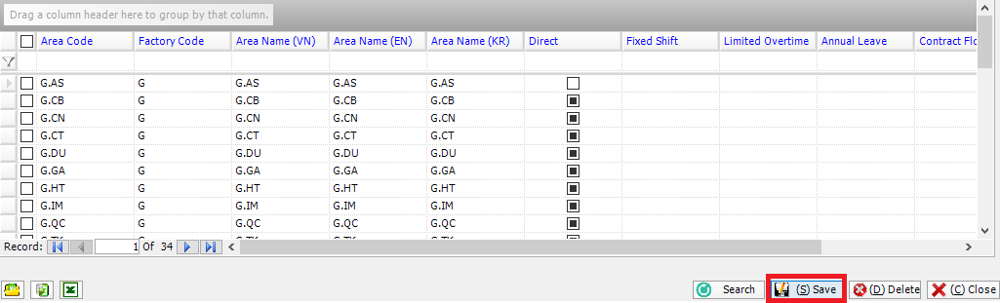

# Instructions to edit data

## **Section Content**

After creating data into software, it can edit directly on the data grid.

**Implementation instructions**

* Columns with blue headline are allowed to edit.
* After edit directly data on the grid -> Click .png>) to save the data. Figure II.3.1,

