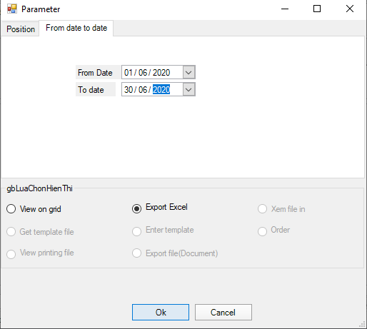

# Instructions to export the Report file

## **Section Content**

This section guides how to export report files in grid view and view as Excel file

## **Implementation Instruction**

### **View report on data grid**

.png>)

Follow the steps (Figure II.6.2)

* Step 1: Click the Function box to display a list of reports
* Step 2: Select the report to view
* Step 3: Click **Implement**.
* Step 4: Select the information on the dialog box just appeared.

.png>)

Example: (Figure II.6.2) In the Location Tab: choose to export data of X01 Department, AUDTO Department, KCS Group.

&#x20;In Tab From Date to Date: select to export data from February 1, 2020 to February 29, 2020

* Step 5: Select **View on grid**.
* Step 6: Click **OK** to continue or click **Cancel** to cancel

The report will display on the grid as Figure II.6.3

.png>)

### **View report as excel file**

* From Step 1 to Step 4: Implement the same part **a**
* Step 5: Select **Export to Excel**, then click **OK** to export the report as Excel or **Cancel** to cancel the order. Figure II.6.4.

* Step 6: Rename the report file (if necessary) and select a folder to save. Example: Figure II.6.5

.png>)

**Noted:** The name of folder and Excel file must be writing closed together and no accent, no special characters.
