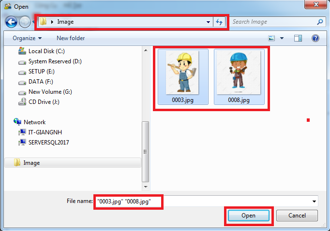

# 직원목록

## 항목 설명

이 항목은 직원 정보 및 관리 보고서 관리를 위해 사용됩니다. 이 항목은 다음의 탭을 포함합니다. :

\- 일반: 직원 정보 및 관리 보고서가 표시됩니다.

\- 신규정보 입력: 신규 직원 정보 추가에 사용합니다.

\- 추가기능: 직원 정보, 코드 변경 등에 사용됩니다.

## 실행 안내

Taskbar에서, .png>)을 선택합니다. .

*
  *
    1. 신규정보 입력 탭을 선택합니다.

이 탭은 신규 직원 정보를 입력시 사용합니다. (그림 V.1.1)

.png>)

신규 직원 정보 생성 :

* Method 1: 직원 정보를 데이터 시트 (위의 빨간 상자 부분)에 입력합니다. -> “SAVE”버튼을 클릭하여 데이터를 저장합니다.

주의:

* 빨간색 부분은 필수입력 사항입니다:성명; 생년월일; 성별; 사원코드; 근무 시작일.
* 주소 열: 다음의 내용을 입력합니다.: 집 호수, 도로명 - 구 - 도시/성.
* 생년월일 열: 본 소프트웨어는 3가지 형식으로 입력이 가능합니다. :
* dd / MM / yyyy: 직원 생일정보 일/월/년 모두를 입력합니다.
* MM / yyyy: 직원 생일 정보 월/년에 대해 입력합니다.
* yyyy: 직원 출생년도에 대해 입력합니다.
* Method 2: 엑셀에서 직원 정보 가지고 오기

&#x20;섹션II.2.3.을 참고하십시오.

1. 데이터 편집, 삭제, 내보내기

데이터 편집, 삭제, 엑셀로 내보내기는 **섹션** **II.3, II.4, II.5, II.6**을 참고하십시오.

*
  *
    1. 일반

본 탭에서는 직원 상세정보 확인이 가능합니다. 본 탭은 2부분으로 구성됩니다.: 화면 왼쪽 목록 부분과 **주요정보**에 대부분의 내용이 나타납니다.

\- 왼쪽 목록에는 직원 목록 또는 보고서의 일부 데이터가 나타납니다.

\- **주요정보**에는 직원의 상세정보가 나타납니다. 모듈에 직원 정보가 표시됩니다. :

• Method 1: 검색(Search box)에 사원코드 또는 사원증 번호를 입력합니다. -> **“Search”** 를 클릭합니다.

• Method 2: 목록에서 선택합니다.(그림 V.1.2).

.png>)

데이터 수정

**Main Information**탭에서 직접 수정 후, “**Save”** 버튼을 클릭하여 데이터를 저장합니다.

1. 데이터 삭제

왼쪽 목록 부분에서 삭제할 직원을 클릭하고, 섹션 II.4에 따라 삭제합니다.

1. 데이터 내보내기

섹션 II.5 및 II.6을 참고하십시오.

1. 일부 특수기능 사용에 관한 실행 안내

* 직원 전체 목록(Employee list): 본 보고서에는 직원 근무시간, 휴가, 퇴사를 포함한 정보가 표시됩니다.
* 근무자 목록(Working Employees list): 본 보고서에는 휴가중인 직원을 제외하고 근무중인 직원가 표시됩니다.
* 재직자 목록(List of working and leave): 본 보고서에는 휴가중인 직원을 포함한 근무중인 직원가 표시됩니다.
* 신입사원 목록: 해당 기간 신입사원 목록을 보여줍니다.
* 퇴사자 목록: 해당 기간 퇴사한 직원의 목록을 보여줍니다.
* 인사이동: 인사이동이 적용된 사항을 보여줍니다.
* 직원 카드 인쇄: 인쇄 실행 (그림 V.1.3):

Step 1: 직원 목록에서 인쇄할 직원 카드를 선택합니다.

.png>)

Step 2: “**Function Box”**&#xC5D0;서, “**Print employee card”**&#xB97C; 선택하고 “**실행”** 버튼을 누릅니다. button

Step 3: “**인쇄 미리보기”**&#xB97C; 선택합니다.

Step 4: “**OK”**&#xBC84;튼을 클릭하고 미리보기를 합니&#xB2E4;**.** (그림 V.1.4)

Step 5: 인쇄 아이콘을 누르고 프린트합니다.

.png>)

기타 보고서 목록

* 신규 직원 목록
* 퇴사자 목록
* 생일자 목록.
  *
    1. 추가기능

본 탭은 다음의 기능을 지원합니다: 직원 코드 변경, 엑셀의 직원 데이터 업그레이드, 대량의 직원 사진 업데이트 기능

.png>)

사원코드 변경

사원코드를 수정할경우 사용합니다. (그림 V.1.6). 기존 코드와 신규 코드를 입력 후 “CHANGE CODE”를 클릭합니다.

직원 코드별 업데이트

1명 또는 회사의 모든 직원 정보를 수정할 경우 사용합니다.

예시: 직원 임시 거주지 등록시, 다음 단계를 따릅니다:

\- Step 1: **“파일 불러오기”** 버튼을 클릭하여 엑셀에서 자료를 가져옵니다.

\- Step 2: 샘플파일에서 새로운 정보를 입력하거나 예전 자료를 수정합니다. (그림 V.1.7).

**주의:** VALUES열에 한 번에 한가지 유형의 정보를 추가하거나 수정 가능합니다.

.png>)

Step 3: “URL”버튼을 클릭하여, step 2의 파일을 선택합니다. (그림 V.1.8).

.png>)

Step 4: 입력한 데이터인 임시 거주지(Temporary Resident (TV))를 선택합니다. -> “ENTER”버튼을 눌러 데이터를 소프트웨어에 입력합니다. (그림 IV.1.9).

.png>)

직원 사진 업데이트

직원 사진을 업데이트하기 위해, 다음의 단계를 따릅니다:

* Step 1: 직원 코드에 따라 저장된 이미지는 모두 동일한 곳에 파일에 저장되어 있습니다. (그림 V.1.10)

* Step 2:  버튼을 클릭하고 이미지가 저장된 폴더를 찾은 후 그림 V.1.11와 같이 가져옵니다.
* Step 3: “OPEN” 버튼을 누르면 실행되고, “CANCEL”을 누르면 취소됩니다.

