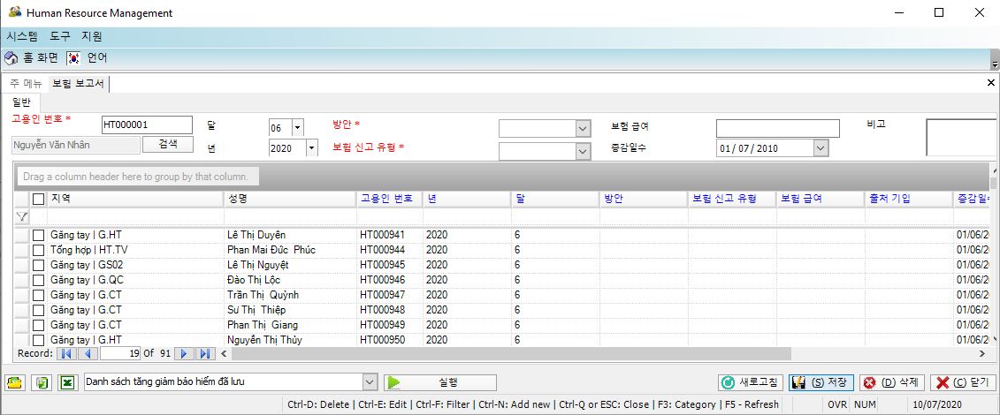

# 사회보험 신고서

## 항목설명

D02-TS양식에 따라 보험의 증가/감소를 나타내는 항목입니다.

## 실행 안내

작업표시줄에서 .png>) 를 선택합니다.

1. 월별 보험료 증가/감소 내역

안내대로 할 경우 **VIII.3.1**의 화면이 표시됩니다.

.png>)

Step 1: 기능박스에서 “보험 증가 데이터 분석” 또는 “보험 증감 데이터 분석” 선택합니다.

Step 2: “실행” 버튼을 클릭합니다.

Step 3: 보험 데이터를 확인할 월을 선택합니다.

Step 4: “엑셀로 내보내기”를 선택합니다.

Step 5: “확인”을 클릭하여 데이터를 저장한 후 “취소”를 선택합니다. “확인”을 클릭하면, **VIII.3.2**의 화면이 표시됩니다

Step 6: 자료를 저장하면 “예”, 저장하지 않으면 “아니오”를 클릭합니다.

.png>)

월별 보험 증가/감소 자료 추가 방법

해당 월에 보험 증가/감소 목록을 확인 후(**VIII.3.2)** 정보등록을 위해 **II.2** 의 안내대로 할 경우 **VIII.3.3**의 화면이 표시됩니다

D02-TS 양식에 따른 자료 확인

Step 1: 기능박스에서 신고할(**VIII.3.4)** D02-TS 양식을 선택합니다.

D02-TS(감소) 파일 : 해당 월에 보험 신고 해지할 직원 목록입니다.

D02-TS(증가) 파일 : 해당 월에 보험 신고 등록할 직원 목록입니다.

D02-TS(증감) 파일 : 해당 월에 보험의 증가 및 감소할 직원 목록입니다.

.png>)

Step 2: “실행” 버튼을 클릭합니다.

Step 3: 해당 월을 선택합니다.

Step 4: “엑셀로 내보내기”를 선택합니다.

Step 5: “확인”을 클릭하면, **VIII.3.5**의 화면이 표시됩니다.

.png>)

정보 편집, 삭제, 추출

II.3, II.4, II.5, II.6의 안내를 따릅니다.
