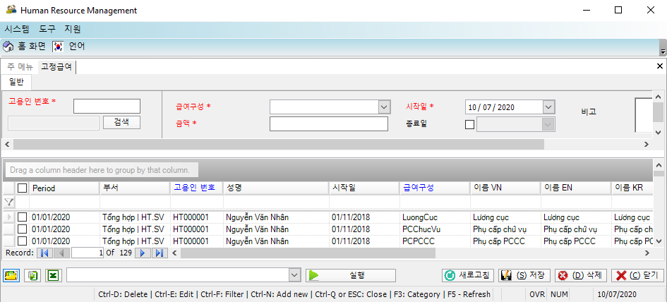

# 고정임금

## 항목 안내

장기간 변하지 않는 고정 지급액 관리를 위한 기능입니다.

## 실행 안내

1. 신규 생성 안내

작업표시줄에서 .png>)를 선택합니다.

신규정보 생성을 위해 **II.2**. 안내대로 실행하며 생성 이후 VII.6.1와 같은 화면이 표시됩니다.

인터페이스 안내

* 항목: 고정성 항목 (기본급여, 책임수당, 주택보조비 등)
* \~일부터 \~일까지: 급여항목의 유효 일자

Noted: \~일까지의 열은 공란으로 남길 수 있습니다.

1. 정보 편집, 삭제, 추출

II.3, II.4, II.5, II.6의 안내를 따릅니다.

1. 관련보고서

* 상세 고정급여항목: VII.4.1와 같이 표시됩니다.
