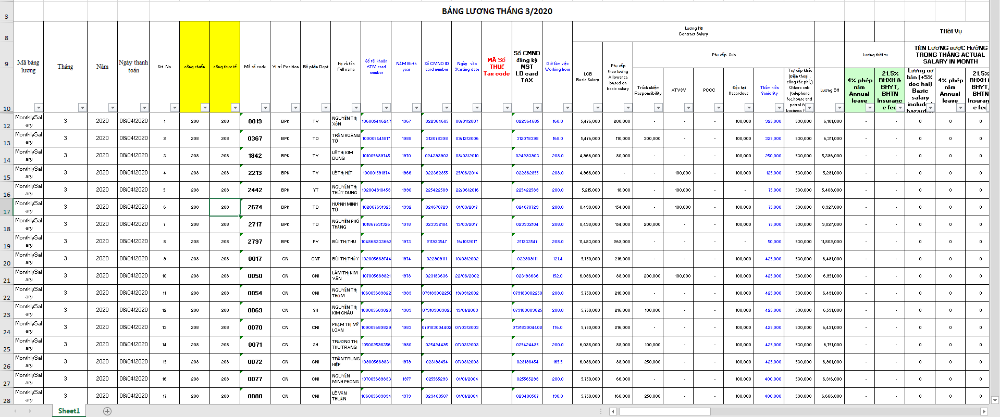
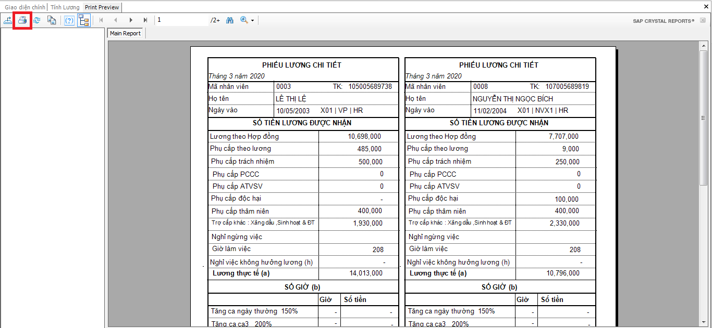

# 급여계산

## 기능안내

급여계산 및 관리 기능입니다.

## 실행 안내

작업표시줄에서 .png>) 를 선택합니다.

.png>)

급여계산 안내

급여계산 항목 : 월급, 퇴사자 급여, 퇴직수당, 연차수당, 소급 연차수당, 육아수당, 개인소득세 연말정산, 노동절 보너스, 독립기념일 보너스, 13개월 보너스.

1. 월별 급여 계산

급여계산 단계 (7 steps - Figure VII.9.2)

Step 1: 월별 급여 탭 선택

Step 2: 기능박스에서 급여계산 선택

Step 3: 실행 클릭

Step 4: 급여계산을 원하는 월 선택

Step 5: OK 또는 Cancel 클릭

.png>)

Step 6: 페이롤 저장을 위한 폴더 클릭 -> Save 클릭

Step 7: 클릭 시 “Do you want to save salary data?” 의 문구가 VII. 9.3 와 같이 표시됩니다.

.png>)

Step 8: "Yes"클릭 시 페이롤이 엑셀파일로 추출되고 데이터에 저장됩니다.

&#x20;“No” 클릭시 엑셀파일로 추출만 되며 데이터에 저장되지 않습니다. 이후 유저는 동일한 페이롤을 추출할 수 없습니다.

급여계산

* 월별 급여계산 단계와 유사합니다.
* **Noted**: 급여계산을 위해 퇴직 시점을 입력해야 합니다.

1. 퇴직수당

* 월별 급여계산과 유사합니다.
* **Noted:** 퇴직급여 계산을 위한 시간을 입력합니다.

1. 연차수당

* 월별 급여계산과 유사합니다.
* **Noted**: 퇴직 시점을 입력해야 합니다.

1. 육아수당

* 월별 급여계산과 유사합니다.
* **Noted:** 자녀보조수당 시점을 입력해야 합니다.

1. 개인소득세 연말정산

* 월별 개인소득세 연말정산 계산을 위한 기능입니다.
* 월별 급여계산과 유사합니다.

1. 노동절 보너스, 13th 개월 보너스

* 월별 급여계산과 유사합니다.
  *
    1. 급여정보 잠금-해제

급여계산 이후 정보 저장을 위하여 잠금기능을 실행해야 합니다. (Figure VII.9.5):

Step 1: 기능박스에서 페이롤 선택

Step 2: 실행 선택

Step 3: 잠금/해제를 원하는 급여 열 선택

Step 4: 잠금/해제 버튼 선택(우측 상단)

.png>)

.png>)

Noted:

* &#x20;“**Status**” &#xC5F4;**:** “0” 은 급여정보열이 잠금되지 않았고 “1” 은 급여정보열이 잠금 되었음을 의미합니다.
* **지급일:** 연말 개인소득세 정산을 목적으로 월별 지급할 급여를 결정하는 기능입니다.
  *
    1. 페이슬립 인쇄 안내

인쇄 방법 (Figure VII.9.6):

Step 1: 페이슬립 인쇄 라인 클릭

전체 직원의 페이슬립 인쇄를 원할 경우 “**Status”**&#xB97C; 클릭합니다.

Step 2: 페이슬립 인쇄를 선택하고 실행 버튼을 클릭합니다.

Step 3: 인쇄할 월을 선택 후 미리보기를 선택합니다.

Step 4: OK를 클릭합니다.

.png>)

Step 5: .png>) 아이콘을 클릭하여 인쇄합니다. (Figure VII.9.7).

