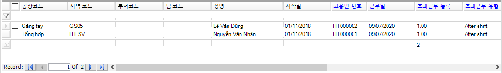

# 초과근무 등록

## 1.1. 항목 설명

이 항목은 초과근무 시간을 기록하고 관리합니다.

## 1.2. 실행 안내

1. 초과근무 정보 등록

작업 표시줄에서.png>)를 선택합니다.

정보 등록을위해 섹션 **II.2**의 지침을 따르십시오. 입력된 정보는 그림 **VI.1.1**과 같이 표시됩니다.

.png>)

인터페이스 설명:

* 초과근무 등록: 초과근무한 시간을 기록합니다 (단위: 시간).
* 초과근무 유형: 초과근무 유형에는 5가지가 있습니다 (정규근무시간 전, 정규근무시간 후, 정오 초과근무, 대체휴가있는 초과근무, 대체휴가없는 초과근무)
  *
    * 평일 초과근무:
      * 근무시간 후 초과근무: 정규근무시간 후 초과근무한 시간입니다.
      * 근무시간 전 초과근무: 정규근무시간 전 초과근무한 시간입니다.
      * 정오 초과근무: 점심시간에 초과근무한 시간입니다.
    * 주말 및 휴일 초과근무:
      * 대체휴가있는 초과근무: 등록된 초과근무 후 대체휴일 1일이 주어지는 초과근무시간입니다.
      * 대체휴가없는 초과근무: 대체휴가가 없는 초과근무시간입니다.
* 근무시간: 정규 근무시간 외 근무시간을 계산하는 기준

1. 데이터 편집, 삭제 및 내보내기

데이터를 편집, 삭제 및 Excel 파일로 내보내려면 섹션 **II.3, II.4, II.5, II.6**의 지침을 따르십시오.

1. 보고서

* 초과근무 세부내역: 각 직원에 대한 일별 초과근무 내역

* 초과근무 등록 내역: 직원의 전체 초과근무 내역

.png>)
