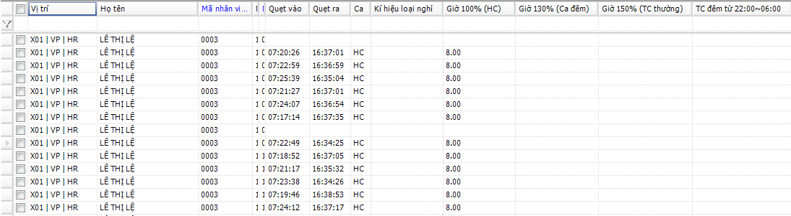

# 근태 일일집계

## 항목 설명

교대등록, 근태정보, 초과근무 등록정보 (해당 시), 휴가등록정보, 출산휴가 등록 정보 등이 모두 저장된 경우 본 기능은 직원의 일일 근태집계에 대하여 안내합니다.

정보가 부족하여 소프트웨어상 계산이 불가능한 경우 유저는 본 단계에서 필수 정보를 추가할 수 있습니다.

## 실행 안내

작업표시줄에서 .png>) 을 선택합니다. -> 선택 시 VI.8.1의 화면이 표시됩니다.

.png>)

근태 계산: 다음의 두 가지 방법으로 계산이 가능합니다.

* **방법 1**: 직원 코드에 따른 계산 (Figure VI.8.2).

Step 1: 직원 코드 입력

Step 2: 계산이 필요한 일자, 월을 선택합니다. 예) 아래 VI.8.2 와 같이 2020년 5월 10일을 선택(근태 계산은 이 경우 2020년 5월부터 적용됨)

Step 3: **CALCULATE** 선택. 계산이 완료된 후 **Search** 를 선택 시 계산 결과과 표시됩니다.

.png>)

**방법 2**: 전직원 근태 계산 (Figure VI.8.3)

Step 1: 기능박스에서 Calculation timekeeping선택

Step 2: 실행 선택

Step 3: 지역별, 시간별 필터값 선택

Step 4: 실행 선택

Step 5: **OK** 혹은 **Cancel** 선택

.png>)

근태정보 추가 안내

출퇴근/외출 정보, 교대등록 정보 등이 부족한 경우 소프트웨어는 근태 계산을 할 수 없으며 이 경우 근태정보를 추가할 수 있습니다.

정보 추가는 **II.2**를 따릅니다.

* 인터페이스 안내
* 근무시간: 그리드에 직원 근태가 표시되지 않을 경우 유저는 근무시간을 추가할 수 있습니다.
* 입력 자료: 유저가 소프트웨어에 입력한 정보 혹은 소프트웨어에서 계산된 정보가 표시됩니다.
* 정보, 편집, 삭제, 추출

정보 편집, 삭제, 추출은 **II.3, II.4, II.5, II.6.** 의 안내를 따릅니다.

* 보고서 안내

일반 근태기록표: 일별 근무 직원 목록 (X- 정규근무시간, X1- 1시간 초과근무, CP- 휴무, Kp- 무단결근)&#x20;

.png>)

근태 상세내역: 업무시간, 초과근무시간 등을 표시합니다.

* 근태 상세내역 추출 시 VI.8.5. 와 같은 창이 표시됩니다. 추가 값 추출을 위해서는 아래와 같이 필터를 설정합니다.
*

.png>)

필터 안내 (Figure VI.8.5):

* 아래 표에서 유저의 필요에 따라 한 개 또는 그 이상의 코드를 선택합니다.
* QV, QR 표시: 출입시간을 나타내기 위해 선택합니다.
* TC 등록 표시창: 초과근무 등록 표시를 위해 선택합니다.

상세 내역은 VI.8.6와 같이 표시됩니다.

.png>)

급여계산 목적의 근태테이블: 아래는 일별 요약 근태관리표로서 VI.8.7 또는 VI.8.8와 같이 정보를 표시합니다.

.png>)

근태요약표: 근무시간, 휴가등록, 업무시작 후 출근/ 조기 퇴근에 대한 요약표입니다.

* 7시간 근무자 목록: 7시간 근무가 적용되는 직원 목록입니다.
* 초과근무 보고서: 전 직원에 대한 초과근무 보고서입니다. (직원별로 SORTING 가능)
