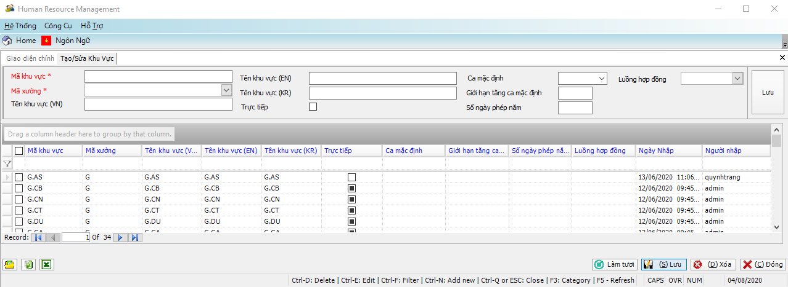

# Cơ cấu phòng ban, bộ phận trong doanh nghiệp

## **Mô tả danh mục**

Mỗi doanh nghiệp sẽ có cơ cấu các phòng ban, bộ phận riêng phục vụ cho công tác thống kê và quản lý nhân viên. Cơ cấu tổ chức của doanh nghiệp được phân ra làm nhiều cấp. Các cấp tổ chức này sẽ được tạo bởi người dùng theo thứ tự Cấp thứ nhất -> đến Cấp thứ hai -> Cấp thứ …n.

Ví dụ: (hình IV.2.1)

* Cấp thứ nhất: Xưởng 1, Xưởng 2, Xưởng 3….
* Cấp thứ hai: Khu vực 1, Khu vực 2…. Cấp tổ chức này thuộc cấp tổ chức thứ nhất.
* Cấp thứ ba: Bộ phận 1, Bộ phận 2, …. Cấp tổ chức này thuộc cấp tổ chức thứ hai.

.png>)

## **Các bước thực hiện**

### **Hướng dẫn tạo, điều chỉnh XƯỞNG**

#### **Hướng dẫn tạo mới**

Các bước thực hiện: (1) Trên Thanh tác nghiệp, chọn vào mục .png>)-> (2) Điền các thông tin Xưởng trên thanh công cụ -> (3) Nhấn Lưu.

Sau khi tạo xong thì dữ liệu sẽ được hiển thị như Hình IV.2.2.

.png>)

#### **Hướng dẫn sửa, xóa và xuất dữ liệu**

Để sửa, xóa và xuất dữ liệu ra file Excel thì làm theo hướng dẫn ở phần **II.3, II.4, II.5, II.6.**

### **Hướng dẫn tạo điều chỉnh KHU VỰC**

#### **Hướng dẫn tạo mới.**

Các bước thực hiện: (1) Trên Thanh tác nghiệp, chọn vào mục .png>)-> (2) Điền các thông tin Khu Vực trên thanh công cụ -> (3) Nhấn Lưu.

Sau khi tạo xong thì dữ liệu sẽ được hiển thị như Hình IV.2.3.

#### **Hướng dẫn sửa, xóa và xuất dữ liệu**

Để sửa, xóa và xuất dữ liệu ra file Excel thì làm theo hướng dẫn ở phần **II.3, II.4, II.5, II.6.**

### **Hướng dẫn tạo, điều chỉnh BỘ PHẬN, TỔ (NHÓM)**

Thực hiện giống như tạo, điều chỉnh KHU VỰC.
