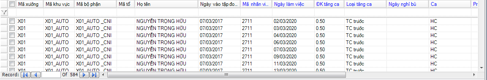

# Hướng dẫn Đăng Ký Tăng Ca

## **Mô tả nghiệp vụ**

Danh mục này quản lý dữ liệu đăng ký tăng ca của công nhân viên.

## **Các bước thực hiện**

### **Hướng dẫn đăng ký thông tin tang ca**

Trên Thanh tác nghiệp, chọn .png>).

Để đăng ký thì làm theo hướng dẫn ở phần **II.2**. Sau đó dữ liệu sẽ được hiển thị như Hình VI.1.1.

.png>)

**Giải thích ý nghĩa:**

* ĐK tăng ca: Là số giờ đăng ký tăng ca (đơn vị tính là giờ).
* Loại tăng ca : có 5 loại Tăng ca (TC sau; TC trước; TC trưa; TC nghỉ bù; TC không nghỉ bù)
  *
    * Tăng ca ngày thường:
      * TC sau: Là tăng ca sau giờ làm việc.
      * TC trước: Là tăng ca trước giờ làm việc.
      * TC trưa: Là tăng ca trong giờ nghỉ trưa.
    * Đăng ký làm tăng ca ngày chủ nhật hoặc ngày lễ:
      * TC nghỉ bù: Là đăng ký tăng ca sau đó được nghỉ bù một ngày nào đó.
      * TC không nghỉ bù: Là đăng ký tăng ca mà không có ngày nghỉ bù.
* Ca: Là Ca làm việc, dựa vào ca này để tính tăng ca cho nhân viên.

### **Hướng dẫn sửa, xóa và xuất dữ liệu**

Để sửa, xóa và xuất dữ liệu ra file Excel thì làm theo hướng dẫn ở phần **II.3, II.4, II.5, II.6.**

1. **Giải thích báo cáo**

* Bảng đăng ký tăng ca chi tiết: là danh sách đăng ký tăng ca theo từng ngày của từng nhân viên.

* Bảng đăng ký tăng ca tổng hợp: là danh sách đăng ký tăng ca theo nhiều ngày của nhiều nhân viên

.png>)
