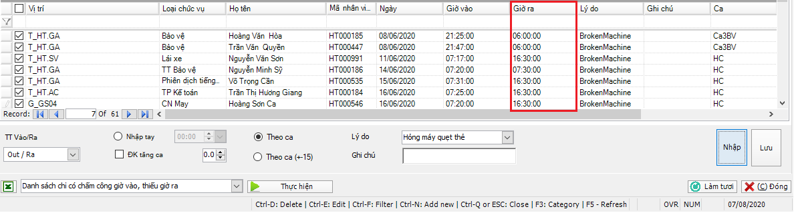

# Hướng dẫn kiểm tra Công Bất Thường

## **Mô tả nghiệp vụ**

Công bất thường ví dụ như: Chỉ có chấm công giờ vào, chỉ có chấm công giờ ra, không chấm công và không có đăng ký nghỉ, một số công bất thường khác theo tiêu chí của doanh nghiệp.

Chức năng này gồm những báo cáo về công bất thường và hỗ trợ xử lý công bất thường.

## **Các bước thực hiện**

Trên Thanh tác nghiệp, chọn vào .png>) -> PM hiển thị giao diện như hình VI.9.1

.png>)

### **Hướng dẫn xử lý trường hợp chỉ có chấm công giờ vào và thiếu giờ ra**

Thực hiện theo các bước trong hình VI.9.2

.png>)

Bước 1: Trong Hộp chức năng, chọn Danh sách chỉ có chấm công giờ vào.

Bước 2: Nhấn Thực hiện để hiển thị danh sách chỉ có chấm công giờ vào trên lưới.

Bước 3: Điền thông tin.

**Lưu ý:**

* TT Vào/Ra: Trạng Thái Vào / Ra. Lựa chọn Out/ Ra nếu thiếu dữ liệu chấm công giờ ra và ngược lại.
* Để bổ sung dữ liệu giờ ra PM có ba lựa chọn:
  *

Bước 4: Tích chọn dòng cần bổ sung giờ ra.

Bước 5: Nhấn nút NHẬP, thì dữ liệu ra sẽ được nhập lên lưới như phần được đóng khung ở hình dưới.

Bước 6: Nhấn nút LƯU để lưu dữ liệu.

### **Hướng dẫn xử lý trường hợp chỉ có chấm công giờ ra, thiếu giờ vào**

Làm tương tự phần a, nhưng cần lưu ý:

Bước 1: Trong Hộp chức năng, chọn Danh sách chỉ có chấm công giờ ra.

Bước 3: Điền thông tin.

### **Hướng dẫn xử lý Danh sách không có công và không có đăng ký nghỉ**:

* Là danh sách nhân viên không có dữ liệu chấm công và không có đăng ký nghỉ.
* Để xử lý danh sách này thì làm như hướng dẫn ở phần a, b.

1. **Một Số báo cáo kiểm tra công bất thường**

* Danh sách vào muộn - ra sớm: Là báo cáo hiển thị danh sách nhân viên đi làm muộn hoặc về sớm.
* Danh sách tăng ca bất thường: Là báo cáo hiển thị danh sách nhân viên có đăng ký tăng ca nhưng thực tế không làm việc vào giờ tăng ca.
* Danh sách không có công và đăng ký nghỉ phép: Là báo cáo hiển thị danh sách nhân viên đăng ký nghỉ phép và không chấm công.
* Chấm công sai quy định ca: Là danh sách nhân viên chấm công sớm hơn và về muộn hơn theo quy định của công ty.
