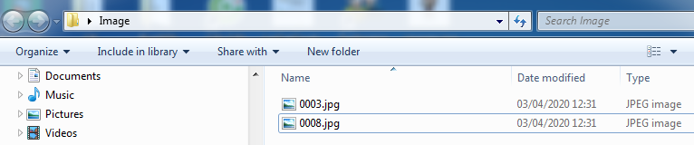

# Danh mục Thông Tin Nhân Viên

## **Mô tả danh mục**

Danh mục này dùng để quản lý thông tin nhân viên cơ bản và những báo cáo quản trị. Danh mục này có các tab dữ liệu sau:

* Tab Tổng quát: Sử dụng để hiển thị thông tin nhân viên và các báo cáo quản trị.
* Tab Nhập nhân viên mới: Sử dụng để tạo thông tin nhân viên mới.
* Tab Tiện ích: Các tiện ích hỗ trợ cập nhật thông tin nhân viên, đổi mã nhân viên…

## **Các bước thực hiện**

Trên Thanh tác nghiệp, chọn vào mục .png>) .

### **Tab Nhập nhân viên mới**

Tab này sử dụng để tạo thông tin nhân viên mới vào PM. (hình V.1.1)

.png>)

#### **Hướng dẫn tạo thông tin nhân viên mới:**

* Cách 1: Điền thông tin nhân viên trực tiếp lên trên lưới dữ liệu (điền vào phần được đóng khung màu đỏ) -> Nhấn nút LƯU để lưu dữ liệu.


- Những cột chứa dòng chữ tiêu đề màu đỏ thì không được để trống: Mã nhân viên; Họ tên; Ngày sinh; Giới tính; Số CMND; Ngày vào tập đoàn.
- Cột Địa chỉ: Điền dữ liệu theo định dạng: Số nhà, ngõ xóm – Phường xã – Quận huyện – Tỉnh TP.
- Cột Ngày sinh: PM hỗ trợ điền thông tin theo 03 định dạng:
  * dd/MM/yyyy: Nhân viên có đủ thông tin ngày tháng năm sinh.
  * MM/yyyy: Nếu nhân viên chỉ có thông tin tháng và năm sinh.
  * yyyy: Nếu nhân viên chỉ có thông tin năm sinh.


* Cách 2: Lấy dữ liệu thông tin nhân viên từ file mẫu Excel

Thực hiện các bước theo hướng dẫn ở phần II.2.3.

#### **Hướng dẫn sửa, xóa và xuất dữ liệu**

Để sửa, xóa và xuất dữ liệu ra file Excel thì làm theo hướng dẫn ở phần **II.3, II.4, II.5, II.6.**

### **Tab Tổng quát**

Tab này thể hiện các thông tin chi tiết của công nhân viên. Tab này gồm 2 phần: Phần lưới bên trái màn hình và Tab **Thông tin chính** chiếm phần lớn còn lại màn hình.

* Phần lưới bên trái của màn hình hiển thị danh sách nhân viên hoặc một số dữ liệu của các báo cáo.
* Tab **Thông tin chính** hiển thị chi tiết thông tin nhân viên. Cách để hiển thị thông tin nhân viên:
  * Cách 1: Nhập mã nhân viên hoặc số CMTND vào ô Tìm Kiếm -> Nhấn nút Search.
  * Cách 2: Click chọn vào dòng trên lưới (hình V.1.2).

.png>)

#### **Hướng dẫn sửa dữ liệu**

Sửa trực tiếp dữ liệu vào các ô trong tab **Thông tin chính** sau đó nhấn nút **Lưu** để lưu dữ liệu.

#### **Hướng dẫn xóa**

Tích chọn nhân viên cần xóa trên lưới bên trái, sau đó làm theo hướng dẫn ở phần II.4.

#### **Hướng dẫn xuất dữ liệu.**

Thực hiện các bước theo hướng dẫn ở phần II.5 và II.6

**Giải thích các báo cáo và hướng dẫn sử dụng một số chức năng đặc biệt**

* Danh sách nhân viên: Báo cáo này hiển thị toàn bộ thông tin nhân viên bao gồm đang đi làm, đang nghỉ phép và đã thôi việc.
* Danh sách đang làm việc: Báo cáo này hiển thị danh sách nhân viên đang làm việc không bao gồm nhân viên nghỉ phép.
* Danh sách đang làm việc và nghỉ phép: Báo cáo này hiển thị danh sách nhân viên đang làm việc bao gồm cả nhân viên nghỉ phép.
* Danh sách nhân viên mới vào: Báo cáo này hiển thị danh sách nhân viên mới vào trong khoảng thời gian.
* Danh sách nhân viên thôi việc: Báo cáo này hiển thị danh sách nhân viên nghỉ việc trong khoảng thời gian.
* Đơn xin chuyển vị trí: In đơn xin chuyển sang vị trí mới.
* In thẻ nhân viên: Hướng dẫn In thẻ nhân viên (hình V.1.3):

Bước 1: Chọn vào nhân viên cần in thẻ trên lưới

.png>)

Bước 2: Trong **Hộp Chức năng**, chọn **In thẻ nhân viên** rồi nhấn nút **Thực hiện**

Bước 3: Chọn **Xem file in**

Bước 4: Nhấn nút **OK** sẽ thấy kết quả như hình V.1.4

Bước 5: Chọn biểu tượng in để in thẻ.

.png>)

**Danh sách báo cáo khác**

* Danh sách nhân viên mới vào.
* Danh sách nhân viên thôi việc.
*   Danh sách nhân viên sinh nhật.

### **Tab Tiện ích**

Tab này hỗ trợ một số tiện ích như: Đổi mã nhân viên, cập nhật dữ liệu viên từ Excel, cập nhật ảnh nhân viên số lượng lớn.

.png>)

#### **Tiện ích Đổi mã nhân viên**

Sử dụng trong trường hợp muốn sửa lại Mã nhân viên (hình V.1.5). Thực hiện nhập mã cũ và mã mới sau đó nhấn nút ĐỔI MÃ NV để thực hiện.

.png>)

**Tiện ích cập nhật dữ liệu theo mã nhân viên.**

Sử dụng tiện ích này khi muốn sửa hoặc bổ sung thông tin cho 1 hay toàn bộ nhân viên trong doanh nghiệp.

Ví dụ: Bổ sung địa chỉ tạm trú cho nhân viên thì làm các bước như sau:

* Bước 1: Nhấn vào nút LẤY TEMPLATE để lấy file mẫu Excel.
* Bước 2: Điền thông tin mới hoặc sửa lại thông tin cũ lên file mẫu (hình V.1.6).

**Lưu ý:** Chỉ điền 1 loại thông tin vào cột GIÁ TRỊ trong 1 lần sửa đổi hoặc bổ sung thông tin.

.png>)

* Bước 3: Nhấn vào nút URL rồi tìm đến file đã điền thông tin ở bước 2 (hình V.1.7).

.png>)

* Bước 4: Chọn dữ liệu cần nhập là Đ/C tạm trú (TV) -> nhấn nút NHẬP để lấy dữ liệu vào PM (hình IV.1.8).

**Tiện ích cập nhật ảnh cho nhân viên**

Để cập nhật ảnh cho công nhân viên thì làm theo các bước sau:

* Bước 1: Đặt tên ảnh theo mã nhân viên và để vào trong cùng một thư mục. (hình V.1.9)

* Bước 2: Nhấn nút  sau đó trỏ vào thư mục lưu trữ ảnh, rồi chọn ảnh cần nhập như hình V.1.10.
* Bước 3: Nhấn nút OPEN để thực hiện lệnh hoặc nhấn nút CANCEL để hủy lệnh.

