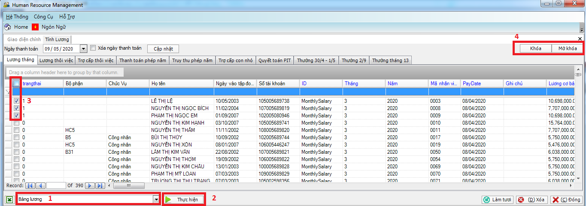

# Tính Lương

## **Mô tả nghiệp vụ**

Chức năng này để tính toán tiền lương và các báo cáo về lương.

## **Các bước thực hiện**

Trên Thanh tác nghiệp, chọn vào .png>).

.png>)

**Hướng dẫn tính lương**

Các nghiệp vụ tính lương: Lương tháng, Lương thôi việc, Trợ cấp thôi việc, Thanh toán phép năm, Truy thu phép năm, Trợ cấp con nhỏ, Quyết toán PIT, Thưởng 30/4-1/5, Thưởng 2/9, Thưởng tháng 13. Mỗi một nghiệp vụ lương sẽ ứng với một tab trên giao diện.

### **Hướng dẫn tính lương tháng**

Các bước thực hiện tính lương (7 bước - Hình VII.9.2)

Bước 1: Vào tab Lương tháng

Bước 2: Trong Hộp chức năng, chọn Tính lương

Bước 3: Nhấn nút Thực hiện

Bước 4: Chọn Tháng tính lương

Bước 5: Nhấn OK để tính lương hoặc Cancel để hủy lệnh.

.png>)

Bước 6: Chọn thư mục để lưu bảng lương -> Nhấn nút Save

Bước 7: Màn hình sẽ hiện lên hộp thoại hỏi có muốn lưu dữ liệu lương hay không? Như hình VII.9.3.

.png>)

Bước 8: Chọn “Yes” thì bảng lương sẽ được xuất ra file Excel và lưu trong cơ sở dữ liệu.

Chọn “No” thì bảng lương chỉ xuất ra file Excel, không được lưu trong cơ sở dữ liệu và sau này sẽ không lấy được thông tin bảng lương này.

.png>)

### Hướng dẫn tính lương thôi việc:

* Các bước thực hiện tương tự như Tính lương tháng.
* **Lưu ý:** Cần nhập thời gian tính lương thôi việc cho nhân viên.

### Hướng dẫn tính trợ cấp thôi việc:

* Các bước thực hiện tương tự như Tính lương tháng.
* **Lưu ý:** Cần nhập thời gian tính trợ cấp thôi việc.

### Hướng dẫn tính thanh toán phép năm (Cho người thôi việc)

* Các bước thực hiện tương tự như Tính lương tháng.
* **Lưu ý:** Cần nhập thời gian thôi việc của nhân viên.

### Hướng dẫn tính Trợ cấp con nhỏ (Cho người thôi việc)

* Các bước thực hiện tương tự như Tính lương tháng.
* **Lưu ý:** Cần nhập thời gian tính trợ cấp con nhỏ cho nhân viên thôi việc.

### Hướng dẫn Quyết toán PIT

* Chức năng này dùng để tính quyết toán PIT theo tháng.
* Các bước thực hiện tính tương tự như Tính lương tháng.

### Hướng dẫn tính thưởng 30/4 – 1/5, 2/9 và lương tháng 13

* Các bước thực hiện tính tương tự như Tính lương tháng.

### **Hướng dẫn khóa lương – mở khóa lương**

Sau khi hoàn chỉnh phần tính lương thì cần phải khóa lương lại để đảm bảo dữ liệu. Các bước thực hiện khoá lương hoặc mở khóa lương (hình VII.9.5):

Bước 1: Trong Hộp chức năng, chọn Bảng lương

Bước 2: Nhấn nút Thực hiện

Bước 3: Tích chọn dòng lương cần khóa hoặc mở khóa

Bước 4: Nhấn nút Khóa hoặc Mở khóa. (góc trên cùng bên phải)

**Lưu ý:**

* Ở Cột **trangthai:** Có 2 dữ liệu hiển thị số “0” hoặc “1” (“1”: nghĩa là dòng lương đó đã được khóa; “0”: nghĩa là dòng lương đó chưa được khóa)
* Cột **PayDate:** là cột ngày thanh toán lương. Cột này dùng để xác định tháng thanh toán lương có mục đích để quyết toán PIT.

### **Hướng dẫn in phiếu lương**

Thực hiện 5 bước để in phiếu lương (hình VII.8.6):

Bước 1: Tích chọn dòng cần in phiếu lương

Trong trường hợp muốn in phiếu lương cho toàn bộ nhân viên: Tích chọn ô bên trái cạnh dòng tiêu đề “**trangthai”**

Bước 2: Trong Hộp chức năng chọn In Phiếu lương

Bước 3: Chọn tháng in phiếu lương rồi chọn Xem file in

Bước 4: Nhấn OK

.png>)

Bước 5: Nhấn vào biểu tượng .png>)để in phiếu lương (hình VII.8.7).

.png>)
