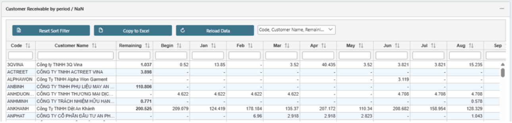

# 10.2 Customer

#### 10.2.1    Dashboard

·       Customer Active by Year: Compare the active customers in three years

·       Customer Active by Month: number of Customers have bought any products through months this year

·       Top 10 Customers report: List of 10 customers that have largest sales amount, compare with total sales

·       Customer Outlet: Number of new customers, Returning Customers and Lost Customers in this year

<figure><figcaption></figcaption></figure>

<figure><figcaption></figcaption></figure>

#### 10.2.2    Receivable Customer

Detail of receivable account by customer

<figure><figcaption></figcaption></figure>
