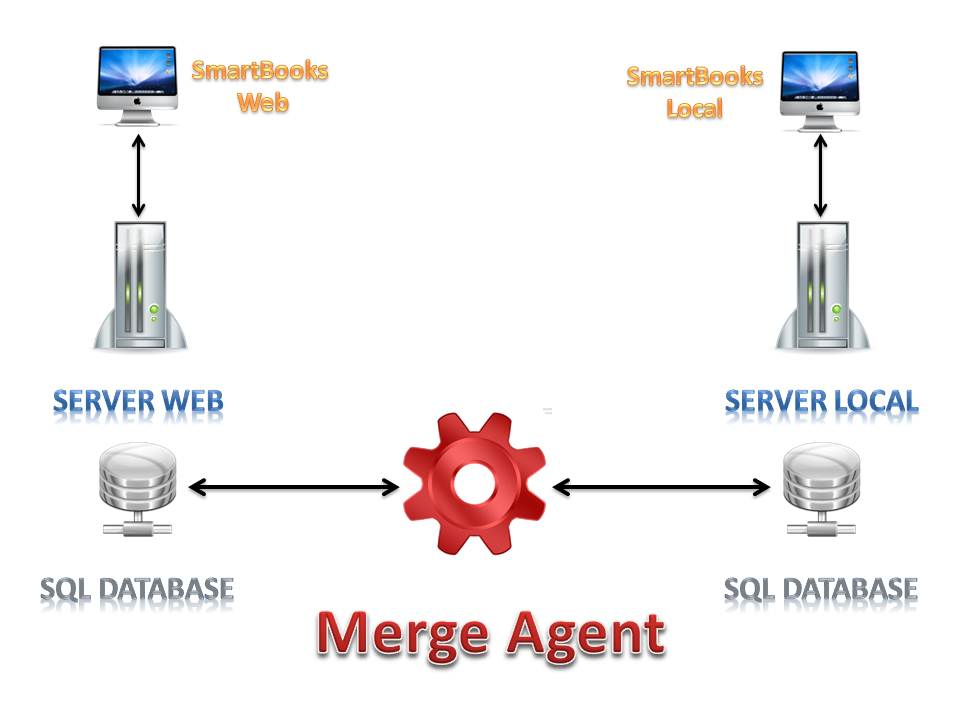

# 자료 동기화

자료의 동기화는 업로드된 데이터와 다운로드한 데이터가 중앙서버에서 여러 데이터 소스간의 교환 및 동기화하는 과정입니다.

정보 교환 및 동기화 과정을 위해 SQL 서버 사본을 이용합니다.

SQL서버 사본은 데이터 복사, 다른 데이터베이스로 이동하는 암호화 기술, 데이토 분산 및 데이터 동기화 와 데이터 통합이 수행됩니다.

본 기술은 서버간 상위 거래를 통해 사용되며, 확장성, 가용성, 자료 및 보고서, 여러 위치로부터의 데이터 통합, 비동기 데이터 통합 및 배치절차 분할 실행 등을 실시합니다. 결합한 사본은 주로 데이터 충돌이 발생할 경우에 대비해 응용프로그램의 어플리케이션을 위해 설계됩니다.

본 과정은 로컬 소프트웨어에서 중앙시스템으로 인터넷 연결 시 자동으로 실행되며, 아래 두가지 설치가 필요합니다.

**분류 1: 회사 내 로컬 소프트웨어 설정**

**분류 2: SS audit의 중앙시스템은 중앙서버에서 자료를 집중 관리**

기업의 로컬 소프트웨어 정보의 동기화 및 데이터 동기화 솔루션이 인터넷 네트워크를 통하여 중앙 시스템으로 통합됩니다.

당사의 중앙시스템은 로컬 데이터 시스템 복구 기능을 가지고 있으며 복원 및 유지보수는 인터넷을 통해 쉽고 빠르게 이행 가능합니다.

**장점:**

* Window 유형과 Web유형의 장점을 결합
* 데이터 보안 및 데이터의 높은 가용성
* 데이터 복사 및 원격시스템, 보호 및 복원 기능
* 정보를 정확하고 적시에 반영 자능
* 통신을 수행하는 동안 데이터의 안전과 보안을 보장함
