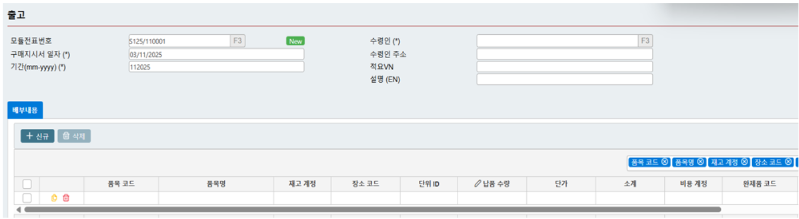

# 6.1.	전표입력

#### 6.1.1.   원재료 입고

본 항목은 구매한 원재료, 상품 및 도구들의 데이터를 입력하는 데 사용합니다.

“신규”를 선택하여 입력 창을 엽니다.

<figure><figcaption></figcaption></figure>

**기본설정:**

·         전표번호: 프로그램에서 자동으로 생성됩니다.

·         전표작성일: 전표가 작성된 날짜

·         회계월: 전표일자를 기준으로 프로그램이 자동 계산합니다.

·         세금계산서 번호/ 일련번호/ 양식번호/ 세금계산서 일자: 구매 세금계산서 관련 정보

·         공급업체 코드: F3 키를 눌러 목록에서 선택합니다.

·         계정: F3 키를 눌러 목록에서 선택합니다.

·         통화/ 환율

·         적요

·         수입세

&#x20;

**상세정보:**

입력할 3 가지 항목이 포함됩니다.

·         기본설정: 품목코드, 수량, 단가, 세율

·         기타비용: 구매와 관련하여 발생한 비용을 입력합니다. AP모듈 (외상매입금) 에 기록된 구매비용을 지급해야 합니다.

·         매입비용 배부: 구매비용을 품목 단가로 배부합니다.

·         기타 비용: 구매 관련 부대비용을 입력하는 부분입니다. 이미 AP 모듈에서 회계 처리된 구매비용 전표를 선택합니다.

·         비용 배분: 구매비용을 입고 단가에 배분합니다.

<figure><figcaption></figcaption></figure>

#### 6.1.2   완제품 입고

원재료 데이터 입력과 동일하게, 기간 중 완제품을 입력할 때 사용합니다.

“신규”를 선택하여 입력 창을 엽니다.

기본 정보

·         전표번호: 프로그램에서 자동으로 순번이 부여됩니다.

·         전표작성일: 전표가 작성된 날짜

·         회계월: 작성일을 기준으로 프로그램이 자동 계산합니다.

·         납품자

·         재공품 계정: 당기 재공품을 기록하는 계정

·         적요

<figure><figcaption></figcaption></figure>

상세 정보:

·         자재코드

·         창고계정

·         단위

·         수량

·         단가

·         금액

·         공정코드/ 이익코드/ 비용코드

<figure><figcaption></figcaption></figure>

#### 6.1.3   기타입고

구매 및 생산 이외의 기타 입고 상황을 입력할 때 사용합니다.

완제품 입고 등록과 동일한 방식으로 진행합니다.

<figure><figcaption></figcaption></figure>

#### 6.1.4.   매입 반품

공급업체로부터 구매한 상품을 반품할 때 사용합니다.

작업 방식은 원자재 입고 처리와 동일합니다.

이전에 입력한 매입전표 중 반품할 전표 번호를 선택한 후에 반품 수량을 조정하여 입력합니다.

<figure><figcaption></figcaption></figure>

#### 6.1.5   생산투입 품목

본 항목은 원재료, 제품, 도구를 생산에 사용하기 위해 출고할 경우 입력합니다.

출고 수량을 입력하여 단가는 마감시 “제품제조원가 계산” 과정에서 자동으로 계산됩니다.

&#x20;

기본설정:

·         전표번호: 프로그램에서 자동으로 순번이 부여됩니다.

·         전표작성일: 전표가 작성된 날짜

·         회계월: 전표일자를 기준으로 프로그램이 자동 계산됩니다.

·         수령자

·         수령자 주소

·         적요

&#x20;

상세정보

·         자재코드: F3 키를 눌러 목록에서 선택합니다.

·         창고계정: F3 키를 눌러 목록에서 선택합니다.

·         창고코드: F3 키를 눌러 목록에서 선택합니다.

·         단위

·         수량

·         단가/ 금액: 원가 계산 후 자동으로 업데이트됩니다.

·         비용계정: 원재료비를 인식하는 계정

·         완제품코드: F3 키를 눌러 목록에서 선택합니다.

·         공정코드/ 비용코드/ 이익코드

<figure><figcaption></figcaption></figure>

#### 6.1.6.   판매용 출고

본 항목은 완제품, 상품, 원자재를 판매할 경우 사용합니다.

매출 수량을 입력시, 단가는 마감시 제품제조원가 계산 과정에서 자동으로 계산됩니다.

&#x20;

_주의: 원재료를 판매하는 경우, 비용계정은 계정을 제조원가 계정(621)에서 매출원가 계정(632)으로 조정해야 합니다._

&#x20;

**기본설정**

·         전표번호: 프로그램에서 자동으로 순번이 부여됩니다.

·         전표작성일: 전표가 작성된 날짜입

·         회계월: 전표일자를 기준으로 프로그램이 자동 계산됩니다.

·         세금계산서 번호/ 일련번호/ 양식번호/ 세금계산서 일자

·         전자세금계산서(E-invoice)

·         고객코드

·         계정: 인식하는 계정

·         통화

·         적요

·         수령자/ 수령자 주소

**상세정보**

·         자재코드: F3 키를 눌러 목록에서 선택합니다.

·         창고계정: F3 키를 눌러 목록에서 선택합니다.

·         창고코드: F3 키를 눌러 목록에서 선택합니다.

·         단위

·         수량

·         단가/ 금액: 매출원가 계산 후 자동으로 업데이트됩니다.

·         비용계정: 원재료비를 인식하는 계정

·         완제품코드: F3 키를 눌러 목록에서 선택합니다.

·         공정코드/ 비용코 / 이익코드:

<figure><figcaption></figcaption></figure>

#### 6.1.7.   기타출고

생산투입 항목과 동일한 방식으로 진행합니다

<figure><figcaption></figcaption></figure>

#### 6.1.8.   매출환입

본 항목은 판매한 원재료, 상품, 완제품이 매출처로부터 반품되었을 경우 사용합니다.

판매한 전표번호를 검색하여 선택한 후 수량을 입력합니다.

<figure><figcaption></figcaption></figure>

#### 6.1.9.   창고이동

창고 간 자재를 이동할 때 사용합니다.

실행 방법은 생산투입 품목과 동일합니다.

<figure><figcaption></figcaption></figure>

#### 6.1.10.   재고실사

기말 재고를 실사할 때 사용합니다. 실제 수량과 장부상 수량의 차이를 확인하여 자동으로 업데이트 및 처리됩니다.

실행 방법은 생산투입 품목과 동일합니다.

<figure><figcaption></figcaption></figure>

#### 6.1.11.   재고조정

실제 수량과 장부상 수량에 차이가 발생한 경우 사용합니다.

실행 방법은 생산투입 품목과 동일합니다.

<figure><figcaption></figcaption></figure>
