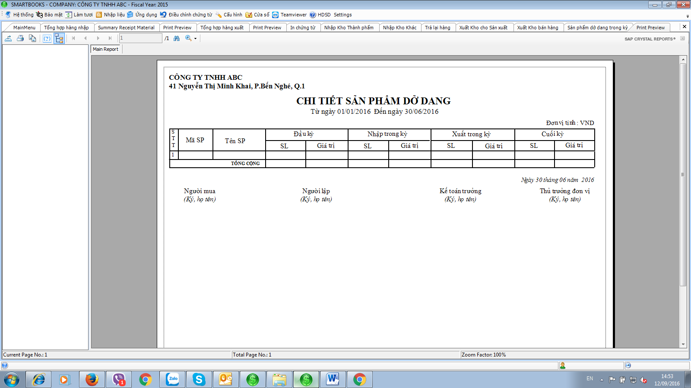

# 6.4 Report

The software integrates the following reports:

#### a) Inventory status by location

.png>)

\-        Input the date of inquiry

\-        Set the range of inventory items (press F3 to select from the list)

\-        Set the range of inventory locations (press F3 to select from the list)

Click the “Print Preview” button

#### b) Inventory movement

.png>)

\-         Select the accounting period to view (Start date / End date)

\-         Click the “View” button

\-         Set the range of inventory items (press F3 to select from the list)

\-         Set the range of inventory locations (press F3 to select from the list)

\-         “Item” setting: Select “All” for print preview, “All item” to print all items, or “Item” to print by each item

\-         To save as Excel, click the “Export Excel” button; for preview by inventory item, click “Print Preview”; to print, click the “Print” button

#### c) Inventory transactions

.png>)

* Select the accounting period to view (Start date / End date)
* For preview, click the “Print Preview” button

#### d) Raw material released for production

.png>)

\-         Select the accounting period to view (Start date / End date)

\-         Set the inventory item range (press F3 to select from the list)

\-         Set the inventory location range (press F3 to select from the list)

\-         To save to Excel, click the “Export Excel” button; to preview by inventory item, click the “Print Preview” button.

#### e) Manufacturing - Finished goods input for inventory

.png>)

\-         Select the accounting period to view (Start date / End date)

\-         Set the inventory item range (press F3 to select from the list)

\-         Set the inventory location range (press F3 to select from the list)

\-         To save to Excel, click the “Export Excel” button; to preview, click the “Print Preview” button.

#### f) Cost card

.png>)

\-         Select the accounting period to view (start date/end date)

\-         Select the cost summary type to view: by coefficient, by production process, by BOM, or by specific raw materials

\-         For preview, click the “Print Preview” button

#### g) List per item

.png>)

\-         Select the accounting period to view (Start date / End date)

\-         Set the inventory item range (press F3 to select from the list)

\-         Set the inventory location range (press F3 to select from the list)

\-         To preview, click the “Print Preview” button.

#### h) Detail table for revenue-cost of goods sold

**:** The purpose is to compare revenue and COGS of each finished goods output for sales sheet in Detail.

.png>)

\-         Select the accounting period to view (Start date / End date)

\-         Set the inventory item range (press F3 to select from the list)

\-         Set the inventory location range (press F3 to select from the list)

\-         For preview, click the “Print Preview” button.

#### i) Summary table for revenue-cost of goods sold

: The purpose is to compare total revenue and COGS of each finished goods output for sales in the period.

.png>)

\-         Select the accounting period to view (Start date / End date)

\-         Set the inventory item range (press F3 to select from the list)

\-         Set the inventory location range (press F3 to select from the list)

\-         For preview, click the “Print Preview” button.

#### j) Returned goods, materials

.png>)

.png>)

\-         Select the accounting period to view (Start date / End date)

\-         To view items returned to suppliers, select “Purchase Return”

\-         To view items returned from customers, select “Sales Return”

\-         For preview, click the “Print Preview” button.

#### k) Summary Receipt Material

.png>)

Choose from date … to date …

Choose preview or print.

#### l) Summary Issue Material

.png>)

Choose from date … to date …

Choose preview or print.

#### m) Print sheet

.png>)

<figure><figcaption></figcaption></figure>

Choose from date … to date …

Choose R1 to print receipt notes of materials, tools and supplies

Choose R2 to print receipt notes of finished goods

Choose R2 to print receipt notes of other

Choose R4 to print purchase return notes of materials, tools and supplies for suppliers

Choose S1 to print delivery notes of materials, tools and supplies for manufacturing in the period

Choose S2 to print delivery notes of goods, finished goods in the period.

Choose S3 to print delivery notes of other.

Choose S4 to print delivery return notes of materials, tools and supplies.

Choose warwhouse to print inventory items card

\+ Choose option :

&#x20;All : all of items

&#x20;By Item : Hit F3 key and select item which printed

.png>)

#### n) Working in process finished goods - in the period

\-         Select the accounting period to view (Start date / End date)

\-         Select the accounting period to view (Start date / End date)

\-         For preview, click the “Print Preview” button.
