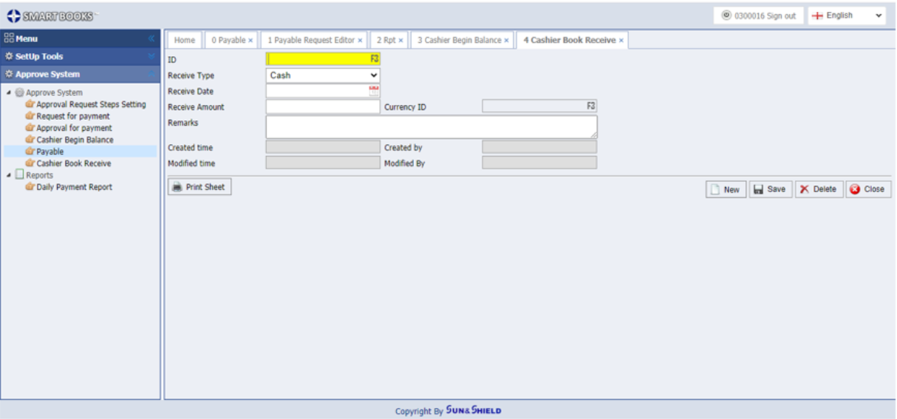

# 13.3 Cashier collects money

<figure><figcaption></figcaption></figure>

<figure><figcaption></figcaption></figure>

Go into Cashier collects money, click Add new to allow cashier enter information on money receipt including

Money receipt by cash or by bank transfer

Money receipt date

Amount receipt

Currency receipt

Description detail

Then click save

Once completed, the screen will display receipt voucher created at when, by whom. If there is any amendment, the timing, the amendment person will be also displayed.

If you want to print, click print voucher.

