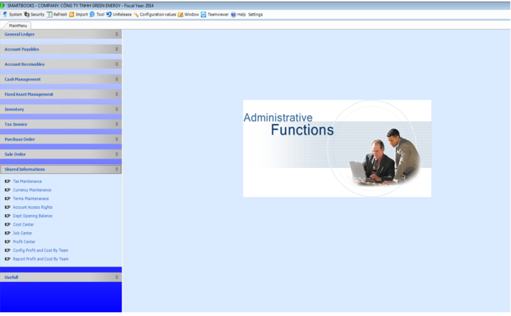

# 11.1 설정

<figure><figcaption></figcaption></figure>

시스템 관리 모듈에는 설정 및 보안 2가지로 구성되어 있습니다.

#### 11.1 설정

#### a) 부가세유형 설정

<figure><figcaption></figcaption></figure>

매입, 매출부가세 유형을 설정합니다. 납세유형 코드, 베트남어/영어/한국어로된 납세내용, 세율, 매입부가세계정, 매출부가세계정 등 내용을 입력합니다

#### b) 통화유형 및 환율설정

<figure><figcaption></figcaption></figure>

회사에서 사용하는 외화(JPY, USD, EUR 등)에 대한 설정이 가능합니다.

#### c) 결제조건 설정

<figure><figcaption></figcaption></figure>

결제조건에 대한 코드를 설정할 수 있습니다. (예시: 00 – 현금결제, 01 - 15일이내 결제)

#### d) 계정 접근 권한

<figure><figcaption></figcaption></figure>

총계정원장 내 신규 계정 생성 후, F3키를 클릭하여 본 계정에 사용되기 위한 모듈을 설정합니다. “Update”를 클릭하여 새로 생성된 계정의 계정목록 업데이트한 후 “저장” 버튼을 클릭합니다.

#### e) 기초잔액 등록

<figure><figcaption></figcaption></figure>

전년도 종료일을 입력합니다.

잔액이 있는 계정을 선택하여 통화유형, 환율(있을 경우), 차변금액, 외화 및 VND 금액을 입력하고 “저장”버튼을 선택하여 저장합니다.
