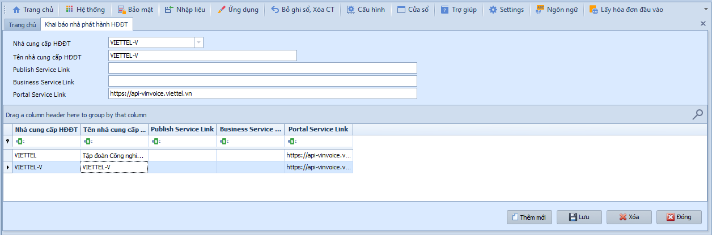
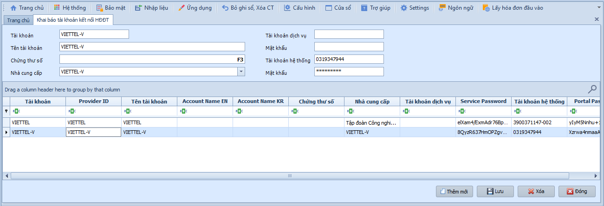
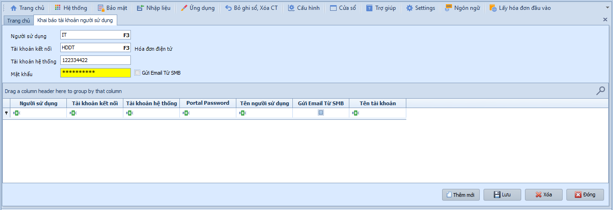
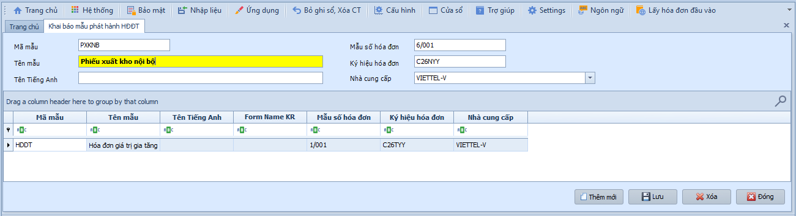
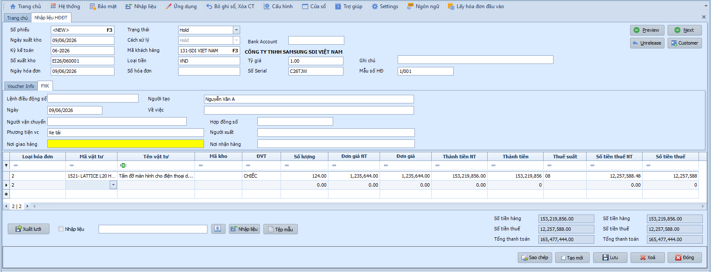
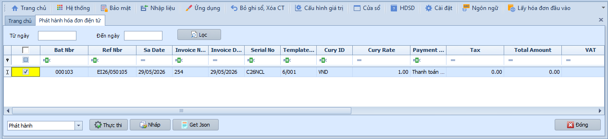
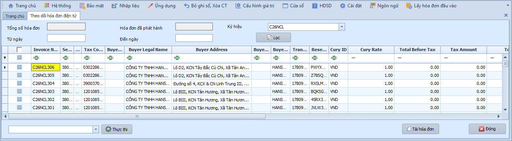

# 9.1 Khai báo nhà phát hành

### Khai báo nhà phát hành HĐĐT

Khi cần đăng ký thông tin nhà cung cấp dịch vụ hóa đơn điện tử (Viettel, VNPT...) để kết nối phát hành HĐĐT.

Để khai báo nhà phát hành, người dùng thực hiện:

1. Nhập **Tên** và **Mã nhà cung cấp** dịch vụ HĐĐT.
2. Nhập **Portal Service Link** (đường dẫn kết nối).
3. Nhấn **Lưu** để hoàn tất.

- **Các nút chức năng:**
  - F3 tại mã nhà cung cấp: Tìm nhà phát hành đã khai báo.
  - Lưu: Lưu thông tin nhà phát hành.
  - Thêm mới: Tạo nhà phát hành mới.
  - Xóa: Xóa nhà phát hành chưa sử dụng.
  - Đóng: Thoát khỏi màn hình.

- **Lưu ý khi thao tác:**
  - Đường dẫn kết nối phải lấy đúng từ nhà cung cấp dịch vụ HĐĐT.
  - Không nên xóa nhà phát hành đã gắn với mẫu hóa đơn hoặc tài khoản kết nối.

> **Hệ thống tự kiểm tra khi Lưu:** Mã nhà phát hành, tên và đường dẫn kết nối không được để trống.

---

### Khai báo tài khoản kết nối HĐĐT

Khi cần đăng ký tài khoản đăng nhập để kết nối với hệ thống nhà cung cấp HĐĐT.

Để khai báo tài khoản kết nối, người dùng thực hiện:

1. Nhập **Mã** và **Tên tài khoản**.
2. Chọn **Nhà cung cấp** (đã khai báo ở bước trên).
3. Nhập **Tài khoản** và **Mật khẩu** đăng nhập trên web nhà cung cấp.
4. Nhấn **Lưu** để hoàn tất.

- **Các nút chức năng:**
  - F3 tại mã tài khoản: Tìm tài khoản kết nối đã khai báo.
  - Lưu: Lưu thông tin tài khoản kết nối.
  - Thêm mới: Tạo tài khoản kết nối mới.
  - Xóa: Xóa tài khoản không còn dùng.
  - Đóng: Thoát khỏi màn hình.

- **Lưu ý khi thao tác:**
  - Tài khoản/mật khẩu phải đúng với thông tin được nhà cung cấp HĐĐT cấp.
  - Khi đổi mật khẩu trên cổng nhà cung cấp, cần cập nhật lại tại SmartBooks trước khi phát hành hóa đơn.

> **Hệ thống tự kiểm tra khi Lưu:** Phải chọn nhà cung cấp đã khai báo và nhập đủ tài khoản kết nối.

---

### Khai báo tài khoản người sử dụng HĐĐT

Khi cần gán quyền phát hành HĐĐT cho từng người dùng trong hệ thống SmartBooks.

Để khai báo, người dùng thực hiện:

1. Chọn **Người sử dụng** và **Tài khoản kết nối**.
2. Nhập **Tài khoản hệ thống** và **Mật khẩu**.
3. Nhấn **Lưu** để hoàn tất.

- **Các nút chức năng:**
  - F3 tại người sử dụng: Chọn người dùng SmartBooks cần được cấp quyền phát hành.
  - Lưu: Lưu liên kết giữa người dùng và tài khoản HĐĐT.
  - Xóa: Bỏ liên kết nếu người dùng không còn được phép phát hành.
  - Đóng: Thoát khỏi màn hình.

- **Lưu ý khi thao tác:**
  - Chỉ cấp tài khoản phát hành cho người có trách nhiệm lập/phát hành hóa đơn.
  - Khi nhân sự nghỉ việc hoặc đổi vị trí, cần thu hồi quyền phát hành HĐĐT.

> **Hệ thống tự kiểm tra khi Lưu:** Người sử dụng và tài khoản kết nối là thông tin bắt buộc.

---

### Khai báo mẫu phát hành HĐĐT

Khi cần đăng ký mẫu hóa đơn điện tử đã thông báo phát hành với cơ quan thuế.

Để khai báo mẫu phát hành, người dùng thực hiện:

1. Nhập **Mã** và **Tên mẫu** HĐĐT.
2. Nhập **Mẫu số** và **Ký hiệu** hóa đơn.
3. Chọn **Nhà cung cấp** (nhà phát hành HĐĐT).
4. Nhấn **Lưu** để hoàn tất.

- **Các nút chức năng:**
  - F3 tại mã mẫu: Tìm mẫu phát hành đã khai báo.
  - Lưu: Lưu mẫu/ký hiệu hóa đơn.
  - Thêm mới: Tạo mẫu phát hành mới.
  - Xóa: Xóa mẫu chưa phát sinh hóa đơn.
  - Đóng: Thoát khỏi màn hình.

- **Lưu ý khi thao tác:**
  - Mẫu số và ký hiệu phải khớp thông tin đã đăng ký/thông báo với cơ quan thuế và nhà cung cấp HĐĐT.
  - Không sửa mẫu/ký hiệu đã phát sinh hóa đơn nếu chưa có quy trình kiểm soát rõ ràng.

> **Hệ thống tự kiểm tra khi Lưu:** Mã mẫu, mẫu số, ký hiệu và nhà phát hành là thông tin bắt buộc.

---

### Luồng dữ liệu nguồn

| Nguồn | Cách thực hiện | Ghi chú |
|-------|----------------|---------|
| Nhập trực tiếp hóa đơn bán hàng | Vào màn nhập HĐĐT, nhập trực tiếp | Phát hành qua Viettel/VNPT |
| Xuất bán kho → Phải thu | Ghi sổ phiếu xuất bán hàng (Kho) | Sinh chứng từ phải thu (AR) |
| Từ chứng từ Kho/AR đã ghi sổ | Ghi sổ hàng loạt → tích **E-Invoices** | Chọn chứng từ đã ghi sổ để tạo HĐĐT chờ phát hành |
| Hóa đơn AR | Ghi sổ hóa đơn phải thu | Thông tin phục vụ bảng kê thuế đầu ra |

---

### Nhập liệu HĐĐT

Khi cần nhập trực tiếp hóa đơn bán hàng để phát hành HĐĐT (không phải phiếu xuất kho).

Để nhập hóa đơn bán hàng, người dùng thực hiện như sau:

1. Nhấn **Tạo mới** để tạo hóa đơn.
2. Nhập thông tin chung: Ngày chứng từ, Khách hàng, Số hóa đơn.
3. Tại lưới chi tiết, chọn **Mã vật tư**, nhập **Số lượng** và **Đơn giá**.
4. Nhấn **Lưu** để hoàn tất.

- **Thông tin chung:**
  - Số phiếu / Số chứng từ / Kỳ kế toán / Ngày chứng từ: Hệ thống tự sinh theo cấu hình.
  - Khách hàng: Chọn từ danh mục (nhấn **F3** để tra cứu).
  - Cách xử lý / Loại tiền / Tỷ giá: Mặc định VND.
  - Số hóa đơn / Số Serial / Mẫu số HĐ / Ngày hóa đơn: Thông tin phục vụ bảng kê thuế.
  - Tab PXK: Phiếu xuất kho đi kèm — Lệnh điều động, Người vận chuyển, Phương tiện, Nơi giao hàng.
  - Hợp đồng số / Người xuất / Nơi nhận hàng: Nhập nếu có yêu cầu.

- **Lưới chi tiết:**
  - Mã vật tư: Chọn từ danh mục — hệ thống tự hiển thị tên, mã kho, đơn vị tính.
  - Số lượng / Đơn giá: Nhập giá trị — hệ thống tự tính thành tiền và tiền thuế.

- **Các nút chức năng:**
  - Xuất lưới / Nhập liệu: Xuất Excel hoặc nhập dữ liệu từ file mẫu.
  - Xem trước: Xem trước HĐĐT trước khi phát hành.
  - Tiếp theo / Điều chỉnh: Chuyển phiếu tiếp theo hoặc đưa chứng từ chưa phát hành về Chưa ghi sổ.
  - Sao chép / Tạo mới / Lưu / Xóa / Đóng: Các thao tác tiêu chuẩn.

- **Ô chọn và tùy chọn thường gặp:**
  - Thuế: Hiển thị/kiểm soát các cột thuế GTGT trên lưới chi tiết.
  - Diễn giải: Hiển thị cột diễn giải chi tiết trên từng dòng hàng.
  - PXK: Khai báo thông tin phiếu xuất kho kiêm vận chuyển nội bộ nếu hóa đơn cần kèm thông tin giao hàng.

- **Lưu ý khi thao tác:**
  - Cần kiểm tra khách hàng, mã số thuế, địa chỉ, mẫu số, ký hiệu và số hóa đơn trước khi xem trước/phát hành.
  - Hóa đơn ở trạng thái Chưa ghi sổ có thể chỉnh sửa; hóa đơn đã phát hành chính thức không sửa trực tiếp.
  - Nếu nhập dữ liệu từ Excel, dùng đúng file mẫu và kiểm tra lỗi trên lưới trước khi lưu.

> **Hệ thống tự kiểm tra khi Lưu:** Khách hàng, ngày hóa đơn, mẫu/ký hiệu, dòng hàng hóa/dịch vụ, số lượng, đơn giá và thuế suất phải hợp lệ.

---

### Ghi sổ chứng từ HĐĐT

Khi cần chuyển các hóa đơn bán hàng từ trạng thái Chưa ghi sổ sang Đã ghi sổ trước khi phát hành HĐĐT.

1. Chọn tất cả chứng từ chưa ghi sổ hoặc lọc theo kỳ kế toán.
2. Tích chọn các chứng từ cần ghi sổ.
3. Nhấn **Thực hiện** để ghi nhận. Chỉ chứng từ chưa phát hành mới được xử lý.

- **Ô chọn và nút chức năng:**
  - Ô chọn từng dòng: Chọn hóa đơn cần ghi sổ.
  - Ô chọn đầu cột: Chọn nhanh toàn bộ hóa đơn đang hiển thị.
  - Thực hiện: Chuyển các hóa đơn đã chọn sang Đã ghi sổ.
  - Đóng: Thoát khỏi màn hình.

> **Hệ thống tự kiểm tra khi ghi sổ:** Hóa đơn phải đủ thông tin bắt buộc và chưa phát hành chính thức.

---

### Chọn bút toán sang hóa đơn điện tử

Khi có chứng từ đã ghi sổ từ phân hệ Kho (IN) hoặc Phải thu (AR) cần chuyển sang phát hành HĐĐT.

1. Chọn **Phân hệ nguồn** (IN hoặc AR) và nhập khoảng ngày.
2. Nhấn **Tải lại** để hiển thị chứng từ đủ điều kiện.
3. Tích chọn các dòng cần chuyển.
4. Nhấn **Thực hiện ghi sổ** để tạo chứng từ bán hàng chờ phát hành HĐĐT.

- **Lưu ý khi thao tác:**
  - Chỉ chọn chứng từ nguồn đã ghi sổ và có đầy đủ thông tin khách hàng, hàng hóa/dịch vụ, thuế.
  - Nếu chứng từ nguồn sai thông tin, cần điều chỉnh tại phân hệ nguồn trước khi chuyển sang HĐĐT.

> **Hệ thống tự kiểm tra khi chuyển dữ liệu:** Chứng từ nguồn phải thuộc phân hệ được chọn, nằm trong khoảng ngày và chưa được chuyển/phát hành trùng.

---

### Phát hành hóa đơn điện tử

Khi hóa đơn đã sẵn sàng và cần gửi lên nhà cung cấp HĐĐT để phát hành chính thức.

1. Tích chọn hóa đơn cần phát hành.
2. Chọn **Nháp** để xuất nháp kiểm tra, hoặc **Phát hành chính thức** để phát hành.

- **Các nút chức năng:**
  - Nháp: Gửi/xuất bản nháp để kiểm tra dữ liệu trước khi phát hành.
  - Phát hành chính thức: Phát hành chính thức lên hệ thống nhà cung cấp HĐĐT.
  - Tải lại/Xem lưới: Cập nhật lại danh sách hóa đơn chờ phát hành nếu màn hình hỗ trợ.

- **Lưu ý khi thao tác:**
  - Luôn dùng **Nháp** để kiểm tra trước các hóa đơn có giá trị lớn hoặc thông tin khách hàng mới.
  - Sau khi **Phát hành chính thức** thành công, hóa đơn được xem là đã phát hành và phải xử lý điều chỉnh/hủy theo quy định nếu sai.

> **Lưu ý:** Hóa đơn đã phát hành không thể sửa đổi. Nếu cần điều chỉnh, phải thực hiện qua chức năng **Hủy HĐĐT** hoặc lập hóa đơn điều chỉnh.

---

### Theo dõi hóa đơn điện tử

Khi cần kiểm tra trạng thái, tải file hoặc gửi email hóa đơn đã phát hành cho khách hàng.

1. Lọc theo khoảng ngày và mẫu phát hành / ký hiệu.
2. Tải file hóa đơn (PDF/XML/JSON) khi cần lưu trữ.
3. Gửi email cho khách hàng nếu hệ thống đã cấu hình email.
4. Kiểm tra số lượng hóa đơn đã phát hành theo mẫu.

- **Các nút chức năng:**
  - Xem lưới/Tải lại: Lấy danh sách hóa đơn theo điều kiện lọc.
  - Tải PDF/XML/JSON: Lưu file hóa đơn phục vụ đối chiếu hoặc lưu trữ.
  - Gửi email: Gửi hóa đơn cho khách hàng.
  - Đóng: Thoát khỏi màn hình.

- **Lưu ý khi thao tác:**
  - Nếu gửi email không thành công, kiểm tra lại email khách hàng và cấu hình email hệ thống.
  - File XML là hồ sơ quan trọng khi đối chiếu với cơ quan thuế; cần lưu trữ đầy đủ.

> **Hệ thống tự kiểm tra khi tải/gửi:** Hóa đơn phải có trạng thái phát hành thành công và có file tương ứng từ nhà cung cấp HĐĐT.

---

### Hủy hóa đơn điện tử

Khi hóa đơn đã phát hành cần hủy theo nghiệp vụ (sai thông tin, khách hàng trả hàng) và được nhà cung cấp HĐĐT chấp nhận.

1. Lọc danh sách hóa đơn cần hủy theo khoảng ngày và mẫu phát hành.
2. Tích chọn hóa đơn cần hủy.
3. Nhấn **Thực hiện** để gửi yêu cầu hủy. Hệ thống cập nhật trạng thái khi thành công.

- **Lưu ý khi thao tác:**
  - Chỉ hủy hóa đơn khi có căn cứ nghiệp vụ và hồ sơ theo quy định.
  - Trước khi hủy, cần thông báo/đối chiếu với khách hàng nếu hóa đơn đã gửi.
  - Sau khi hủy thành công, cần kiểm tra lại báo cáo tình hình sử dụng hóa đơn.

> **Hệ thống tự kiểm tra khi hủy:** Hóa đơn phải đã phát hành, chưa bị hủy trước đó và kết nối nhà cung cấp HĐĐT phải hoạt động.

> **Lưu ý:** Việc hủy HĐĐT phải tuân thủ quy định của Nghị định 123/2020/NĐ-CP về hóa đơn điện tử.
