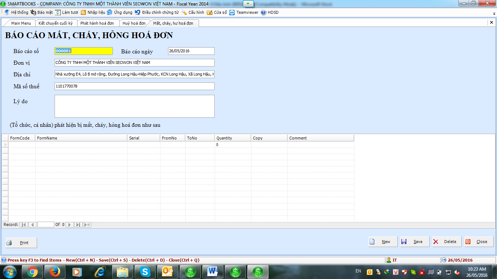

# 8.1 Phân mục cài đặt

**PHÂN HỆ HÓA ĐƠN BÁN HÀNG**

.png>)

Từ Bảng danh mục (Menu), ta có thể thấy của phân hệ hóa đơn bán hàng bao gồm 3 phân mục:

* **Phân mục cài đặt:** Hủy hóa đơn. Mất, cháy hư hóa đơn.
* **Phân mục nhập liệu (Input):** Danh sách hóa đơn, kiểm tra hóa đơn.
* **Phân mục báo cáo:** Báo cáo phát hành hóa đơn. Báo cáo hủy hóa đơn. Báo cáo mất, cháy, hư hỏng hóa đơn. Báo cáo tình hình sử dụng hóa đơn.

#### 8.1 Phân mục cài đặt

#### a) Phát hành hóa đơn

<figure><figcaption></figcaption></figure>

Chức năng đăng ký thông tin hóa đơn

\-        Thông tin hóa đơn:

\+      Mẫu hóa đơn

\+      Số serial

\+      Số lượng

\+      Hóa đơn từ số

\+      Hóa đơn đến số

\-        Công ty : Công ty cung cấp hóa đơn

\-        Hợp đồng :

\+      Số Hợp Đồng

\+      Ngày Hợp đồng

#### b) Hủy hóa đơn

.png>)

Phân hệ này dùng để hủy các hóa đơn đã phát hành mà không sử dụng nữa.

Cần phải nhập dầy đủ thông tin như ngày hủy hóa đơn.

Tên công ty của mình, địa chỉ, mã số thuế.

Phương pháo hủy hóa đơn.

#### c) Mất, cháy, hư hóa đơn

Báo cáo này dùng để báo cáo về việc mất, cháy, hỏng hóa đơn

Cần nhập số báo cáo, ngày báo cáo.

Tên công ty của mình, địa chỉ, má số thuế.

Nguyên nhân bị mất, cháy, hỏng hóa đơn.
