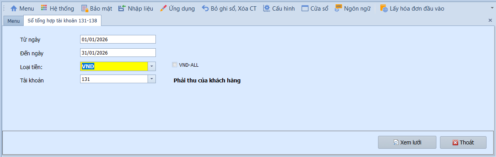
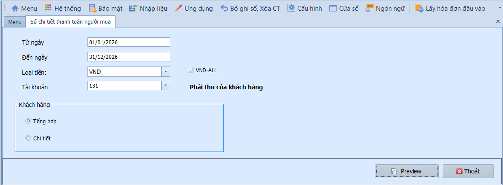
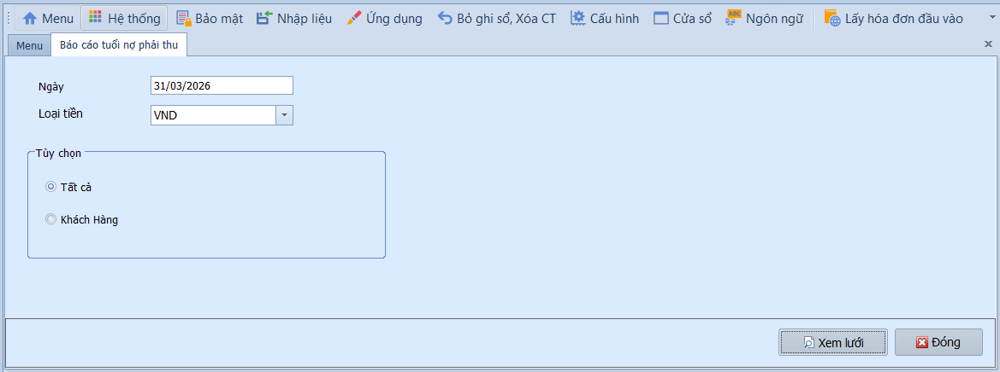
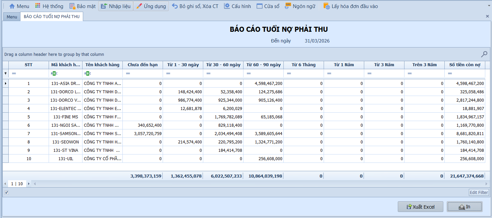
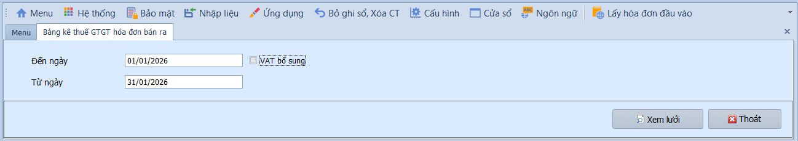
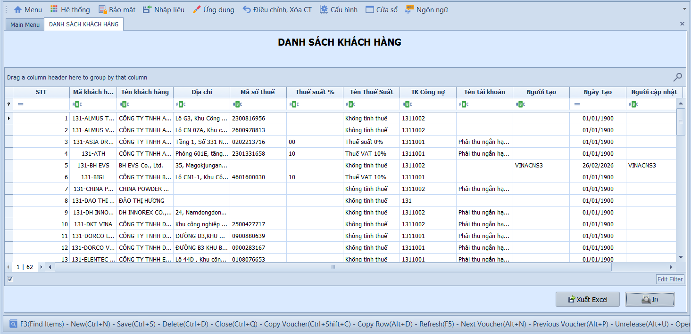
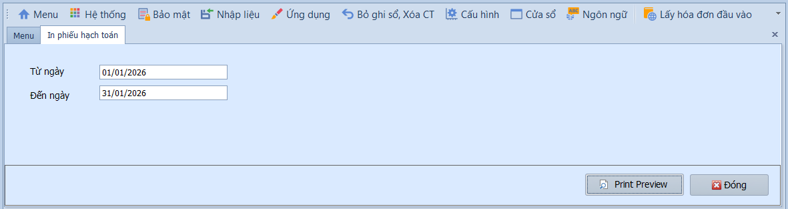

# 3.5 Phân mục báo cáo

### Nút và tùy chọn chung trên báo cáo phải thu

**Nghiệp vụ áp dụng:** Các báo cáo phải thu dùng để theo dõi công nợ khách hàng, tiến độ thu tiền, hóa đơn bán ra và thuế GTGT đầu ra. Người dùng cần chọn đúng kỳ, tài khoản và khách hàng trước khi đối chiếu.

- **Điều kiện lọc thường gặp:**
  - Từ ngày / Đến ngày: Khoảng thời gian lấy số liệu.
  - Loại tiền: Chọn VND hoặc ngoại tệ; tích **VND-ALL** nếu muốn quy đổi toàn bộ về VND.
  - Tài khoản: Chọn tài khoản phải thu, ví dụ 131, 136, 138.
  - Tất cả / Theo từng KH: Xem toàn bộ khách hàng hoặc lọc một khách hàng cụ thể.

- **Các nút chức năng:**
  - Xem lưới: Tải dữ liệu báo cáo theo điều kiện lọc.
  - In: In báo cáo theo mẫu.
  - Xuất Excel: Xuất dữ liệu để gửi đối chiếu hoặc lưu hồ sơ.
  - Đóng: Thoát khỏi màn hình báo cáo.

- **Lưu ý khi thao tác:**
  - Nên đối chiếu báo cáo công nợ với hóa đơn AR và phiếu thu trước khi chốt số dư.
  - Nếu công nợ đến hạn không đúng, kiểm tra lại ngày hóa đơn, điều khoản thanh toán và phiếu thu đã phân bổ.

> **Hệ thống tự kiểm tra khi xem báo cáo:** Khoảng ngày và điều kiện lọc phải hợp lệ. Báo cáo chỉ phản ánh đúng khi hóa đơn và phiếu thu đã ghi sổ đầy đủ.

---

### Sổ tổng hợp 131-138

**Nghiệp vụ áp dụng:** Khi cần xem tổng hợp số dư và phát sinh của các tài khoản công nợ phải thu (131 — Phải thu KH, 136 — Phải thu nội bộ, 138 — Phải thu khác…) trong kỳ.

> **Ví dụ:** Xem tổng số dư Nợ TK 131 cuối tháng 01/2026 để biết tổng công nợ phải thu khách hàng hiện tại.

Để xem báo cáo, người dùng thực hiện như sau:

1. Nhập khoảng thời gian vào ô **Từ ngày / Đến ngày**.
2. Chọn **Loại tiền** (mặc định VND); tích **VND-ALL** nếu muốn quy đổi toàn bộ phát sinh ngoại tệ về VND.
3. Chọn **Tài khoản** cần xem trong nhóm nợ phải thu.
4. Nhấn **Xem lưới** để hiển thị báo cáo.

---

### Sổ chi tiết thanh toán người mua

**Nghiệp vụ áp dụng:** Khi cần xem chi tiết từng giao dịch thanh toán với từng khách hàng — phục vụ đối chiếu công nợ, xác nhận số dư với KH và theo dõi tiến độ thu tiền.

Để xem báo cáo, người dùng thực hiện như sau:

1. Nhập khoảng thời gian vào ô **Từ ngày / Đến ngày**, chọn **Loại tiền** và tích **VND-ALL** nếu muốn quy đổi về VND.
2. Chọn **Tài khoản** cần xem, sau đó chọn xem **Tất cả** khách hàng hoặc lọc **Theo từng KH** cụ thể.
3. Nhấn **Xem lưới** để hiển thị báo cáo.

---

### Báo cáo công nợ đến hạn phải thu

**Nghiệp vụ áp dụng:** Khi cần theo dõi các khoản công nợ KH sắp đến hạn hoặc đã quá hạn — phục vụ đôn đốc thu tiền, quản trị dòng tiền và đánh giá rủi ro nợ xấu.

> **Ví dụ:** Xem các hóa đơn KH đến hạn/quá hạn tính đến ngày 31/01/2026, phân loại theo số ngày quá hạn để ưu tiên nhắc nợ.

Để xem báo cáo, người dùng thực hiện như sau:

1. Nhập **ngày theo dõi** công nợ quá hạn, chọn **Loại tiền**.
2. Chọn xem **Tất cả** khách hàng hoặc lọc **Theo từng KH** cụ thể.
3. Nhấn **Xem lưới** để hiển thị báo cáo.

---

### Bảng kê thuế GTGT hóa đơn bán ra

**Nghiệp vụ áp dụng:** Khi cần lên bảng kê thuế GTGT đầu ra theo quy định — tổng hợp tất cả hóa đơn bán ra có thuế GTGT trong kỳ để kê khai thuế.

Để xem báo cáo, người dùng thực hiện như sau:

1. Nhập khoảng thời gian vào ô **Từ ngày / Đến ngày**.
2. Nhấn **Xem lưới** để hiển thị báo cáo.

---

### Danh sách khách hàng

**Nghiệp vụ áp dụng:** Khi cần in hoặc xuất danh sách toàn bộ khách hàng đang quản lý trong hệ thống — phục vụ kiểm toán hoặc lưu trữ hồ sơ.

---

### In phiếu hạch toán

**Nghiệp vụ áp dụng:** Khi cần in phiếu hạch toán (chứng từ ghi sổ) của phân hệ phải thu theo khoảng thời gian — phục vụ lưu trữ hồ sơ kế toán hoặc đính kèm chứng từ gốc.

Để in phiếu hạch toán, người dùng thực hiện như sau:

1. Nhập khoảng thời gian vào ô **Từ ngày / Đến ngày**.
2. Nhấn **Xem lưới** để hiển thị báo cáo.

