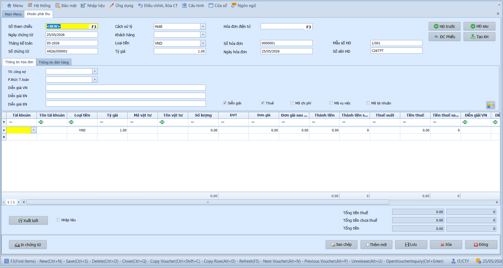

# 3.2 Phân mục nhập liệu

### Khoản phải thu

**Nghiệp vụ áp dụng:** Khi phát sinh hóa đơn bán hàng hóa, thành phẩm hoặc cung cấp dịch vụ cho khách hàng — cần ghi nhận doanh thu và theo dõi công nợ phải thu (TK 131).

> **Ví dụ nghiệp vụ:** Ảnh minh họa chứng từ mới số AR26/050001 ngày 25/05/2026, kỳ 05-2026, hóa đơn số 0000001, mẫu số 1/001, sêri C26TPT. Đây là hóa đơn đang nhập mới nên chưa có khách hàng và dòng doanh thu; kế toán nhập tiếp mã khách hàng, TK doanh thu, hàng hóa/dịch vụ, thuế suất và số tiền theo hóa đơn thực tế.

Để nhập hóa đơn bán hàng, người dùng thực hiện như sau:

1. Nhấn **Thêm mới** để tạo hóa đơn bán hàng; **Số tham chiếu** hiển thị `<NEW>` cho chứng từ mới.
2. Nhập **Ngày chứng từ** và kiểm tra **Tháng kế toán**. Ngày chứng từ phải thuộc đúng kỳ kế toán đang mở.
3. Chọn **Cách xử lý**. Nên giữ Chưa ghi sổ trong lúc nhập và kiểm tra hóa đơn trước khi ghi sổ.
4. Chọn **Mã khách hàng**; hệ thống gợi ý tài khoản công nợ, loại tiền và thông tin thanh toán mặc định.
5. Nhập thông tin hóa đơn: **Hóa đơn điện tử** nếu có, **Số hóa đơn**, **Ngày hóa đơn**, **Mẫu số HĐ** và **Số sêri HĐ**.
6. Kiểm tra **TK công nợ**, **P.thức T.toán**, **Loại tiền** và **Tỷ giá**.
7. Nhập **Diễn giải VN / EN / KR** để mô tả nội dung bán hàng.
8. Nhập từng dòng chi tiết: TK doanh thu, mã vật tư/dịch vụ nếu có, số lượng, đơn giá, thành tiền, thuế suất và tiền thuế.
9. Kiểm tra **Tổng tiền thuế**, **Tổng tiền chưa thuế** và **Tổng tiền**, sau đó nhấn **Lưu**.

- **Thông tin chung:**
  - Số tham chiếu: Mặc định `<NEW>` khi thêm mới; nhấn **F3** để tìm chứng từ cũ.
  - Ngày chứng từ / Tháng kế toán / Số chứng từ: Hệ thống tự động hiển thị theo ngày hiện tại và quy tắc cấu hình.
  - Mã khách hàng: Chọn mã KH — hệ thống tự động điền TK công nợ, loại tiền và thông tin mặc định.
  - Hóa đơn điện tử: Nhấn **F3** để chọn hóa đơn điện tử liên quan nếu doanh nghiệp phát hành qua phân hệ hóa đơn điện tử.
  - Số HĐ / Số seri / Mẫu HĐ / Ngày HĐ: Nhập thông tin hóa đơn GTGT để lên bảng kê thuế.
  - P.thức T.toán: Chọn phương thức thanh toán để quản trị dòng tiền.
  - Diễn giải VN / EN / KR: Nhập nội dung tóm tắt nghiệp vụ.

- **Lưới chi tiết:**
  - Tài khoản: Nhập TK doanh thu đối ứng bên Có.
  - Mã vật tư / SL / ĐVT / Đơn giá: Chọn hàng hóa, nhập số lượng và đơn giá — hệ thống tự tính Thành tiền.
  - Thuế suất / Tiền thuế: Chọn % thuế GTGT **đầu ra** — hệ thống tự động tính tiền thuế từng dòng.
  - Số HĐ / Số seri / Mẫu HĐ / Ngày HĐ: Nhập thông tin hóa đơn GTGT để lên bảng kê thuế.

- **Các nút chức năng:**
  - HĐ trước / HĐ sau: Duyệt chứng từ liền kề.
  - Tạo mới KH: Thêm nhanh **khách hàng** mới ngay trên màn hình.
  - Xuất lưới / Nhập liệu: Xuất dữ liệu ra Excel hoặc nhập dữ liệu từ file ngoài.
  - In chứng từ: In hoặc xuất PDF theo mẫu.
  - Lưu / Sao chép / Thêm mới / Xóa / Đóng: Các thao tác tiêu chuẩn.

- **Lưu ý khi thao tác:**
  - Nếu hóa đơn có thuế GTGT đầu ra, cần nhập đủ số hóa đơn, mẫu số, sêri, ngày hóa đơn và mã thuế trên dòng chi tiết.
  - Khi nhập dữ liệu từ Excel, loại tiền và tỷ giá lấy theo phần thông tin chung trên màn hình, không lấy từ file Excel. Hãy chọn đúng trước khi nhập dữ liệu.
  - Nếu tài khoản doanh thu yêu cầu mã chi phí, mã vụ việc hoặc mã lợi nhuận, nhập đủ để báo cáo quản trị lên đúng số liệu.
  - Chứng từ ở trạng thái Đã ghi sổ muốn sửa cần bỏ ghi sổ hoặc lập chứng từ điều chỉnh theo quy trình kiểm soát.

> **Hệ thống tự kiểm tra khi Lưu:**
> - Kỳ kế toán không được đóng và ngày chứng từ phải thuộc đúng tháng kế toán.
> - Loại chứng từ, cách xử lý, mã khách hàng, loại tiền, tỷ giá, phương thức thanh toán và tài khoản công nợ là bắt buộc.
> - Với hóa đơn bán hàng, số hóa đơn và sêri là thông tin bắt buộc để kiểm soát trùng hóa đơn.
> - Phải có ít nhất một dòng chi tiết; tài khoản doanh thu trên dòng phải hợp lệ trong phân hệ phải thu.
> - Số lượng, đơn giá, thành tiền và tiền thuế không được âm.
> - Nếu có tiền thuế và bật theo dõi thuế, dòng chi tiết phải có mã thuế.
> - Hệ thống kiểm tra số chứng từ và số hóa đơn để tránh trùng trong cùng kỳ.

> **Lưu ý:** Có thể lưu hóa đơn ở trạng thái Chưa ghi sổ để kiểm tra, sau đó chuyển sang Ghi sổ tại màn này hoặc dùng **Ghi sổ nhiều chứng từ AR** để ghi sổ hàng loạt.

---

### Phiếu thu / Thanh toán khách hàng

**Nghiệp vụ áp dụng:** Khi khách hàng thanh toán tiền hàng — cần ghi nhận khoản thu và phân bổ vào từng hóa đơn AR còn nợ để giảm trừ số dư phải thu. Bao gồm:
  - **Thu tiền hàng (PA):** Khách hàng thanh toán cho hóa đơn đã phát hành.
  - **Thu tiền ứng trước (PP):** Khách hàng trả trước khi chưa có hóa đơn.

> **Ví dụ nghiệp vụ:** Thu tiền KH "ABC" 50.000.000đ qua chuyển khoản và phân bổ vào hóa đơn bán hàng số 001 — ghi nhận Nợ 112 / Có 131 để giảm số dư phải thu của khách hàng.

Để nhập phiếu thu/thanh toán, người dùng thực hiện như sau:

1. Nhấn **Thêm mới** hoặc nhấn **F3** để chọn phiếu thu cũ.
2. Chọn loại nghiệp vụ: **Thu tiền hàng (PA)** khi thu cho hóa đơn đã phát hành, hoặc **Thu tiền ứng trước (PP)** khi khách hàng trả trước.
3. Nhập ngày chứng từ, kỳ kế toán, cách xử lý, loại tiền và tỷ giá.
4. Chọn **Mã khách hàng** — hệ thống tải số dư công nợ và danh sách hóa đơn AR còn nợ của khách hàng đó.
5. Chọn tài khoản thu tiền: 111 nếu thu tiền mặt, 112 nếu thu qua ngân hàng.
6. Nhập số tiền phân bổ cho từng hóa đơn trong lưới chi tiết.
7. Kiểm tra tổng tiền phân bổ so với số tiền thu trên phần thông tin chung.
8. Nhấn **Lưu** để lưu ở trạng thái Chưa ghi sổ; chuyển sang Ghi sổ khi đã đối chiếu xong và cần ghi sổ.

- **Thông tin chung:**
  - Loại chứng từ: Phân biệt thu tiền hóa đơn và thu tiền ứng trước.
  - Mã khách hàng: Đối tượng thanh toán; hệ thống dùng mã này để tải công nợ còn phải thu.
  - Loại tiền / Tỷ giá: Dùng để ghi nhận số tiền nguyên tệ, quy đổi và chênh lệch tỷ giá nếu có.
  - Tài khoản thu tiền: Tài khoản tiền mặt/ngân hàng nhận tiền.

- **Lưới chi tiết phân bổ:**
  - Số hóa đơn/chứng từ AR: Hóa đơn còn nợ được phân bổ tiền thu.
  - Số tiền phân bổ: Số tiền thu áp vào từng hóa đơn.
  - Số dư còn lại: Dùng để kiểm tra số công nợ sau khi thanh toán.

- **Lưu ý khi thao tác:**
  - Tổng số tiền phân bổ phải khớp với tổng tiền thu trên phần thông tin chung.
  - Không phân bổ vượt số dư còn nợ của từng hóa đơn.
  - Nếu có người khác vừa thu tiền cùng hóa đơn, hệ thống sẽ cảnh báo khi số dư đã thay đổi; cần tải lại dữ liệu trước khi lưu.
  - Với ngoại tệ, khi ghi sổ hệ thống có thể phát sinh bút toán chênh lệch tỷ giá theo tỷ giá thu tiền và tỷ giá ghi nhận công nợ ban đầu.
  - Khoản ứng trước của khách hàng sẽ được dùng để cấn trừ khi phát sinh hóa đơn bán hàng sau này.

> **Hệ thống tự kiểm tra khi Lưu:**
> - Kỳ kế toán, loại chứng từ, ngày chứng từ, mã khách hàng, loại tiền và tài khoản thu tiền là bắt buộc.
> - Tỷ giá không được âm.
> - Phải có ít nhất một dòng chi tiết phân bổ.
> - Số tiền phân bổ từng dòng không được âm.
> - Tổng số tiền phân bổ trên lưới phải khớp với tổng tiền thu trên phần thông tin chung.
> - Hệ thống kiểm tra số dư hóa đơn tại thời điểm lưu để tránh phân bổ vào số dư đã thay đổi.
> - Số chứng từ không được trùng trong cùng kỳ kế toán.

> **Lưu ý:** Sau khi ghi sổ, hệ thống tự động cập nhật số dư công nợ phải thu của khách hàng. Khoản trả trước sẽ được tự động bù trừ khi phát sinh hóa đơn bán hàng.
