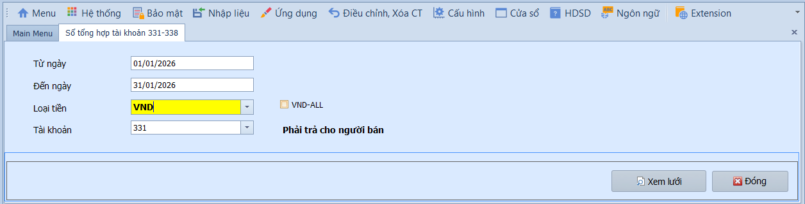
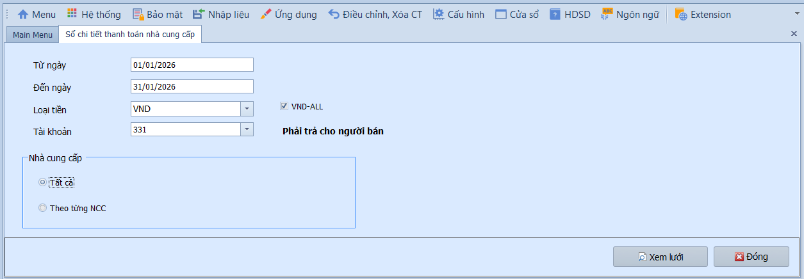
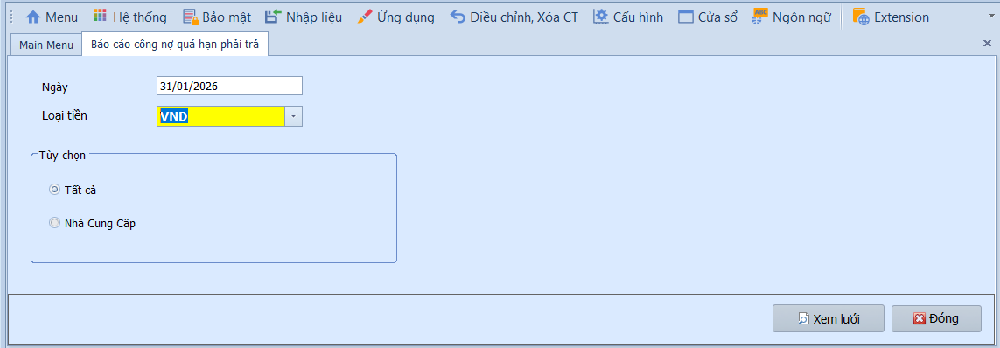
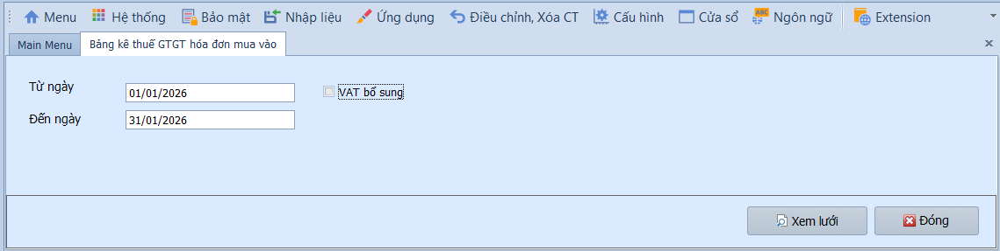
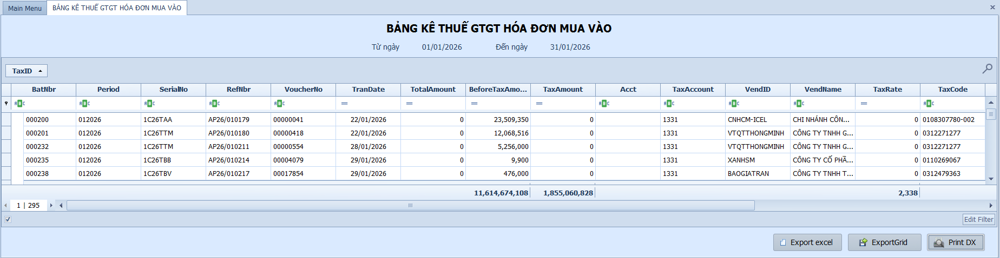
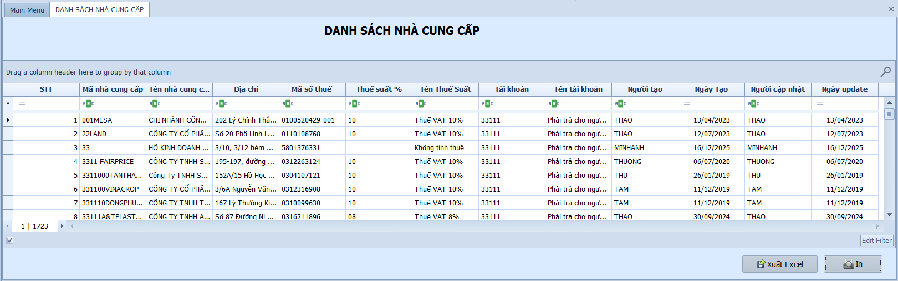
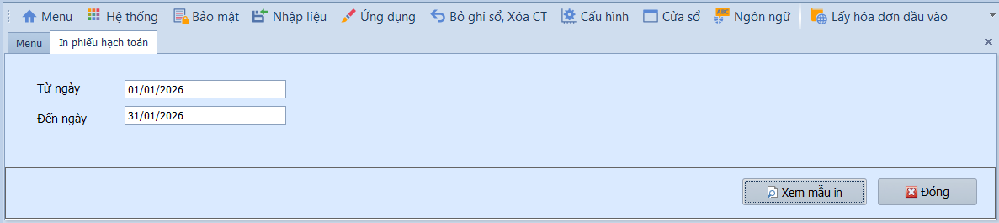

# 2.5 Phân mục báo cáo

### Nút và tùy chọn chung trên báo cáo phải trả

**Nghiệp vụ áp dụng:** Các báo cáo phải trả dùng để đối chiếu công nợ nhà cung cấp, thuế đầu vào và chứng từ AP đã ghi sổ. Trước khi in/xuất báo cáo, người dùng cần chọn đúng kỳ, tài khoản và nhà cung cấp cần theo dõi.

- **Điều kiện lọc thường gặp:**
  - Từ ngày / Đến ngày: Khoảng thời gian lấy số liệu.
  - Loại tiền: Chọn VND hoặc ngoại tệ; tích **VND-ALL** nếu muốn quy đổi toàn bộ về VND.
  - Tài khoản: Chọn tài khoản công nợ/thuế cần xem, ví dụ 331, 333, 338.
  - Tất cả / Theo từng NCC: Xem toàn bộ nhà cung cấp hoặc lọc một nhà cung cấp cụ thể.

- **Các nút chức năng:**
  - Xem lưới: Tải dữ liệu báo cáo theo điều kiện lọc.
  - In: In báo cáo theo mẫu.
  - Xuất Excel: Xuất dữ liệu để đối chiếu, gửi nhà cung cấp hoặc lưu hồ sơ.
  - Đóng: Thoát khỏi màn hình báo cáo.

- **Lưu ý khi thao tác:**
  - Nên đối chiếu báo cáo công nợ với chứng từ AP và phiếu thanh toán trước khi chốt số dư.
  - Nếu số liệu không khớp, kiểm tra trạng thái Chưa ghi sổ/Đã ghi sổ và kỳ kế toán của hóa đơn, thanh toán.

> **Hệ thống tự kiểm tra khi xem báo cáo:** Khoảng ngày và điều kiện lọc phải hợp lệ. Báo cáo chỉ phản ánh đúng khi chứng từ đã ghi sổ đầy đủ.

---

### Sổ tổng hợp 331-338

**Nghiệp vụ áp dụng:** Khi cần xem tổng hợp số dư và phát sinh của các tài khoản công nợ phải trả (331 — Phải trả NCC, 333 — Thuế phải nộp, 334 — Phải trả người lao động, 338 — Phải trả khác…) trong kỳ.

> **Ví dụ:** Xem tổng số dư Nợ/Có TK 331 cuối tháng 01/2026 để biết tổng công nợ phải trả NCC hiện tại.

Để xem báo cáo, người dùng thực hiện như sau:

1. Nhập khoảng thời gian vào ô **Từ ngày / Đến ngày**.
2. Chọn **Loại tiền** (mặc định VND); tích **VND-ALL** nếu muốn quy đổi toàn bộ phát sinh ngoại tệ về VND.
3. Chọn **Tài khoản** cần xem trong nhóm nợ phải trả.
4. Nhấn **Xem lưới** để hiển thị báo cáo.

---

### Sổ chi tiết thanh toán nhà cung cấp

**Nghiệp vụ áp dụng:** Khi cần xem chi tiết từng giao dịch thanh toán với từng nhà cung cấp — phục vụ đối chiếu công nợ, xác nhận số dư với NCC.

Để xem báo cáo, người dùng thực hiện như sau:

1. Nhập khoảng thời gian vào ô **Từ ngày / Đến ngày**, chọn **Loại tiền** và tích **VND-ALL** nếu muốn quy đổi về VND.
2. Chọn **Tài khoản** cần xem, sau đó chọn xem **Tất cả** nhà cung cấp hoặc lọc **Theo từng NCC** cụ thể.
3. Nhấn **Xem lưới** để hiển thị báo cáo.

---

### Báo cáo công nợ quá hạn phải trả

**Nghiệp vụ áp dụng:** Khi cần theo dõi các khoản công nợ NCC đã quá hạn thanh toán — phục vụ quản trị dòng tiền, ưu tiên thanh toán và tránh phạt chậm trả.

> **Ví dụ:** Xem các hóa đơn NCC quá hạn tính đến ngày 31/01/2026, phân loại theo số ngày quá hạn (0-30, 31-60, 61-90, trên 90 ngày).

Để xem báo cáo, người dùng thực hiện như sau:

1. Nhập **ngày theo dõi** công nợ quá hạn, chọn **Loại tiền**.
2. Chọn xem **Tất cả** nhà cung cấp hoặc lọc **Theo từng NCC** cụ thể.
3. Nhấn **Xem lưới** để hiển thị báo cáo.

---

### Bảng kê thuế GTGT hóa đơn mua vào

**Nghiệp vụ áp dụng:** Khi cần lên bảng kê thuế GTGT đầu vào theo quy định — tổng hợp tất cả hóa đơn mua vào có thuế GTGT trong kỳ để kê khai thuế.

Để xem báo cáo, người dùng thực hiện như sau:

1. Nhập khoảng thời gian vào ô **Từ ngày / Đến ngày**.
2. Nhấn **Xem lưới** để hiển thị báo cáo.

---

### Danh sách nhà cung cấp

**Nghiệp vụ áp dụng:** Khi cần in hoặc xuất danh sách toàn bộ nhà cung cấp đang quản lý trong hệ thống — phục vụ kiểm toán hoặc lưu trữ hồ sơ.

---

### In phiếu hạch toán

**Nghiệp vụ áp dụng:** Khi cần in phiếu hạch toán (chứng từ ghi sổ) của phân hệ phải trả theo khoảng thời gian — phục vụ lưu trữ hồ sơ kế toán hoặc đính kèm chứng từ gốc.

Để in phiếu hạch toán, người dùng thực hiện như sau:

1. Nhập khoảng thời gian vào ô **Từ ngày / Đến ngày**.
2. Nhấn **Xem lưới** để hiển thị báo cáo.

