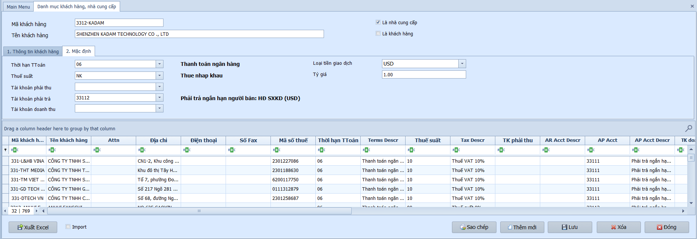

# 2.1 Phân mục cài đặt

### Danh mục nhà cung cấp

**Nghiệp vụ áp dụng:** Khi cần khai báo, quản lý thông tin các đối tượng (nhà cung cấp, khách hàng) giao dịch với doanh nghiệp. Đây là danh mục cốt lõi phục vụ theo dõi công nợ chi tiết (Phải thu TK 131, Phải trả TK 331), quản lý thông tin xuất hóa đơn và tự động liên kết dữ liệu khi hạch toán.

> **Ví dụ:** Khai báo NCC "Công ty TNHH Vật tư ABC" — MST 0312345678, TK phải trả mặc định 331, thuế suất 10%, loại tiền VND.

Để khai báo thông tin nhà cung cấp / khách hàng, người dùng thực hiện như sau:

- **Thông tin cơ bản:**
  - Mã / Tên nhà cung cấp: Nhập mã định danh và tên đầy đủ theo giấy phép đăng ký kinh doanh.
  - Là NCC / Là KH: Tích chọn vai trò đối tượng; có thể chọn đồng thời cả hai nếu vừa mua vừa bán.
  - Mã số thuế / Địa chỉ / Điện thoại / Email: Nhập thông tin liên hệ và mã số thuế để đối chiếu bảng kê thuế GTGT.

- **Thông tin mặc định:**
  - Thời hạn thanh toán: Chọn điều khoản thanh toán (00 - Tiền mặt, 01 - 30 ngày...) để tự động tính ngày đến hạn.
  - Thuế suất: Chọn mã thuế GTGT thường áp dụng — hệ thống sẽ gợi ý mã thuế mặc định khi hạch toán cho đối tượng.
  - Tài khoản phải thu / Phải trả / Doanh thu: Gán tài khoản công nợ và doanh thu mặc định cho đối tượng.
  - Loại tiền / Tỷ giá: Chọn đồng tiền giao dịch (mặc định VND).

- **Các nút chức năng:**
  - Xuất Excel / Nhập liệu: Xuất dữ liệu ra file Excel hoặc nhập dữ liệu từ file ngoài.
  - Lưu / Sao chép / Thêm mới / Xóa / Đóng: Các thao tác tiêu chuẩn.

> **Lưu ý:** Danh mục NCC/KH dùng chung cho cả phân hệ Phải trả (AP) và Phải thu (AR). Khi tích chọn đồng thời "Là NCC" và "Là KH", đối tượng sẽ xuất hiện ở cả hai phân hệ.
