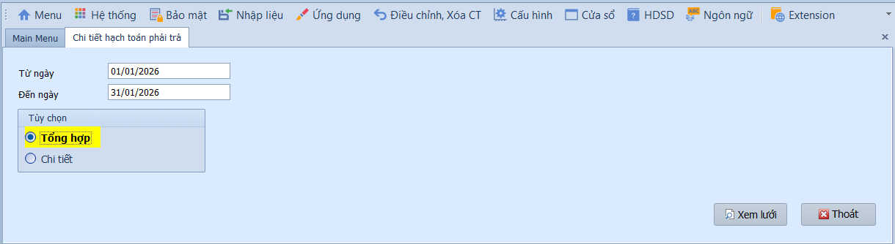
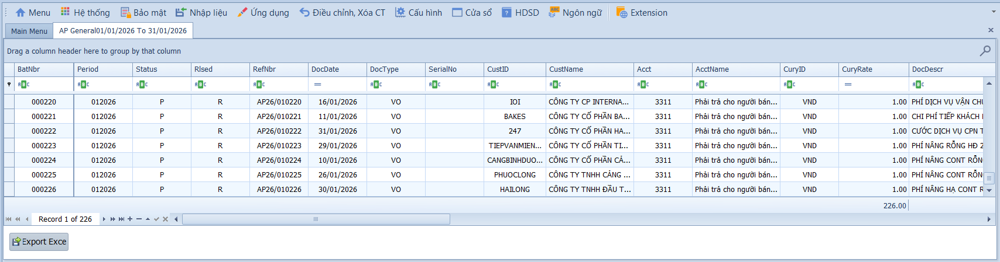

# 2.4 Phân mục chi tiết hạch toán phải trả

### Chi tiết hạch toán phải trả

**Nghiệp vụ áp dụng:** Khi cần tổng hợp hoặc kiểm tra chi tiết các bút toán hạch toán liên quan đến công nợ phải trả (NCC, phải trả khác) trong kỳ — phục vụ đối chiếu công nợ, kiểm tra trước khi lên báo cáo.

> **Ví dụ:** Kiểm tra chi tiết phát sinh TK 331 tháng 01/2026 — xem tất cả hóa đơn mua vào và thanh toán NCC để đối chiếu với bảng xác nhận công nợ.

Để xem báo cáo, người dùng thực hiện như sau:

1. Nhập khoảng thời gian vào ô **Từ ngày / Đến ngày**.
2. Chọn **Tổng hợp** để xem số dư và tổng phát sinh theo nhà cung cấp/tài khoản, hoặc **Chi tiết** để xem từng chứng từ phát sinh.
3. Nhấn **Xem lưới** để hiển thị báo cáo.

