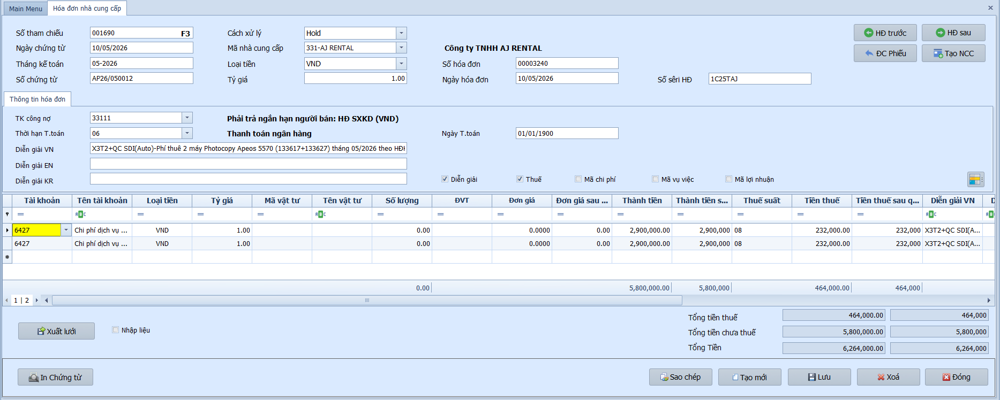

# 2.2 Phân mục nhập liệu

### Hóa đơn nhà cung cấp

**Nghiệp vụ áp dụng:** Khi nhận được hóa đơn mua hàng hóa, dịch vụ từ nhà cung cấp — cần ghi nhận nghiệp vụ mua vào để theo dõi công nợ phải trả (TK 331) và hạch toán chi phí/kho tương ứng.

> **Ví dụ nghiệp vụ:** Chứng từ AP26/050012 ngày 10/05/2026 — nhận HĐ 00003240, sêri 1C25TAJ từ Công ty TNHH AJ RENTAL. Nội dung là phí thuê 2 máy Photocopy Apeos 5570 tháng 05/2026, TK công nợ 33111; chi tiết Nợ TK 6427 tổng 5.800.000đ, VAT 8% là 464.000đ, tổng thanh toán 6.264.000đ.

Để nhập hóa đơn mua hàng, người dùng thực hiện như sau:

1. Nhấn **Thêm mới** để tạo chứng từ mới; **Số tham chiếu** hiển thị `<NEW>` hoặc số tạm theo cấu hình.
2. Nhập **Ngày chứng từ**, kiểm tra **Tháng kế toán** và **Số chứng từ** theo kỳ ghi nhận hóa đơn.
3. Chọn **Cách xử lý**. Nên giữ Chưa ghi sổ khi cần kiểm tra hóa đơn, thuế hoặc phân bổ chi phí trước khi ghi sổ.
4. Chọn **Mã nhà cung cấp**; hệ thống hiển thị tên nhà cung cấp và gợi ý tài khoản công nợ, loại tiền, điều khoản thanh toán.
5. Nhập **Số hóa đơn**, **Ngày hóa đơn** và **Số sêri HĐ** đúng theo hóa đơn GTGT nhận được.
6. Kiểm tra **TK công nợ**, **Thời hạn T.toán**, **Ngày T.toán**, **Loại tiền** và **Tỷ giá**.
7. Nhập **Diễn giải VN / EN / KR** để nêu rõ nội dung hóa đơn.
8. Nhập từng dòng chi tiết: tài khoản chi phí/kho, vật tư nếu có, số lượng, đơn giá, thành tiền, thuế suất và tiền thuế.
9. Kiểm tra **Tổng tiền thuế**, **Tổng tiền chưa thuế** và **Tổng Tiền**, sau đó nhấn **Lưu**.

- **Thông tin chung:**
  - Số tham chiếu: Mặc định `<NEW>` khi thêm mới; nhấn **F3** để tìm chứng từ cũ.
  - Ngày chứng từ / Tháng kế toán / Số chứng từ: Hệ thống tự động hiển thị theo ngày hiện tại và quy tắc cấu hình.
  - Mã nhà cung cấp: Chọn mã NCC — hệ thống tự động điền TK công nợ, loại tiền và thông tin mặc định.
  - Số hóa đơn / Ngày hóa đơn / Số sêri HĐ: Nhập theo hóa đơn đầu vào để theo dõi VAT và kiểm tra trùng hóa đơn.
  - Thời hạn / Ngày thanh toán: Nhập điều khoản và ngày dự kiến thanh toán để quản trị dòng tiền.
  - Diễn giải VN / EN / KR: Nhập nội dung tóm tắt nghiệp vụ.

- **Lưới chi tiết:**
  - Tài khoản: Nhập TK chi phí hoặc kho đối ứng bên Nợ.
  - Mã vật tư / SL / ĐVT / Đơn giá: Chọn hàng hóa, nhập số lượng và đơn giá — hệ thống tự tính Thành tiền.
  - Thuế suất / Tiền thuế: Chọn % thuế đầu vào — hệ thống tự động tính tiền thuế từng dòng.
  - Số HĐ / Số seri / Mẫu HĐ / Ngày HĐ: Nhập thông tin hóa đơn GTGT để lên bảng kê thuế.
  - Mã NCC (lưới): Nhập nếu chứng từ tổng hợp nhiều nhà cung cấp khác nhau.

- **Các nút chức năng:**
  - HĐ trước / HĐ sau: Duyệt chứng từ liền kề.
  - Tạo mới NCC: Thêm nhanh nhà cung cấp mới ngay trên màn hình.
  - Xuất lưới / Nhập liệu: Xuất dữ liệu ra Excel hoặc nhập dữ liệu từ file ngoài.
  - In chứng từ: In hoặc xuất PDF theo mẫu.
  - Lưu / Sao chép / Thêm mới / Xóa / Đóng: Các thao tác tiêu chuẩn.

- **Lưu ý khi thao tác:**
  - Nếu hóa đơn có VAT, cần nhập đủ số hóa đơn, sêri, ngày hóa đơn và mã thuế trên dòng chi tiết để bảng kê thuế lên đúng.
  - Khi tài khoản chi tiết yêu cầu mã chi phí, mã vụ việc hoặc mã lợi nhuận, nhập đủ các mã này trước khi lưu.
  - Nếu dùng tài khoản tài sản cố định hoặc chi phí trả trước, hệ thống có thể hỏi thêm để khai báo tài sản/khoản phân bổ liên quan.
  - Chứng từ ở trạng thái Đã ghi sổ muốn sửa cần bỏ ghi sổ hoặc lập chứng từ điều chỉnh theo quy trình kiểm soát nội bộ.

> **Hệ thống tự kiểm tra khi Lưu:**
> - Số chứng từ bắt buộc nhập, 4 ký tự cuối phải là số và không được trùng trong cùng kỳ.
> - Ngày chứng từ phải thuộc tháng kế toán và kỳ kế toán chưa đóng.
> - Bắt buộc có mã nhà cung cấp, loại tiền, tỷ giá lớn hơn 0, điều khoản thanh toán và tài khoản công nợ hợp lệ.
> - Phải có ít nhất một diễn giải VN/EN/KR và ít nhất một dòng chi tiết.
> - Số lượng, đơn giá, thành tiền và tiền thuế không được âm.
> - Nếu có tiền VAT và đang bật theo dõi thuế, dòng chi tiết phải có mã thuế.
> - Hệ thống kiểm tra trùng số hóa đơn theo nhà cung cấp/sêri và kiểm tra hóa đơn trùng trong cùng kỳ.
> - Một hóa đơn AP chỉ được dùng một loại tiền trên các dòng chi tiết.

> **Lưu ý:** Có thể lưu hóa đơn ở trạng thái Chưa ghi sổ để kiểm tra, sau đó chuyển sang Ghi sổ tại màn này hoặc dùng **Ghi sổ nhiều chứng từ AP** để ghi sổ hàng loạt.

---

### Thanh toán nhà cung cấp

**Nghiệp vụ áp dụng:** Khi cần ghi nhận việc thanh toán công nợ cho nhà cung cấp — phân bổ số tiền thanh toán vào từng hóa đơn AP còn nợ, giảm trừ số dư phải trả.

> **Ví dụ nghiệp vụ:** Thanh toán cho NCC "ABC" số tiền 50.000.000đ, phân bổ vào 2 hóa đơn còn nợ: HĐ001 là 30.000.000đ và HĐ002 là 20.000.000đ — hạch toán giảm công nợ phải trả Nợ 331 / Có 112.

Để nhập phiếu thanh toán, người dùng thực hiện như sau:

1. Nhấn **Thêm mới** hoặc nhấn **F3** để chọn phiếu thanh toán cũ.
2. Nhập **Ngày chứng từ**, kiểm tra **Tháng kế toán** và **Số chứng từ**.
3. Chọn **Mã nhà cung cấp** — hệ thống tải danh sách hóa đơn AP còn nợ của NCC đó.
4. Chọn **Tài khoản chi tiền**: dùng 111 khi chi tiền mặt, dùng 112 khi thanh toán qua ngân hàng.
5. Chọn **Loại tiền** và nhập **Tỷ giá** nếu thanh toán bằng ngoại tệ.
6. Nhập số tiền phân bổ cho từng hóa đơn trong lưới chi tiết.
7. Nhấn **Lưu** để lưu phiếu ở trạng thái Chưa ghi sổ, hoặc chuyển sang Ghi sổ khi đã đối chiếu xong và cần ghi sổ.

- **Thông tin chung:**
  - Số tham chiếu / Số chứng từ: Nhấn **F3** để tìm phiếu cũ; số chứng từ dùng để theo dõi phiếu thanh toán trong kỳ.
  - Mã nhà cung cấp: Đối tượng được thanh toán; chỉ nên chọn khi đã xác định đúng hóa đơn còn nợ.
  - Tài khoản chi tiền: Tài khoản tiền mặt hoặc tiền gửi dùng để thanh toán.
  - Loại tiền / Tỷ giá: Dùng để quy đổi và ghi nhận chênh lệch tỷ giá nếu có.

- **Lưới chi tiết thanh toán:**
  - Số hóa đơn/chứng từ AP: Chọn hóa đơn còn nợ cần thanh toán.
  - Số tiền thanh toán: Nhập số tiền phân bổ cho từng hóa đơn.
  - Số dư còn lại: Dùng để kiểm tra khoản nợ sau khi phân bổ thanh toán.

- **Lưu ý khi thao tác:**
  - Tổng số tiền phân bổ không được vượt quá số dư còn nợ của từng hóa đơn.
  - Nếu thanh toán ngoại tệ, cần kiểm tra tỷ giá vì hệ thống có thể ghi nhận chênh lệch tỷ giá khi ghi sổ.
  - Với nghiệp vụ cấn trừ tạm ứng, số tiền cấn trừ không được vượt quá giá trị còn lại của phiếu tạm ứng.

> **Hệ thống tự kiểm tra khi Lưu:**
> - Kỳ kế toán, số chứng từ, cách xử lý, mã nhà cung cấp, loại tiền và tài khoản chi tiền là bắt buộc.
> - 3 ký tự cuối của số chứng từ phải là số.
> - Ngày chứng từ phải thuộc đúng tháng kế toán.
> - Phải có ít nhất một hóa đơn/chứng từ AP trong lưới chi tiết.
> - Số tiền thanh toán không được âm và không được vượt số dư còn nợ tại thời điểm lưu.
> - Nếu là cấn trừ tạm ứng, hệ thống kiểm tra số tiền cấn trừ không vượt quá số tiền tạm ứng còn lại.

> **Lưu ý:** Tổng số tiền phân bổ không được vượt quá tổng giá trị hóa đơn còn nợ.

---

### Tạm ứng nhà cung cấp

**Nghiệp vụ áp dụng:** Khi doanh nghiệp ứng trước tiền cho nhà cung cấp trước khi nhận hàng/dịch vụ — ghi nhận khoản tạm ứng để bù trừ khi thanh toán hóa đơn sau này.

> **Ví dụ nghiệp vụ:** Tạm ứng 30.000.000đ cho NCC "XYZ" để đặt cọc mua nguyên vật liệu — ghi nhận khoản trả trước nhà cung cấp để cấn trừ khi nhận hóa đơn sau này.

Để nhập phiếu tạm ứng, người dùng thực hiện như sau:

1. Nhấn **Thêm mới** để tạo phiếu tạm ứng mới.
2. Nhập **Ngày chứng từ**, kiểm tra **Tháng kế toán** và **Số chứng từ**.
3. Chọn **Mã nhà cung cấp** nhận tạm ứng.
4. Chọn **Loại tiền**, nhập **Tỷ giá** và chọn tài khoản công nợ/tạm ứng phù hợp.
5. Nhập diễn giải và dòng chi tiết số tiền tạm ứng.
6. Nhấn **Lưu** để lưu ở trạng thái Chưa ghi sổ; chuyển sang Ghi sổ khi chứng từ đã được phê duyệt và cần ghi sổ.

- **Thông tin chung:**
  - Số tham chiếu / Số chứng từ: Dùng để quản lý phiếu tạm ứng trong kỳ; nhấn **F3** để tìm chứng từ cũ.
  - Mã nhà cung cấp: Đối tượng nhận tạm ứng.
  - Loại tiền / Tỷ giá: Dùng để ghi nhận đúng số tiền nguyên tệ và số tiền quy đổi.
  - Tài khoản: Tài khoản công nợ/tạm ứng nhà cung cấp theo chính sách kế toán của doanh nghiệp.

- **Lưới chi tiết:**
  - Tài khoản: Tài khoản đối ứng hoặc tài khoản chi tiết theo dõi khoản tạm ứng.
  - Số tiền: Giá trị tạm ứng phát sinh.
  - Diễn giải: Nội dung đặt cọc/tạm ứng để đối chiếu khi nhận hóa đơn.

- **Lưu ý khi thao tác:**
  - Khoản tạm ứng nên được theo dõi theo đúng nhà cung cấp để khi thanh toán hóa đơn có thể cấn trừ đúng đối tượng.
  - Không nên sửa trực tiếp chứng từ tạm ứng đã được dùng để cấn trừ; cần kiểm tra số đã cấn trừ trước khi điều chỉnh.
  - Với ngoại tệ, kiểm tra tỷ giá tại ngày tạm ứng để tránh lệch số dư công nợ quy đổi.

> **Hệ thống tự kiểm tra khi Lưu:**
> - Kỳ kế toán, số chứng từ, loại chứng từ, cách xử lý, mã nhà cung cấp, loại tiền và tài khoản là bắt buộc.
> - 3 ký tự cuối của số chứng từ phải là số.
> - Ngày chứng từ phải thuộc đúng tháng kế toán.
> - Tỷ giá phải lớn hơn 0.
> - Phải có ít nhất một dòng chi tiết và số tiền trên dòng không được âm.
> - Số chứng từ không được trùng trong cùng kỳ kế toán.

> **Lưu ý:** Khoản tạm ứng sẽ được tự động bù trừ khi thanh toán hóa đơn AP của cùng nhà cung cấp.
