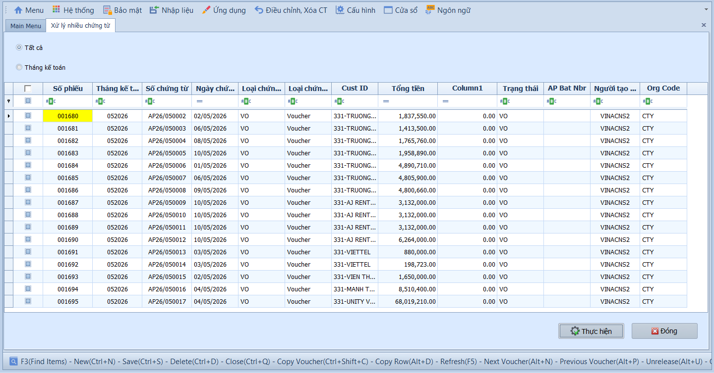

# 2.3 Phân mục xử lý: AP xử lý nhiều chứng từ

### Ghi sổ nhiều chứng từ

**Nghiệp vụ áp dụng:** Khi cần ghi sổ hoặc bỏ ghi sổ hàng loạt các chứng từ phải trả trong kỳ — thay vì phải mở từng hóa đơn/phiếu thanh toán để xử lý riêng lẻ.

> **Ví dụ:** Cuối ngày, kế toán trưởng rà soát và ghi sổ hàng loạt 15 hóa đơn NCC tháng 01/2026 đang ở trạng thái Chưa ghi sổ để phản ánh lên Sổ cái.

Để xử lý hàng loạt chứng từ, người dùng thực hiện như sau:

1. Chọn phạm vi hiển thị: **Tất cả** để lấy toàn bộ chứng từ, hoặc **Tháng kế toán** để lọc theo tháng cụ thể.
2. Tích chọn từng chứng từ cần xử lý, hoặc tích ô đầu cột để chọn tất cả.
3. Nhấn **Thực hiện** để chạy xử lý hàng loạt, sau đó nhấn **Đóng** để thoát.

- **Ô chọn và bộ lọc:**
  - Tất cả: Hiển thị chứng từ theo phạm vi hệ thống cho phép.
  - Tháng kế toán: Chỉ hiển thị chứng từ thuộc kỳ được chọn.
  - Ô chọn từng dòng: Chọn hóa đơn/phiếu thanh toán cần ghi sổ hoặc hủy ghi sổ.
  - Ô chọn đầu cột: Chọn nhanh toàn bộ chứng từ đang hiển thị.

- **Các nút chức năng:**
  - Xem lưới/Tải dữ liệu: Lấy danh sách chứng từ theo điều kiện lọc.
  - Thực hiện: Xử lý các chứng từ đã chọn.
  - Đóng: Thoát khỏi màn hình.

- **Lưu ý khi thao tác:**
  - Chỉ ghi sổ sau khi đã kiểm tra hóa đơn, nhà cung cấp, tài khoản công nợ, thuế và tổng tiền.
  - Không chọn tất cả nếu lưới đang hiển thị nhiều kỳ chưa được rà soát.
  - Chứng từ thuộc kỳ đã khóa hoặc thiếu dữ liệu bắt buộc có thể không ghi sổ được.

> **Hệ thống tự kiểm tra khi xử lý:** Chứng từ phải hợp lệ, kỳ kế toán còn mở và người dùng phải có quyền ghi sổ/bỏ ghi sổ.

> **Lưu ý:** Chỉ các chứng từ đang ở trạng thái Chưa ghi sổ mới được hiển thị để ghi sổ. Sau khi ghi sổ, chứng từ chuyển sang trạng thái Đã ghi sổ và phản ánh lên Sổ cái GL.
