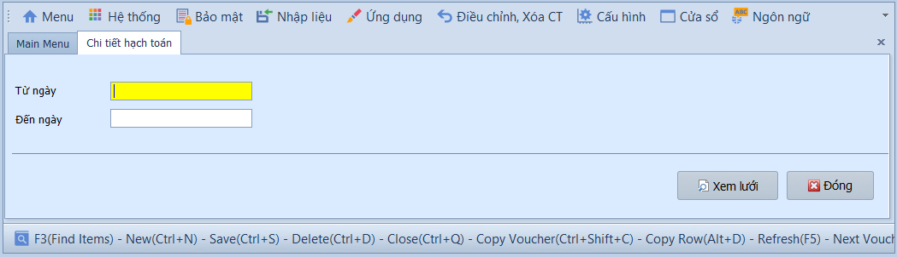
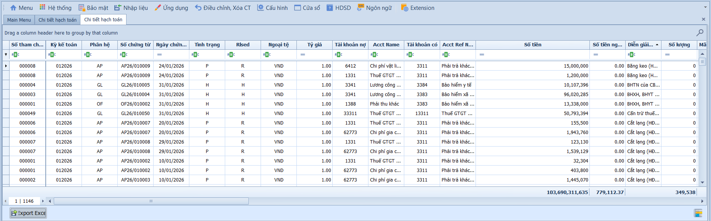

# 1.4 Chi tiết hạch toán

### Chi tiết hạch toán

**Nghiệp vụ áp dụng:** Khi cần trích xuất và rà soát toàn bộ các bút toán định khoản chi tiết (Nợ/Có) phát sinh trong một khoảng thời gian — phục vụ kiểm tra, đối chiếu số liệu trước khi lên báo cáo hoặc khóa sổ.

> **Ví dụ:** Cuối tháng, kế toán trưởng xem chi tiết tất cả bút toán phát sinh tháng 01/2026 để kiểm tra xem có bút toán Nợ 642 / Có 142 nào bị nhập sai số tiền không.

Để xem báo cáo, người dùng thực hiện như sau:

1. Nhập khoảng thời gian vào ô **Từ ngày / Đến ngày**.
2. Chọn thêm điều kiện lọc nếu cần, ví dụ phân hệ, tài khoản, loại tiền hoặc đối tượng liên quan.
3. Nhấn **Xem lưới** để hiển thị báo cáo.
4. Kiểm tra từng dòng định khoản và dùng chức năng in/xuất Excel để lưu file đối chiếu nếu cần.

- **Các nút chức năng:**
  - Xem lưới: Tải dữ liệu chi tiết hạch toán theo điều kiện đã chọn.
  - Xuất Excel: Xuất danh sách bút toán chi tiết để lọc, đối chiếu hoặc gửi kiểm toán.
  - In: In báo cáo theo mẫu.
  - Đóng: Thoát khỏi màn hình.

- **Lưu ý khi thao tác:**
  - Nếu không thấy chứng từ, kiểm tra lại khoảng ngày, trạng thái ghi sổ và phân hệ phát sinh.
  - Báo cáo có thể hiển thị dữ liệu từ nhiều phân hệ; cần đối chiếu số chứng từ và phân hệ nguồn trước khi kết luận sai lệch.
  - Khi lọc theo tài khoản công nợ, nên đối chiếu thêm với báo cáo chi tiết AP/AR tương ứng.

> **Hệ thống tự kiểm tra khi xem lưới:** Khoảng ngày phải hợp lệ; nếu điều kiện lọc quá rộng, báo cáo có thể tải chậm do số dòng bút toán lớn.

> **Lưu ý:** Báo cáo hiển thị tất cả bút toán từ mọi phân hệ (GL, AP, AR, CA…) đã ghi sổ trong khoảng thời gian được chọn.
