# 1.5 Phân mục báo cáo

> **Lưu ý:** Trước khi xem Báo cáo tài chính, cần cấu hình chỉ tiêu tại **Cài đặt → Thiết lập Báo cáo tình hình tài chính** để mapping tài khoản vào bảng cân đối kế toán.

### Nút và tùy chọn chung trên các báo cáo GL

**Nghiệp vụ áp dụng:** Hầu hết báo cáo trong phân hệ Kế toán tổng hợp dùng chung một nhóm nút và điều kiện lọc. Người dùng cần hiểu ý nghĩa các nút này để xem đúng kỳ, đúng loại tiền và xuất dữ liệu phục vụ kiểm toán/đối chiếu.

- **Điều kiện lọc thường gặp:**
  - Từ ngày / Đến ngày: Khoảng thời gian lấy số liệu.
  - Kỳ hiện tại / Kỳ so sánh: Dùng cho báo cáo có so sánh cùng kỳ hoặc kỳ trước.
  - Loại tiền: Chọn VND hoặc ngoại tệ nếu báo cáo hỗ trợ.
  - Tất cả / Theo từng tài khoản: Chọn xem toàn bộ tài khoản hoặc lọc một tài khoản cụ thể.
  - Mã vụ việc / công trình / trung tâm chi phí: Dùng cho báo cáo quản trị theo dự án, công trình hoặc khoản mục.

- **Các nút chức năng:**
  - Xem lưới: Tải dữ liệu theo điều kiện lọc.
  - In: In báo cáo theo mẫu.
  - Xuất Excel: Xuất dữ liệu ra Excel để gửi kiểm toán hoặc xử lý thêm.
  - Làm mới: Tải lại dữ liệu sau khi thay đổi điều kiện lọc.
  - Đóng: Thoát khỏi màn hình báo cáo.

- **Lưu ý khi thao tác:**
  - Trước khi xem báo cáo tài chính, cần chắc chắn các chứng từ trong kỳ đã ghi sổ và kỳ chưa bị thiếu bút toán kết chuyển.
  - Nếu số liệu báo cáo không khớp, đối chiếu theo thứ tự: Bảng cân đối số phát sinh → Sổ cái tổng hợp → Sổ cái chi tiết → chứng từ gốc.
  - Với báo cáo theo ngoại tệ, kiểm tra lại loại tiền và tỷ giá của chứng từ gốc trước khi kết luận chênh lệch.

> **Hệ thống tự kiểm tra khi xem báo cáo:** Khoảng ngày/kỳ báo cáo phải hợp lệ. Báo cáo tài chính phụ thuộc cấu hình chỉ tiêu và bút toán kết chuyển; nếu cấu hình thiếu, số liệu có thể không lên đủ chỉ tiêu.

---

### Báo cáo tài chính

**Nghiệp vụ áp dụng:** Khi cần lên bộ Báo cáo tài chính tổng hợp theo quy định (Bảng cân đối kế toán, Kết quả HĐKD, Lưu chuyển tiền tệ) để nộp cơ quan thuế hoặc phục vụ quản trị nội bộ.

Để xem báo cáo, người dùng thực hiện như sau:

1. Nhập khoảng thời gian vào ô **Từ ngày / Đến ngày**.
2. Nhấn **Xem lưới** để hiển thị báo cáo.

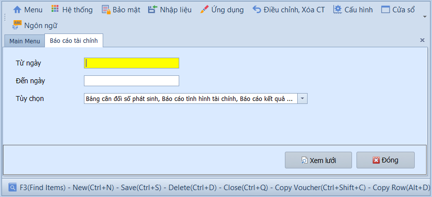

---

### Bảng cân đối số phát sinh

**Nghiệp vụ áp dụng:** Khi cần kiểm tra tổng phát sinh Nợ/Có và số dư cuối kỳ của tất cả tài khoản — đây là bước kiểm tra bắt buộc trước khi lên Báo cáo tài chính để đảm bảo tổng Nợ = tổng Có.

> **Ví dụ:** Kiểm tra bảng cân đối tháng 01/2026 để xác nhận tổng phát sinh Nợ = tổng phát sinh Có trước khi nộp báo cáo.

Để xem báo cáo, người dùng thực hiện như sau:

1. Nhập khoảng thời gian vào ô **Từ ngày / Đến ngày** và chọn **Loại tiền** (mặc định VND).
2. Nhấn **Xem lưới** để hiển thị báo cáo.

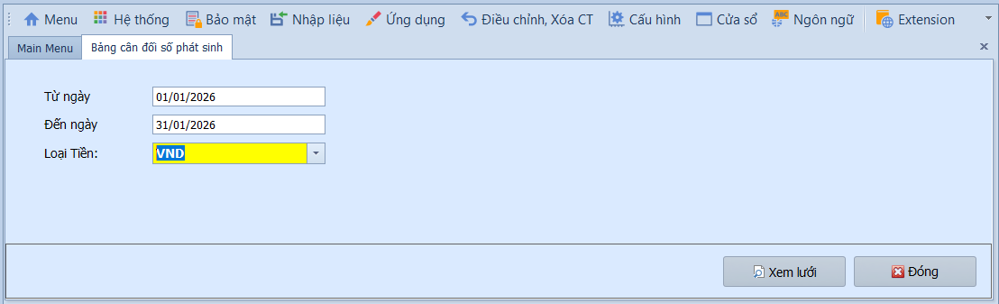

---

### Báo cáo tình hình tài chính

**Nghiệp vụ áp dụng:** Khi cần lên Bảng cân đối kế toán (Báo cáo tình hình tài chính) theo biểu mẫu Thông tư 99/TT-BTC — thể hiện tài sản, nợ phải trả và vốn chủ sở hữu tại thời điểm báo cáo.

Để xem báo cáo, người dùng thực hiện như sau:

1. Nhập khoảng thời gian vào ô **Từ ngày / Đến ngày**.
2. Nhấn **Xem lưới** để hiển thị báo cáo.

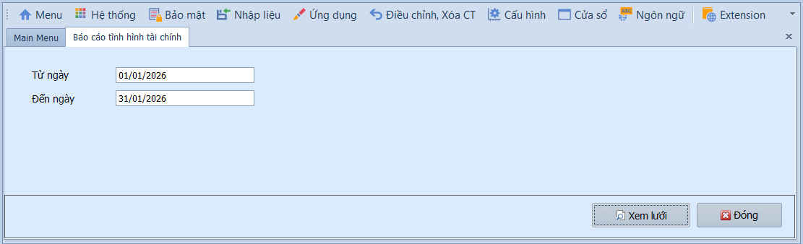

---

### Báo cáo kết quả hoạt động kinh doanh

**Nghiệp vụ áp dụng:** Khi cần xem kết quả kinh doanh (doanh thu, chi phí, lợi nhuận) của kỳ hiện tại và so sánh với kỳ trước — phục vụ đánh giá hiệu quả hoạt động và nộp cơ quan thuế.

> **Ví dụ:** So sánh doanh thu thuần tháng 01/2026 với tháng 01/2025 để đánh giá tăng trưởng.

Để xem báo cáo, người dùng thực hiện như sau:

1. Nhập khoảng thời gian vào ô **Từ ngày / Đến ngày** (Kỳ hiện tại và kỳ so sánh).
2. Nhấn **Xem lưới** để hiển thị báo cáo.

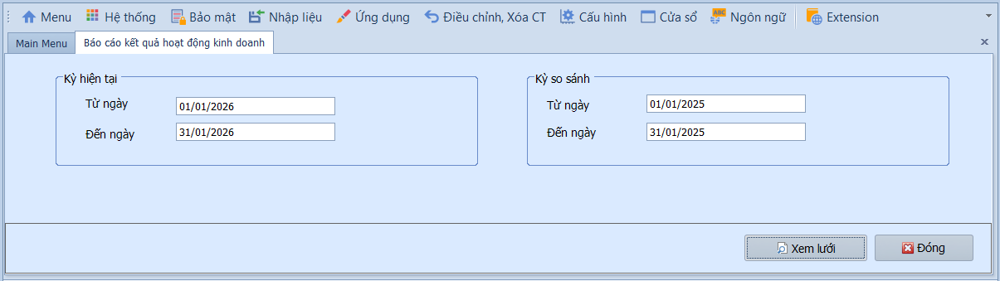

---

### Báo cáo lưu chuyển tiền tệ

**Nghiệp vụ áp dụng:** Khi cần xem dòng tiền vào/ra trong kỳ theo 3 hoạt động: kinh doanh, đầu tư, tài chính — phục vụ quản trị dòng tiền và nộp báo cáo.

Để xem báo cáo, người dùng thực hiện như sau:

1. Nhập khoảng thời gian vào ô **Từ ngày / Đến ngày**.
2. Nhấn **Xem lưới** để hiển thị báo cáo.

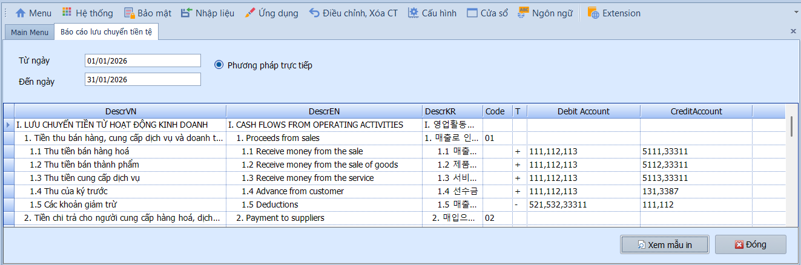

---

### Báo cáo lãi lỗ theo công trình

**Nghiệp vụ áp dụng:** Khi doanh nghiệp theo dõi doanh thu/chi phí theo từng công trình, dự án, vụ việc — cần xem lãi/lỗ riêng biệt từng công trình để đánh giá hiệu quả đầu tư.

> **Ví dụ:** Xem lãi/lỗ riêng của công trình "Nhà máy ABC" — tổng doanh thu 500tr, tổng chi phí 420tr → lãi 80tr.

Để xem báo cáo, người dùng thực hiện như sau:

1. Nhập khoảng thời gian vào ô **Từ ngày / Đến ngày**.
2. Nhấn **Xem lưới** để hiển thị báo cáo.

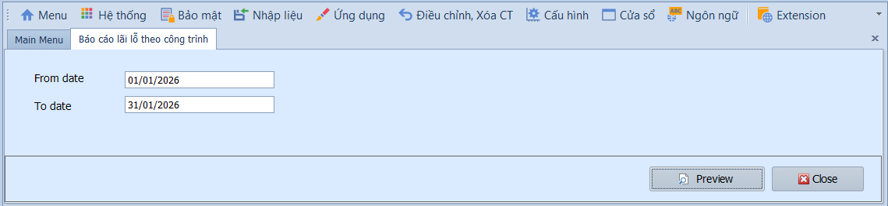

---

### Sổ cái tổng hợp

**Nghiệp vụ áp dụng:** Khi cần xem số dư đầu kỳ, phát sinh Nợ/Có và số dư cuối kỳ của tất cả tài khoản — là sổ sách kế toán bắt buộc theo quy định, phục vụ kiểm toán và lưu trữ.

Để xem báo cáo, người dùng thực hiện như sau:

1. Nhập khoảng thời gian vào ô **Từ ngày / Đến ngày**.
2. Nhấn **Xem lưới** để hiển thị báo cáo.

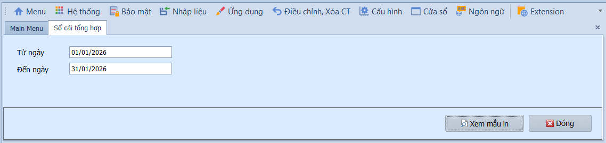

---

### Sổ cái chi tiết

**Nghiệp vụ áp dụng:** Khi cần xem chi tiết từng bút toán phát sinh của một hoặc tất cả tài khoản trong kỳ — phục vụ đối chiếu, kiểm tra và truy xuất nguồn gốc từng nghiệp vụ.

> **Ví dụ:** Xem sổ cái chi tiết TK 642 tháng 01/2026 để kiểm tra từng khoản chi phí quản lý doanh nghiệp phát sinh.

Để xem báo cáo, người dùng thực hiện như sau:

1. Nhập khoảng thời gian vào ô **Từ ngày / Đến ngày** và chọn **Loại tiền** (mặc định VND).
2. Chọn xem **Tất cả** tài khoản hoặc lọc **Theo từng tài khoản** cụ thể.
3. Nhấn **Xem lưới** để hiển thị báo cáo.

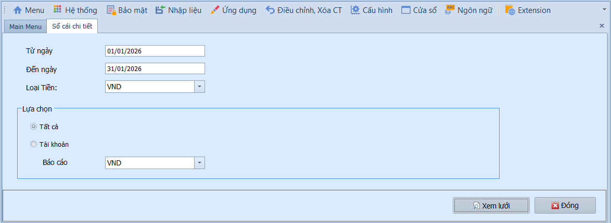

---

### Bảng kê chi phí sản xuất

**Nghiệp vụ áp dụng:** Khi cần tổng hợp chi phí sản xuất (TK 621, 622, 627, 154…) trong kỳ — phục vụ tính giá thành sản phẩm và kiểm soát chi phí sản xuất.

Để xem báo cáo, người dùng thực hiện như sau:

1. Nhập khoảng thời gian vào ô **Từ ngày / Đến ngày**.
2. Nhấn **Xem lưới** để hiển thị báo cáo.

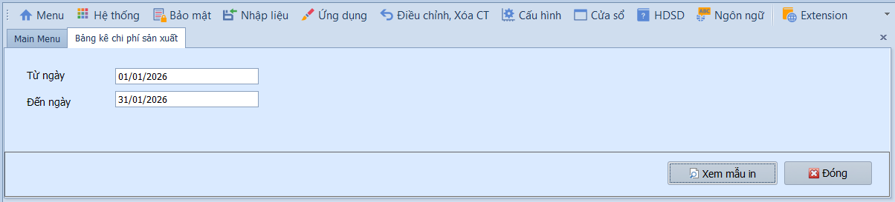

---

### Bảng kê chi phí ngoài sản xuất

**Nghiệp vụ áp dụng:** Khi cần tổng hợp chi phí bán hàng (TK 641) và chi phí quản lý doanh nghiệp (TK 642) trong kỳ hiện tại, so sánh với kỳ trước — phục vụ kiểm soát chi phí hoạt động.

Để xem báo cáo, người dùng thực hiện như sau:

1. Nhập khoảng thời gian vào ô **Từ ngày / Đến ngày** (Kỳ hiện tại và kỳ so sánh).
2. Nhấn **Xem lưới** để hiển thị báo cáo.

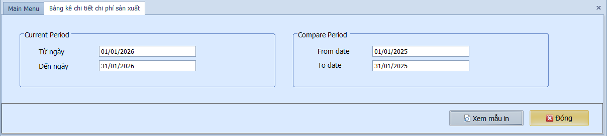

---

### Sổ nhật ký chung

**Nghiệp vụ áp dụng:** Khi cần xem toàn bộ các nghiệp vụ kinh tế phát sinh theo thứ tự thời gian — sổ nhật ký chung là sổ sách bắt buộc theo quy định kế toán, ghi nhận mọi nghiệp vụ trước khi chuyển vào sổ cái.

Để xem báo cáo, người dùng thực hiện như sau:

1. Nhập khoảng thời gian vào ô **Từ ngày / Đến ngày**.
2. Nhấn **Xem lưới** để hiển thị báo cáo.

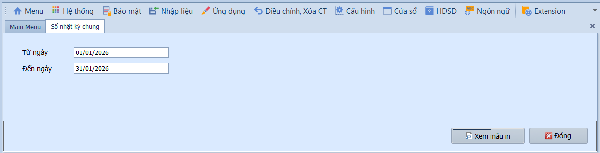

---

### Danh sách tài khoản

**Nghiệp vụ áp dụng:** Khi cần in hoặc xuất danh sách toàn bộ tài khoản kế toán đang sử dụng trong hệ thống — phục vụ kiểm toán hoặc lưu trữ hồ sơ.

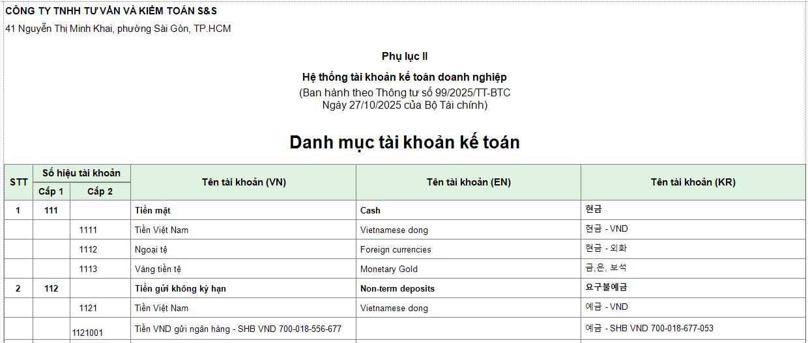

---

### In phiếu hạch toán

**Nghiệp vụ áp dụng:** Khi cần in phiếu hạch toán (chứng từ ghi sổ) theo khoảng thời gian để lưu trữ hồ sơ kế toán hoặc đính kèm chứng từ gốc.

Để in phiếu hạch toán, người dùng thực hiện như sau:

1. Nhập khoảng thời gian vào ô **Từ ngày / Đến ngày**.
2. Nhấn **Xem lưới** để hiển thị báo cáo.

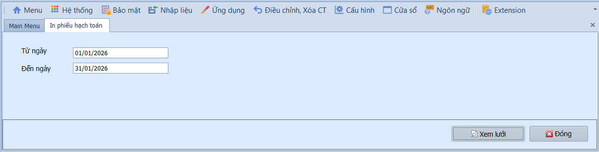
