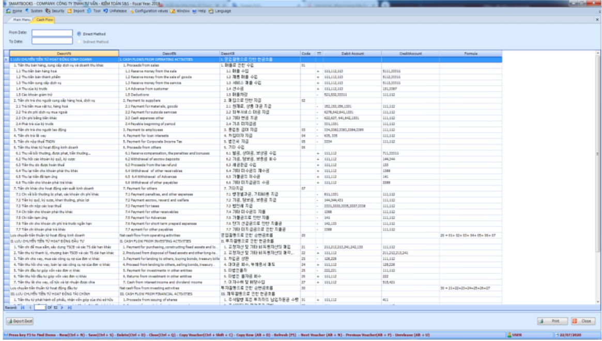

# 1.5 Phân mục báo cáo (Reports)

Sau khi dữ liệu kế toán đã được xử lý tại các phân hệ kế toán người sử dụng sẽ kết xuất được các Báo cáo sau:

#### a) Bảng cân đối phát sinh (Trial Balance):

* Chọn kỳ kế toán cần kết xuất (Từ ngày…Đến ngày…)
* Chọn đơn vị tiền tệ cần thể hiện (Currency ID).
* Chọn xuất excel nếu muốn xuất ra 1 file excel hoàn chỉnh.
* Chọn xem trước nếu muốn xem trước khi in.
* Chọn xem in nếu muốn in trực tiếp.
* Chọn đóng để thoát.
* Chi tiết Chọn Xem

Xem báo cáo cân đối phát sinh trên lưới dữ liệu

.png>)

Với lưới dữ liệu:

* Các tài khoản không phải tài khoản công nợ (131,331) khi click đúp dòng dữ liệu chi tiết sẽ hiện báo cáo chi tiết theo tài khoản

.png>)

* Các tài khoản công nợ (131,331) khi click đúp sẽ hiện thông tin công nợ tổng hợp

.png>)

* Các nút
* In : báo cáo bảng cân đối phát sinh tổng hợp
* Export Excel : Export file excel với các dữ liệu trên lưới

Ví dụ : Export file excel với số liệu tổng hợp công nợ 331

Bước 1 : Click đúp tài khoản 331 >>> Lưới dữ liệu sẽ hiện thêm thông tin tổng hợp công nợ

Bước 2 : Click nút Export Excel

.png>)

#### b) Sổ cái tổng hợp (Ledger Account Listing Sumary Report)

* Chọn kỳ kế toán cần kết xuất (Từ ngày…Đến ngày…)
* Chọn đơn vị tiền tệ cần thể hiện (Currency ID)
* Chọn loại tài khoản cần kết xuất (Option)

&#x20;\+ All (tất cả)

&#x20;**+** Account (nhấn F3 để chọn tài khoản)

* Chọn xem để kiểm tra báo cáo trước khi in.
* Chọn đóng nếu muốn thoát.
* Chọn Export Excel để xuất báo cáo file excel

.png>)

Export excel với lựa chọn tất cả các tài khoản (All) :

* Sheet DOCSMAP : Danh mục các tài khoản chi tiết có trên file excel báo cáo
* Click vào tài khoản để kết nối đến sheet cần xem
* Trên từng sheet excel chi tiết : click DOCSMAP (ô B10) để trở về sheet DOCSMAP

#### c) Sổ cái chi tiết (Ledger Account Listing Detail Report)

.png>)

* Chọn kỳ kế toán cần kết xuất (Từ ngày…Đến ngày…)
* Chọn đơn vị tiền tệ cần thể hiện (Currency ID)
* Chọn loại tài khoản cần kết xuất (Option)

&#x20;\+ All (tất cả)

&#x20;**+** Account (nhấn F3 để chọn tài khoản)

* Chọn xem để kiểm tra báo cáo trước khi in.
* Chọn đóng nếu muốn thoát
* Chọn Export Excel để xuất báo cáo file excel

Các lựa chọn

\+ Full Reports: Báo cáo chi tiết bao gồm cả các báo cáo tài chính

.png>)

&#x20;\_ Bảng cân đối kế toán

&#x20;\_ Bảng cân đối phát sinh

&#x20;\_ Báo cáo kết quả hoạt động kinh doanh

&#x20;\_ Báo cáo chi tiết các tài khoản

\_ Sheet DOCSMAP: Danh mục tài khoản chi tiết và kết nối đến các sheet tài khoản

\+ VND-USD: In báo cáo hoặc export excel với loại tiền VNĐ và USD đồng thời

\+ Main Accout: View báo cáo hoặc export Excel với tài khoản cấp 1

Ví dụ: 111, 112….

#### d) Bảng cân đối kế toán (Balance sheet):

* Chọn kỳ kế toán cần kết xuất (Từ ngày…Đến ngày…)
* Chọn kết xuất excel nếu muốn kết xuất ra file excel.
* Chọn xem in để in báo cáo.
* Chọn xem trước để kiểm tra báo cáo trước khi in

.png>)

Các lựa chọn

* Xem chi tiết : Click nút xem chi tiết sẽ hiện các thông tin dữ liệu các chỉ tiêu được lấy từ tài khoản nào

.png>)

* Export Excel : Export ra excel file với các lựa chọn

\+ Chi tiết : Khi chọn lựa chon sẽ xuất excel file với thông tin các chỉ tiêu từ tài khoản chi tiết

\+ Tổng hơp : Xuất file excel chỉ bao gồm các chỉ tiêu

* In : In báo cáo

\+ Với lưới dữ liệu tổng hợp sẽ in theo số liệu tổng hợp

\+ Với lưới dữ liệu đang hiện chi tiết sẽ in báo cáo với số liệu chi tiết tài khoản

#### e) Báo cáo kết quả hoạt động kinh doanh (Income Statement):

* Chọn kỳ kế toán cần kết xuất (Từ ngày ... Đến ngày ...)
* Chọn kết xuất ra excel nếu muốn kết xuất ra file excel.
* Chọn xem in để in và xem báo cáo.
* Chọn xem trước để kiểm tra báo cáo trước khi in

.png>)

Các lựa chọn

* Xem chi tiết : Click nút xem chi tiết sẽ hiện các thông tin dữ liệu các chỉ tiêu được lấy từ tài khoản nào

.png>)

* Export Excel : Export ra excel file với các lựa chọn

\+ Chi tiết : Khi chọn lựa chon sẽ xuất excel file với thông tin các chỉ tiêu từ tài khoản chi tiết

\+ Tổng hơp : Xuất file excel chỉ bao gồm các chỉ tiêu

* In : In báo cáo

\+ Với lưới dữ liệu tổng hợp sẽ in theo số liệu tổng hợp

\+ Với lưới dữ liệu đang hiện chi tiết sẽ in báo cáo với số liệu chi tiết tài khoản

#### &#x20;f) Báo cáo lưu chuyển tiền tệ (Cash Flow)

<figure><figcaption></figcaption></figure>

* Chọn kỳ kế toán cần kết xuất (Từ ngày ... Đến ngày ...)
* Chọn xem in để in và xem báo cáo.

#### g) Danh sách tài khoản (Chart of Account)

* Chọn Print để in danh sách tài khoản đã thiết lập
* Chọn kết xuất nếu muốn kết xuất danh sách tài khoản ra excel.

#### h) Bảng cân đối phát sinh theo ngày (Daily Trial Balance)

* Chọn khoảng thời gian cần kết xuất (Từ ngày ... Đến ngày ...)
* Chọn xem in để in và xem báo cáo.

#### i) Bảng kê chi phí sản xuất (Particulars of Manufacturing Cost Statement)

* Chọn kỳ kế toán cần kết xuất (Từ ngày ... Đến ngày ...)
* Chọn in để in và xem báo cáo.

#### &#x20;j) Bảng kê chi phí ngoài sản xuất (Non-Manufacturing Cost Statement)

* Chọn kỳ kế toán cần kết xuất (Từ ngày ... Đến ngày ...)
* Chọn xem in để in và xem báo cáo.

#### k) Sổ nhật ký chung (General Journal)

* Chọn kỳ kế toán cần kết xuất (Từ ngày ... Đến ngày ...)
* Chọn xem in để in và xem báo cáo.

#### &#x20;l) In phiếu hạch toán

* Chọn kỳ kế toán cần in phiếu hạch toán (Từ ngày ... Đến ngày ...)
* Chọn xem in để in và xem báo cáo.

#### m) In báo cáo số dư Tiền mặt

\-        Chọn kỳ kế toán cần in phiếu hạch toán (Từ ngày ... Đến ngày ...)

\-        Chọn các lựa chọn (Options)

\-        Chọn xem in để in và xem báo cáo.

<figure><figcaption></figcaption></figure>

#### n) Báo cáo các bút toán kết chuyển tự động

\-        Chọn kỳ kế toán cần in phiếu hạch toán (Từ ngày ... Đến ngày ...)

Chọn xem in để in và xem báo cáo.

#### o) Bảng kê chi tiết chi phí sản xuất

* Chọn kỳ kế toán hiện tại cần kết xuất (Từ ngày ... Đến ngày ...)
* Chọn kỳ so sánh để so sánh (Từ ngày ... Đến ngày ...)
* Chọn xem in để in và xem báo cáo.

#### p) Bảng kê chi tiết kết quả sản xuất kinh doanh

* Chọn kỳ kế toán hiện tại cần kết xuất (Từ ngày ... Đến ngày ...)
* Chọn kỳ so sánh để so sánh (Từ ngày ... Đến ngày ...)
* Chọn xem in để in và xem báo cáo.

#### q) In phiếu chi

* Chọn từ ngày … đến ngày…
* Chọn xem in để in và xem.

#### r) In phiếu thu

* Chọn từ ngày … đến ngày…
* Chọn xem in để in và xem.

#### s) Trial Balance by period:

<figure><figcaption></figcaption></figure>

\-        Chọn kỳ kế toán (Từ ngày -> Đến ngày)

\-        Nhấn vào nút xuất Excel nếu bạn muốn xuất báo cáo ra file Excel.

\-        Click xem in để kiểm tra báo cáo trước khi in

\-        Xem in

<figure><figcaption></figcaption></figure>

<figure><figcaption></figcaption></figure>

#### t) Balance sheet by period:

\-        Chọn kỳ kế toán (Từ ngày -> Đến ngày)

\-        Nhấn vào nút xuất Excel nếu bạn muốn xuất báo cáo ra file Excel.

\-        Click xem in để kiểm tra báo cáo trước khi in

\-        Xem in

<figure><figcaption></figcaption></figure>

Tùy chọn:

\-        Xem chi tiết: Tương tự như bảng cân đối kế toán

Nhất nút xem chi tiết: Lưới dữ liệu sẽ hiển thị chi tiết số lượng từ các tài khoản số tiền

<figure><figcaption></figcaption></figure>

\+  Xuất Excel

#### u)     Income Statement by period:

\-        Chọn kỳ kế toán (Từ ngày -> Đến ngày)

\-        Nhấn vào nút xuất Excel nếu bạn muốn xuất báo cáo ra file Excel.

\-        Click xem in để kiểm tra báo cáo trước khi in

\-        Xem in

<figure><figcaption></figcaption></figure>

Options:

\-        Xem chi tiết: Tương tự như bảng cân đối kế toán

Nhất nút xem chi tiết: Lưới dữ liệu sẽ hiển thị chi tiết số lượng từ các tài khoản số tiền

<figure><figcaption></figcaption></figure>

* Xuất Excel

<figure><figcaption></figcaption></figure>
