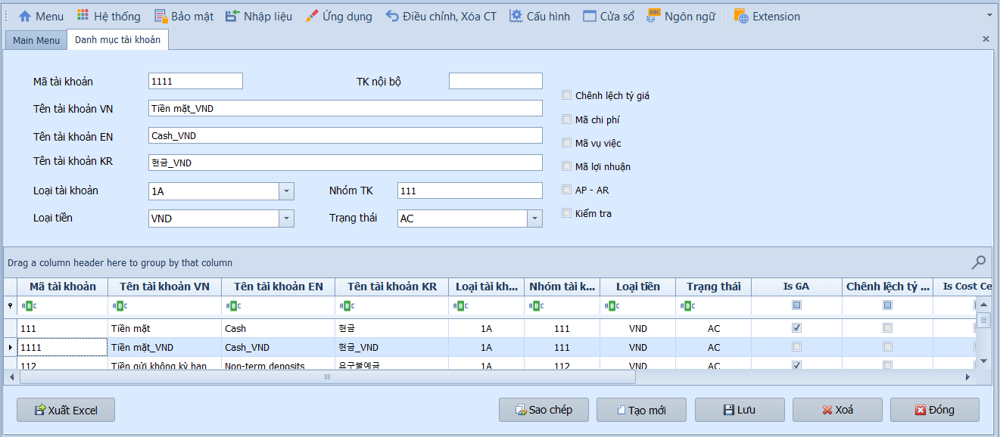
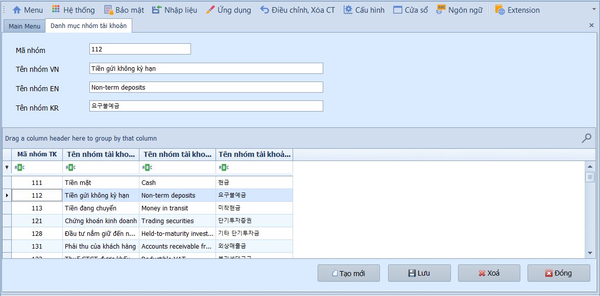
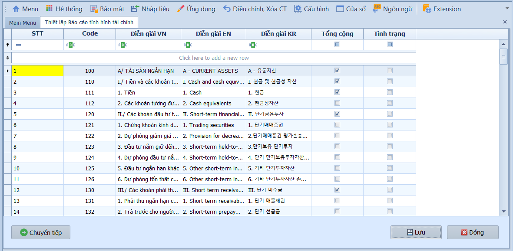
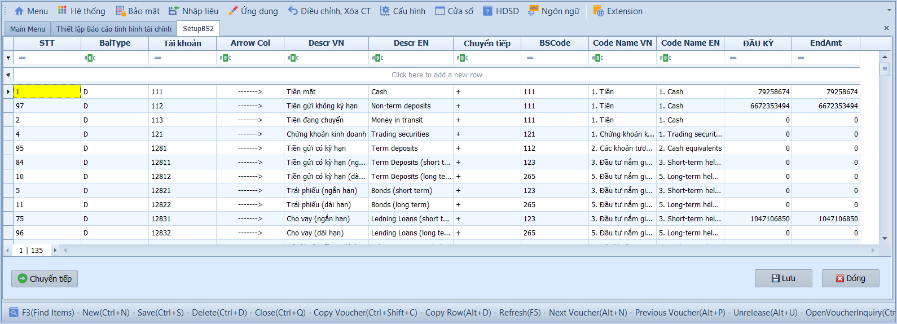
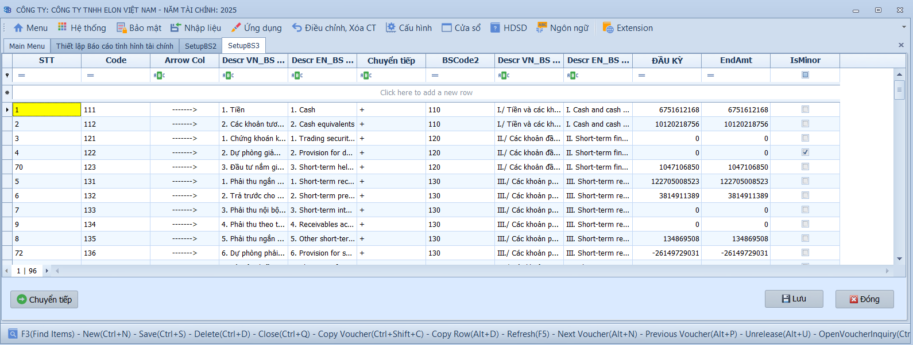
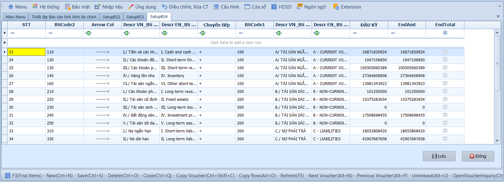
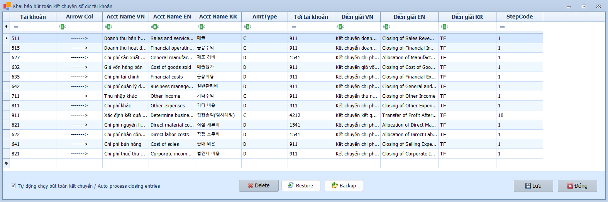

# 1.1 Phân mục cài đặt

### Danh mục tài khoản

**Nghiệp vụ áp dụng:** Khi cần khai báo hoặc chỉnh sửa hệ thống tài khoản kế toán của doanh nghiệp. Hệ thống đã cung cấp sẵn danh mục theo Thông tư số 99/TT-BTC và cho phép bổ sung tài khoản cấp 2, cấp 3… tùy theo đặc thù doanh nghiệp.

> **Ví dụ:** Doanh nghiệp cần thêm tài khoản 6421 — Chi phí bán hàng (lương nhân viên kinh doanh) dưới tài khoản cấp 1 là 642.

Để khai báo danh mục tài khoản, người dùng thực hiện:

1. Nhập mã và tên tài khoản (hỗ trợ đa ngôn ngữ), chọn loại tài khoản (Asset / Liability / Income / Expense) và **nhóm tài khoản** (chọn từ danh mục nhóm tài khoản).
2. Chọn loại tiền và tình trạng (AC: đang dùng / IN: ngừng dùng).
3. Tích chọn Mã chi phí / Vụ việc / Lợi nhuận nếu muốn bắt buộc nhập khi hạch toán; tích AR–AP nếu là tài khoản công nợ để kích hoạt tính năng bù trừ.
4. Nhấn **Lưu** để hoàn tất.

- **Ô chọn và tùy chọn quan trọng:**
  - Mã chi phí: Khi tích chọn, chứng từ phát sinh tài khoản này phải nhập mã chi phí để báo cáo chi phí theo khoản mục.
  - Vụ việc: Khi tích chọn, chứng từ phát sinh tài khoản này phải nhập mã vụ việc/công trình/dự án.
  - Lợi nhuận: Khi tích chọn, chứng từ phát sinh tài khoản này phải nhập mã lợi nhuận để phục vụ báo cáo quản trị.
  - AR-AP: Dùng cho tài khoản công nợ phải thu/phải trả. Khi tích chọn, hệ thống yêu cầu mã khách hàng/nhà cung cấp và cho phép theo dõi/bù trừ công nợ.
  - Tình trạng AC/IN: AC là tài khoản đang sử dụng; IN là tài khoản ngừng sử dụng, không nên chọn trên chứng từ mới.

- **Các nút chức năng:**
  - F3 tại mã tài khoản: Tìm tài khoản đã khai báo để xem hoặc chỉnh sửa.
  - Lưu: Lưu thông tin tài khoản và các điều kiện kiểm soát đi kèm.
  - Thêm mới: Tạo tài khoản mới.
  - Xóa: Xóa tài khoản chưa phát sinh dữ liệu.
  - Đóng: Thoát khỏi màn hình.

> **Hệ thống tự kiểm tra khi Lưu:**
> - Mã tài khoản và tên tài khoản không được để trống.
> - Tài khoản con phải nằm đúng cấp/tài khoản cha theo hệ thống tài khoản.
> - Không nên xóa hoặc đổi bản chất tài khoản đã phát sinh chứng từ vì sẽ ảnh hưởng sổ cái, công nợ và báo cáo tài chính.

> **Lưu ý:** Việc thiết lập danh mục tài khoản ảnh hưởng trực tiếp đến sổ tổng hợp, chi tiết và Báo cáo tài chính nên người sử dụng cần xem xét kỹ trước khi xoá tài khoản. Nếu đã tạo các nghiệp vụ hạch toán liên quan đến tài khoản cần xóa sẽ ảnh hưởng đến tính chính xác của các báo cáo.

---

### Danh mục nhóm tài khoản

**Nghiệp vụ áp dụng:** Khi cần phân loại các tài khoản kế toán theo nhóm (Tài sản ngắn hạn, Tài sản dài hạn, Nợ phải trả, Vốn chủ sở hữu…) để phục vụ lên Báo cáo tình hình tài chính. Hệ thống đã cung cấp sẵn danh mục nhóm cấp 1 và cấp 2 theo Thông tư 99/TT-BTC.

> **Ví dụ:** Nhóm "Tài sản ngắn hạn" bao gồm: Tiền và tương đương tiền (111, 112), Các khoản phải thu (131, 136, 138)…

Để khai báo danh mục nhóm tài khoản, người dùng thực hiện:

1. Nhập mã và tên nhóm tài khoản.
2. Nhấn **Lưu** để hoàn tất.

- **Các nút chức năng:**
  - F3 tại mã nhóm: Tìm nhóm tài khoản đã khai báo.
  - Lưu: Lưu nhóm tài khoản.
  - Thêm mới: Tạo nhóm mới.
  - Xóa: Xóa nhóm chưa được sử dụng.
  - Đóng: Thoát khỏi màn hình.

> **Hệ thống tự kiểm tra khi Lưu:** Mã nhóm không được để trống và không nên xóa nhóm đã được gán cho tài khoản kế toán.

---

### Thiết lập báo cáo tình hình tài chính

**Nghiệp vụ áp dụng:** Khi cần cấu hình (mapping) các chỉ tiêu trên Báo cáo tình hình tài chính — gán số dư tài khoản vào từng chỉ tiêu báo cáo. Hệ thống đã thiết lập sẵn theo biểu mẫu Thông tư 99/TT-BTC; người dùng chỉ cần kiểm tra và tùy chỉnh nếu cần.

> **Ví dụ:** Gán số dư Nợ TK 111 (Tiền mặt) vào chỉ tiêu "Tiền và tương đương tiền" trên bảng cân đối kế toán.

Để thiết lập, vào phân hệ **Kế toán tổng hợp**, chọn **Thiết lập Báo cáo tình hình tài chính**, thực hiện theo các bước sau:

**Bước 1: Thiết lập thông tin chỉ tiêu báo cáo**

- **Thông tin chỉ tiêu:**
  - Code: Mã chỉ tiêu theo chuẩn Thông tư 99.
  - Diễn giải VN / EN / KR: Tên chỉ tiêu bằng tiếng Việt, Anh, Hàn.
  - Tổng cộng: Tích chọn nếu đây là chỉ tiêu tổng — hệ thống sẽ tự cộng từ các chỉ tiêu con và không cho phép gán tài khoản trực tiếp.
  - Tình trạng: Tích chọn để ẩn chỉ tiêu này khỏi báo cáo tài chính; để trống nếu muốn hiển thị bình thường.

**Bước 2: Chỉ định số dư tài khoản theo mã chỉ tiêu**

Tại lưới dữ liệu, người dùng khai báo các thông tin gán tài khoản vào chỉ tiêu báo cáo:

- **Lưới chỉ định tài khoản:**
  - Loại số dư: Chọn D (lấy số dư Nợ) hoặc C (lấy số dư Có).
  - Tài khoản / Descr VN / EN: Chọn tài khoản kế toán cần gán và tên diễn giải tương ứng.
  - Chuyển tiếp: Điền + nếu giá trị dương, - nếu giá trị âm (các khoản giảm trừ, hao mòn...).
  - Mã chỉ tiêu / Tên chỉ tiêu VN / EN: Chọn chỉ tiêu báo cáo và tên tương ứng từ danh mục đã thiết lập.

> **Ví dụ:** Dòng STT = 1 lấy số dư bên Nợ của tài khoản 111, giữ dấu dương ở cột Chuyển tiếp và đưa vào chỉ tiêu 111 trên báo cáo.

Sau khi hoàn tất, nhấn **Lưu** để lưu lại, **Chuyển tiếp** để sang bước tiếp theo, hoặc **Đóng** để thoát.

- **Các nút chức năng và ô chọn:**
  - Tổng cộng: Đánh dấu chỉ tiêu tổng hợp. Chỉ tiêu này lấy số liệu từ các chỉ tiêu con, không lấy trực tiếp từ tài khoản.
  - Tình trạng: Dùng để ẩn/không sử dụng chỉ tiêu trên báo cáo.
  - Lưu: Lưu cấu hình tại bước hiện tại.
  - Chuyển tiếp: Sang bước kế tiếp trong quy trình cấu hình báo cáo.
  - Quay lại: Trở về bước trước để kiểm tra lại thiết lập.
  - Đóng: Thoát khỏi màn hình thiết lập.

> **Hệ thống tự kiểm tra khi Lưu:** Chỉ tiêu tổng không nên gán trực tiếp tài khoản; tài khoản gán vào báo cáo phải tồn tại trong danh mục tài khoản và cần chọn đúng loại số dư Nợ/Có.

**Bước 3: Thiết lập các chỉ tiêu con lên chỉ tiêu cha**

Gán các mã chỉ tiêu con lên các mã chỉ tiêu tổng hợp cao hơn để hệ thống tự động cộng dồn khi lên báo cáo.

**Bước 4: Thiết lập chỉ tiêu tổng lên chỉ tiêu tổng cao nhất**

Gán các chỉ tiêu tổng lên chỉ tiêu tổng cao nhất (các chỉ tiêu này không có số dư trực tiếp từ tài khoản, chỉ cộng từ các chỉ tiêu con).

---

### Khai báo bút toán kết chuyển số dư tài khoản

**Nghiệp vụ áp dụng:** Khi cần cấu hình sẵn các phương thức và thứ tự kết chuyển số dư tài khoản tự động vào thời điểm cuối kỳ (tháng/quý/năm), giảm thiểu sai sót và tiết kiệm thời gian làm việc thủ công.

> **Ví dụ:** Cuối kỳ kết chuyển doanh thu bán hàng — Nợ 511 / Có 911; kết chuyển chi phí quản lý — Nợ 911 / Có 642; sau đó kết chuyển lãi/lỗ — Nợ 911 / Có 4212.

Tại lưới dữ liệu, người dùng khai báo các thông tin cho từng bút toán kết chuyển:

- **Chi tiết khai báo:**
  - Tài khoản / Tên tài khoản: Tài khoản nguồn lấy số dư kết chuyển đi và tên diễn giải (3 ngôn ngữ).
  - Phương thức lấy số dư: Chọn C (số dư Có) hoặc D (số dư Nợ).
  - Tới tài khoản: Tài khoản đích nhận số dư kết chuyển (ví dụ: 911, 1541, 4212...).
  - Diễn giải VN / EN / KR: Nội dung tự động hiển thị trên chứng từ kết chuyển.
  - Thứ tự thực hiện: Bước 1 kết chuyển doanh thu/chi phí về 911 hoặc 1541; Bước 10 kết chuyển từ 911 sang 4212 (thực hiện sau cùng).

- **Các nút chức năng:**
  - Lưu: Lưu danh sách bút toán kết chuyển.
  - Thêm dòng: Khai báo thêm một bút toán kết chuyển.
  - Xóa dòng: Xóa dòng cấu hình chưa cần dùng.
  - Đóng: Thoát khỏi màn hình.

> **Hệ thống tự kiểm tra khi Lưu:** Tài khoản nguồn, phương thức lấy số dư, tài khoản đích và thứ tự thực hiện là các thông tin cần kiểm tra kỹ. Nếu thiết lập sai thứ tự, số liệu kết chuyển cuối kỳ có thể bị lệch.

> **Lưu ý:** Số dư đầu kỳ cần được nhập trước khi hạch toán phát sinh trong kỳ.
