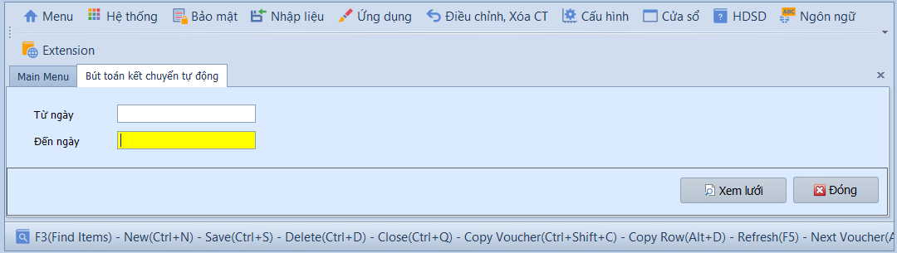
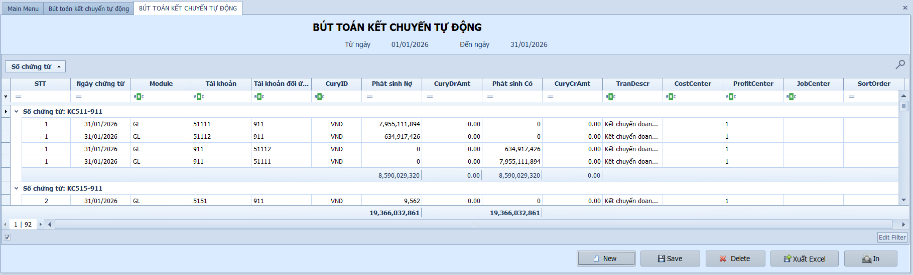
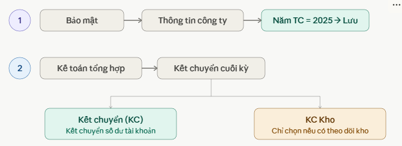
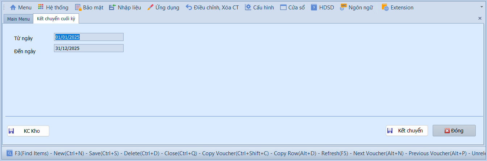
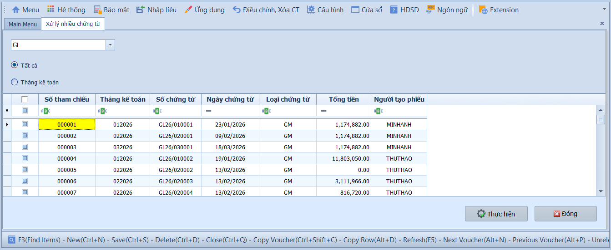
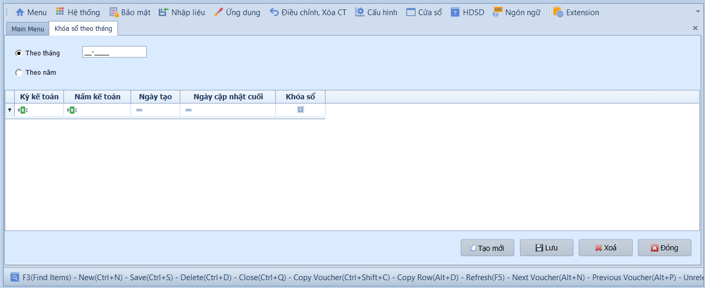

# 1.3 Phân mục xử lý dữ liệu

### Bút toán kết chuyển tự động

**Nghiệp vụ áp dụng:** Cuối kỳ kế toán (tháng/quý/năm), khi cần hệ thống tự động tính toán số dư và tạo bút toán kết chuyển doanh thu, chi phí, xác định kết quả kinh doanh theo khoảng thời gian chỉ định — thay vì phải tạo từng bút toán thủ công.

> **Ví dụ:** Cuối tháng 01/2026, kết chuyển doanh thu Nợ 511 / Có 911: 200.000.000đ; kết chuyển chi phí Nợ 911 / Có 642: 150.000.000đ; kết chuyển lãi Nợ 911 / Có 4212: 50.000.000đ.

Để thực hiện kết chuyển tự động, người dùng thực hiện như sau:

1. Nhập khoảng thời gian **Từ ngày – Đến ngày**, sau đó nhấn **Xem lưới** để hệ thống quét số dư và hiển thị danh sách bút toán dự kiến kết chuyển.
2. Nhấn **Tạo mới** để kích hoạt tạo mới chứng từ kết chuyển dựa trên dữ liệu vừa quét, sau đó nhấn **Lưu** để lưu toàn bộ bút toán vào sổ cái.
3. Nhấn **Xóa** nếu cần hủy bút toán kết chuyển đã tạo để điều chỉnh lại dữ liệu gốc.
4. Nhấn **Xuất Excel** để xuất danh sách ra file .xlsx, hoặc **In** để in/xuất PDF theo mẫu. Nhấn **Đóng** để thoát.

- **Các nút chức năng:**
  - Xem lưới: Quét dữ liệu phát sinh trong khoảng ngày và hiển thị bút toán kết chuyển dự kiến.
  - Tạo mới: Tạo mới bộ chứng từ kết chuyển sau khi đã xem lưới.
  - Lưu: Lưu bút toán kết chuyển vào hệ thống.
  - Xóa: Xóa bộ bút toán kết chuyển đã tạo để chạy lại sau khi điều chỉnh dữ liệu.
  - Xuất Excel: Xuất danh sách bút toán kết chuyển dự kiến hoặc đã tạo.
  - In: In chứng từ/bảng kết chuyển để lưu hồ sơ.
  - Đóng: Thoát khỏi màn hình.

- **Lưu ý khi thao tác:**
  - Chỉ chạy kết chuyển sau khi các phân hệ AP, AR, CA, Kho và Tài sản cố định đã ghi sổ đầy đủ.
  - Nếu phát hiện thiếu chứng từ sau khi đã kết chuyển, cần xóa bút toán kết chuyển, bổ sung chứng từ còn thiếu, rồi chạy lại.
  - Không nên sửa tay số tiền kết chuyển nếu chưa xác định rõ nguyên nhân lệch số liệu.

> **Hệ thống tự kiểm tra khi xử lý:** Dữ liệu kết chuyển được tính theo khoảng ngày và cấu hình bút toán kết chuyển. Nếu cấu hình thiếu tài khoản nguồn/đích hoặc chứng từ trong kỳ chưa ghi sổ, số liệu kết chuyển có thể không đầy đủ.

> **Lưu ý:** Trước khi kết chuyển, cần đảm bảo tất cả chứng từ phát sinh trong kỳ đã được ghi sổ. Bút toán kết chuyển phụ thuộc vào cấu hình tại **Cài đặt → Khai báo bút toán kết chuyển số dư tài khoản**.

---

### Kết chuyển cuối kỳ

**Nghiệp vụ áp dụng:** Sau khi hoàn tất tất cả bút toán kết chuyển và lên Báo cáo tài chính xong, kế toán trưởng thực hiện kết chuyển cuối kỳ để chuyển số dư sang kỳ kế toán mới. Chức năng này giúp xem số dư các tài khoản trước khi thực hiện.

> **Lưu ý:** Không nhầm với việc đổi **Năm tài chính** trên **Bảo mật → Thông tin công ty** — thao tác đó chỉ đổi năm hiển thị, không thay đổi kết chuyển cuối kỳ.

Để kiểm tra và kết chuyển cuối kỳ, người dùng thực hiện như sau:

1. Chọn kỳ/năm cần kết chuyển.
2. Nhấn **Xem lưới** để kiểm tra số dư tài khoản trước khi thực hiện.
3. Đối chiếu các tài khoản trọng yếu: tiền, công nợ, hàng tồn kho, tài sản cố định, doanh thu, chi phí.
4. Chỉ thực hiện kết chuyển khi số liệu đã được kế toán trưởng xác nhận.

- **Các nút chức năng:**
  - Xem lưới: Hiển thị số dư và phát sinh phục vụ kiểm tra trước kết chuyển.
  - Thực hiện/Xử lý: Chạy kết chuyển cuối kỳ theo cấu hình hệ thống.
  - Xuất Excel: Xuất dữ liệu kiểm tra ra file.
  - Đóng: Thoát khỏi màn hình.

- **Lưu ý khi thao tác:**
  - Không thực hiện kết chuyển cuối kỳ khi còn chứng từ Chưa ghi sổ trong kỳ.
  - Sau khi kết chuyển, cần kiểm tra lại số dư đầu kỳ của kỳ tiếp theo.
  - Nếu phải sửa số liệu kỳ đã kết chuyển, cần mở lại kỳ/xử lý lại theo quy trình kiểm soát của kế toán trưởng.

> **Hệ thống tự kiểm tra khi xử lý:** Kỳ đã khóa hoặc chứng từ chưa ghi sổ có thể làm quá trình kết chuyển không đầy đủ. Người dùng cần xử lý hết các cảnh báo trước khi chốt kỳ.

---

### Xử lý nhiều chứng từ

**Nghiệp vụ áp dụng:** Khi cần ghi sổ hoặc bỏ ghi sổ hàng loạt chứng từ kế toán tổng hợp trong kỳ, thay vì phải mở từng chứng từ để xử lý. Thường do kế toán trưởng thực hiện sau khi rà soát xong.

> **Ví dụ:** Cuối ngày, kế toán trưởng chọn tất cả chứng từ tháng 01/2026 đang ở trạng thái Chưa ghi sổ và ghi sổ hàng loạt để phản ánh lên Sổ cái.

Để xử lý hàng loạt chứng từ, người dùng thực hiện như sau:

1. Chọn phạm vi hiển thị: **Tất cả** để lấy toàn bộ chứng từ, hoặc **Tháng kế toán** để lọc theo tháng cụ thể.
2. Tích chọn từng chứng từ cần xử lý, hoặc tích ô đầu cột để chọn tất cả.
3. Nhấn **Thực hiện** để chạy xử lý hàng loạt, sau đó nhấn **Đóng** để thoát.

- **Ô chọn và bộ lọc:**
  - Tất cả: Hiển thị chứng từ của nhiều kỳ theo phạm vi hệ thống cho phép.
  - Tháng kế toán: Chỉ hiển thị chứng từ thuộc tháng được nhập.
  - Ô chọn từng dòng: Chọn chứng từ cần ghi sổ hoặc hủy ghi sổ.
  - Ô chọn đầu cột: Chọn nhanh toàn bộ chứng từ đang hiển thị trên lưới.

- **Các nút chức năng:**
  - Xem lưới/Tải dữ liệu: Lấy danh sách chứng từ theo điều kiện lọc.
  - Thực hiện: Ghi sổ hoặc hủy ghi sổ các chứng từ đã chọn.
  - Đóng: Thoát khỏi màn hình.

- **Lưu ý khi thao tác:**
  - Chỉ chọn chứng từ đã kiểm tra đủ diễn giải, tài khoản, đối tượng công nợ và số tiền.
  - Không nên chọn tất cả nếu lưới đang hiển thị nhiều kỳ chưa được rà soát.
  - Sau khi ghi sổ, chứng từ chuyển sang Đã ghi sổ và không còn chỉnh sửa trực tiếp như chứng từ Chưa ghi sổ.

> **Hệ thống tự kiểm tra khi xử lý:** Chứng từ có lỗi tài khoản, lệch số tiền, thiếu đối tượng bắt buộc hoặc kỳ đã khóa có thể không xử lý được. Hãy mở chứng từ chi tiết để sửa trước rồi chạy lại.

---

### Khóa số theo tháng

**Nghiệp vụ áp dụng:** Sau khi hoàn tất các bút toán kết chuyển và lên Báo cáo tài chính, cần khóa toàn bộ dữ liệu kế toán của kỳ đã hoàn thành để đảm bảo tính toàn vẹn và an toàn — ngăn chặn việc chỉnh sửa, thêm hoặc xóa chứng từ trong kỳ đã khóa.

> **Ví dụ:** Sau khi nộp Báo cáo tài chính quý I/2026, kế toán trưởng khóa sổ các tháng 01, 02, 03 để không ai có thể sửa chứng từ trong quý đã báo cáo.

Để khóa sổ kế toán, người dùng thực hiện như sau:

1. Chọn **Theo tháng** và nhập kỳ **MM-YYYY** (vd. `01-2026`) nếu muốn khóa sổ từng tháng, hoặc chọn **Theo năm** để đóng toàn bộ dữ liệu cả năm tài chính.
2. Trước khi khóa: cần ghi sổ hết chứng từ đang ở trạng thái Chưa ghi sổ.
3. Nhấn **Lưu** để xác nhận khóa sổ, **Xóa** để hủy lệnh khóa, hoặc **Đóng** để thoát.

- **Ô chọn và tùy chọn:**
  - Theo tháng: Khóa một tháng kế toán cụ thể.
  - Theo năm: Khóa toàn bộ năm tài chính.
  - Kỳ kế toán: Nhập kỳ cần khóa theo định dạng tháng/năm.

- **Các nút chức năng:**
  - Lưu: Ghi nhận kỳ/năm đã khóa.
  - Xóa: Mở lại kỳ/năm đã khóa nếu còn cần điều chỉnh.
  - Đóng: Thoát khỏi màn hình.

- **Lưu ý khi thao tác:**
  - Nên in/xuất các báo cáo đối chiếu trước khi khóa sổ.
  - Chỉ người có quyền quản trị/kế toán trưởng mới nên được phép khóa hoặc mở khóa kỳ.
  - Sau khi mở khóa và sửa dữ liệu, cần chạy lại các báo cáo liên quan để đối chiếu.

> **Hệ thống tự kiểm tra khi Lưu:** Nếu kỳ đã có lệnh khóa, người dùng cần xóa lệnh khóa trước khi nhập/sửa chứng từ trong kỳ đó.

> **Lưu ý:** Sau khi khóa sổ, mọi chứng từ phát sinh trong kỳ đã khóa sẽ không thể chỉnh sửa hay xóa. Muốn sửa phải mở khóa (Xóa lệnh khóa) trước.

