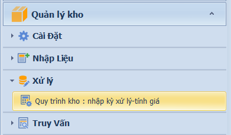
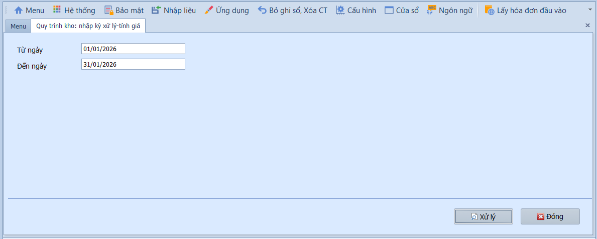
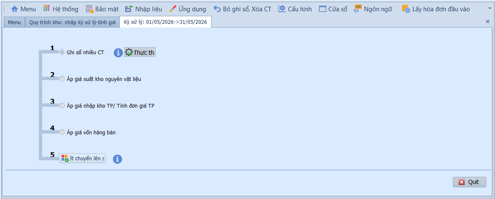
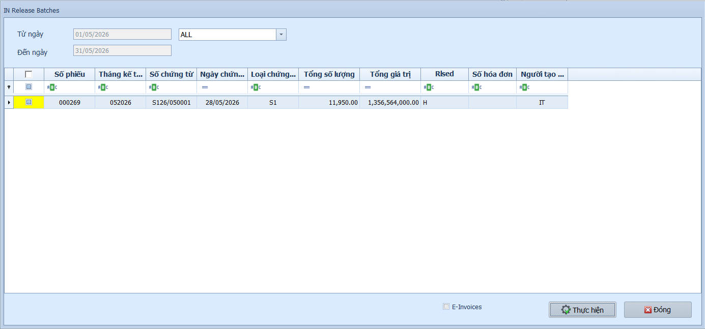
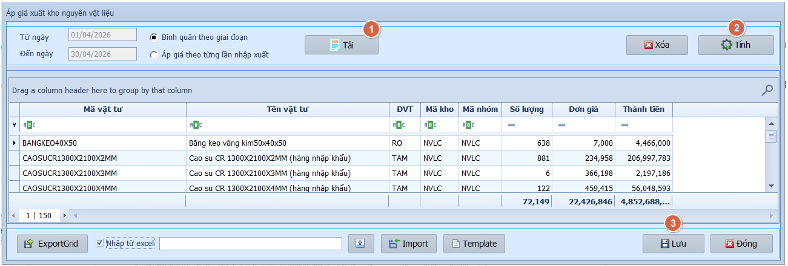
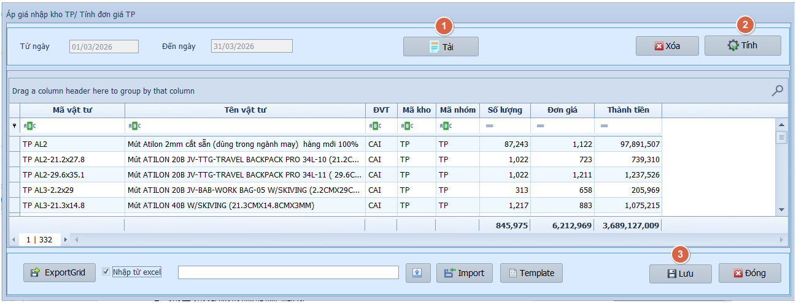
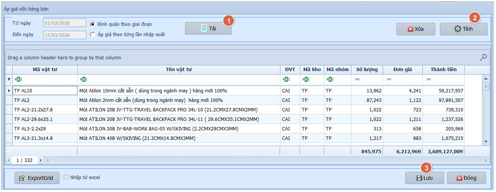
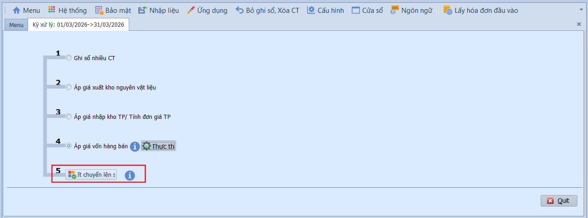

# 6.3 Tính giá thành và giá vốn hàng bán

### Quy trình xử lý cuối kỳ kho

**Nghiệp vụ áp dụng:** Cuối mỗi kỳ kế toán (thường cuối tháng), kế toán kho cần thực hiện quy trình xử lý 5 bước tuần tự để: ghi sổ chứng từ kho, tính giá xuất kho nguyên vật liệu, áp giá nhập kho thành phẩm, tính giá vốn hàng bán và kết chuyển số liệu lên sổ cái. Đây là quy trình bắt buộc trước khi lập báo cáo tài chính.

> **Ví dụ:** Xử lý kho tháng 06/2026 — Ghi sổ toàn bộ phiếu nhập/xuất, áp giá NVL xuất kho theo bình quân gia quyền, tính giá thành sản phẩm từ TK 154, áp giá vốn hàng bán vào TK 632, kết chuyển lên sổ GL.

Để thực hiện quy trình xử lý chứng từ kho, người dùng thực hiện như sau:

1. Nhập khoảng thời gian vào ô **Từ ngày / Đến ngày**.
2. Nhấn **Xử lý** để bắt đầu quy trình 5 bước.

Quy trình gồm 5 bước thực hiện tuần tự:

---

**Bước 1 — Ghi sổ nhiều chứng từ**

Ghi sổ hàng loạt các chứng từ kho (nhập/xuất/chuyển/điều chỉnh) đang ở trạng thái Chưa ghi sổ, chuyển sang Đã ghi sổ.

1. Chọn phạm vi hiển thị: **Tất cả** để lấy toàn bộ chứng từ, hoặc chọn **phân hệ** để lọc.
2. Tích chọn từng chứng từ cần xử lý, hoặc tích ô đầu cột để chọn tất cả.
3. Nhấn **Thực hiện** để ghi sổ hàng loạt.
4. Nhấn **Đóng** để thoát.

---

**Bước 2 — Áp giá xuất kho nguyên vật liệu**

Tính đơn giá xuất kho cho toàn bộ nguyên vật liệu trong kỳ theo phương pháp đã chọn.

1. Chọn **Phương pháp áp giá**:
   - Bình quân theo giai đoạn: Tính đơn giá xuất theo giá bình quân toàn kỳ (phổ biến nhất, theo TT200).
   - Áp giá theo từng lần nhập xuất: Tính theo phương pháp bình quân di động.
2. Nhấn **Tải** để nạp danh sách vật tư cần áp giá theo kỳ đã chọn.
3. Nhấn **Tính** để thực hiện tính và áp đơn giá xuất kho.
4. Kiểm tra kết quả trên lưới — nhấn **Lưu** để xác nhận.

- **Các nút chức năng:**
  - Xóa: Xóa kết quả đã tính để thực hiện lại.
  - Xuất lưới / Nhập từ Excel: Xuất dữ liệu ra Excel hoặc nhập dữ liệu từ file ngoài.

---

**Bước 3 — Áp giá nhập kho thành phẩm**

Tính đơn giá nhập kho thành phẩm từ chi phí sản xuất trong kỳ (TK 154 → TK 155).

1. Nhấn **Tải** để tải danh sách thành phẩm nhập kho trong kỳ.
2. Nhấn **Tính** để tính đơn giá nhập kho từ chi phí sản xuất.
3. Kiểm tra kết quả — nhấn **Lưu** để xác nhận.

- **Các nút chức năng:**
  - Xóa: Xóa kết quả đã tính để thực hiện lại.
  - Xuất lưới / Nhập từ Excel / Tệp mẫu: Xuất dữ liệu, nhập dữ liệu hoặc tải file mẫu.

---

**Bước 4 — Áp giá vốn hàng bán**

Cập nhật giá vốn hàng bán (TK 632) cho các phiếu xuất bán trong kỳ dựa trên đơn giá xuất kho đã tính ở bước 2.

---

**Bước 5 — Kết chuyển lên sổ**

Kết chuyển toàn bộ số liệu kho (nhập, xuất, giá vốn) lên sổ kế toán tổng hợp (GL). Sau bước này, số liệu kho sẽ phản ánh trên sổ cái các TK 152, 155, 156, 632.

- **Lưu ý khi thao tác:**
  - Phải thực hiện đúng thứ tự 5 bước — không được bỏ bước hoặc đảo thứ tự.
  - Nếu phát hiện sai sót ở bước trước, cần xóa kết quả và thực hiện lại từ bước đó.
  - Đảm bảo tất cả chứng từ kho trong kỳ đã được nhập đầy đủ trước khi chạy quy trình.
  - Nên backup dữ liệu trước khi chạy quy trình xử lý.

> **Lưu ý:** Quy trình 5 bước này cần thực hiện hoàn tất trước khi chạy kết chuyển cuối kỳ ở phân hệ GL (Kế toán tổng hợp) và trước khi lập báo cáo tài chính.
