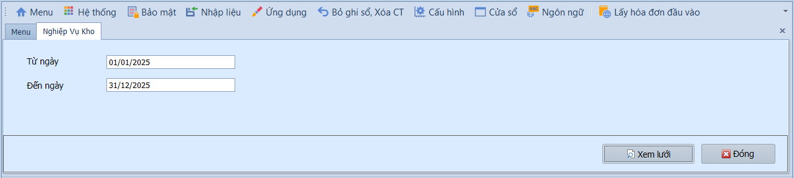

# 6.4 Báo cáo

### Báo cáo kho

**Nghiệp vụ áp dụng:** Khi cần kiểm tra, đối chiếu số liệu kho: tồn kho, chi tiết nhập xuất, thẻ kho, sổ chi tiết vật tư và tình hình tồn kho theo kỳ. Các báo cáo phục vụ cho việc quản lý kho, đối chiếu với sổ cái (TK 152/155/156) và lập báo cáo tài chính.

> **Ví dụ:** Xem báo cáo nhập xuất tồn tháng 06/2026 để đối chiếu số dư TK 152 trên sổ cái, chuẩn bị cho kiểm kê kho bán niên.

Các loại báo cáo kho:

- **Thẻ kho / Sổ chi tiết vật tư:** Theo dõi phát sinh nhập, xuất và tồn kho của từng vật tư theo trình tự thời gian — tương đương thẻ kho vật lý theo mẫu S12-DN (TT200).
- **Chi tiết nhập / Chi tiết xuất:** Kiểm tra các chứng từ nhập hoặc xuất theo khoảng thời gian, chi tiết đến từng phiếu.
- **Tổng hợp nhập / Tổng hợp xuất:** Xem số liệu nhập hoặc xuất tổng hợp theo vật tư, kho hoặc nhóm — không chi tiết đến từng chứng từ.
- **Nhập xuất tồn / Tình hình tồn kho:** Đối chiếu số dư đầu kỳ, phát sinh nhập, phát sinh xuất và tồn cuối kỳ — tương đương bảng tổng hợp NXT theo mẫu S11-DN.
- **Giao dịch kho:** Truy vết toàn bộ giao dịch kho khi cần kiểm tra chi tiết từng bút toán.

Để xem báo cáo, người dùng thực hiện như sau:

1. Chọn loại báo cáo cần xem từ danh sách.
2. Nhập khoảng thời gian vào ô **Từ ngày / Đến ngày**.
3. Chọn **Kho**, **Nhóm vật tư**, **Mã vật tư** hoặc điều kiện lọc khác nếu báo cáo yêu cầu.
4. Nhấn **Xem lưới / Xem trước** để hiển thị báo cáo, hoặc **In / Xuất Excel** để lưu trữ.

> **Lưu ý:** Số liệu báo cáo kho chỉ chính xác sau khi đã hoàn thành quy trình xử lý 5 bước tại **Xử lý → Tính giá thành & Giá vốn**. Nếu chưa chạy quy trình, giá vốn và tồn kho có thể chưa được cập nhật.
