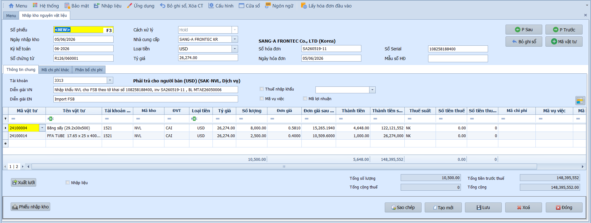
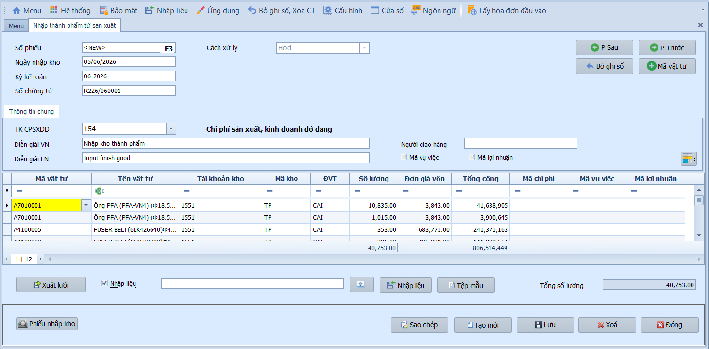
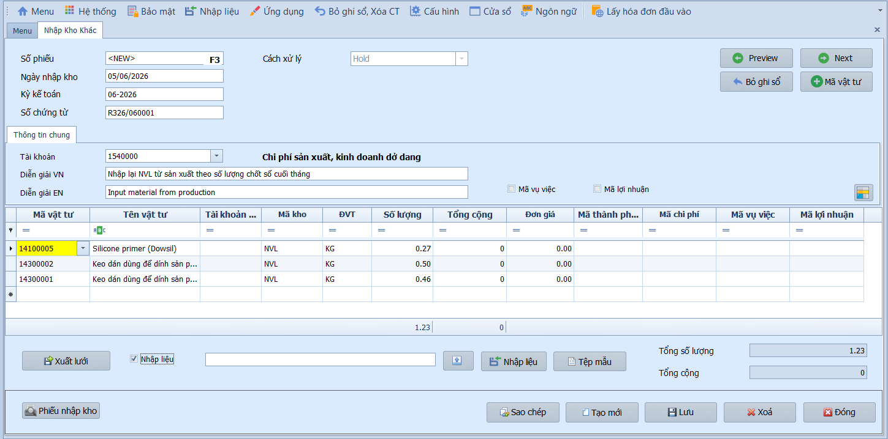
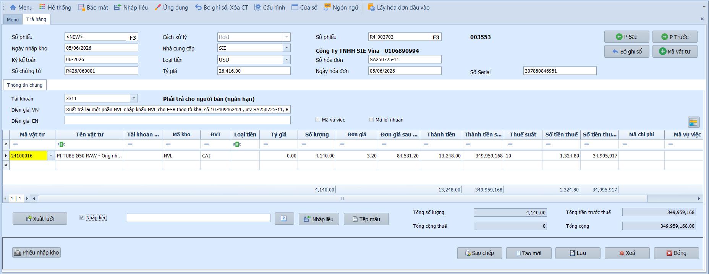
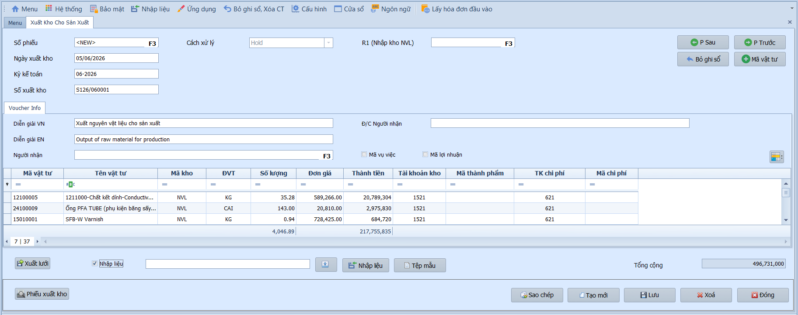
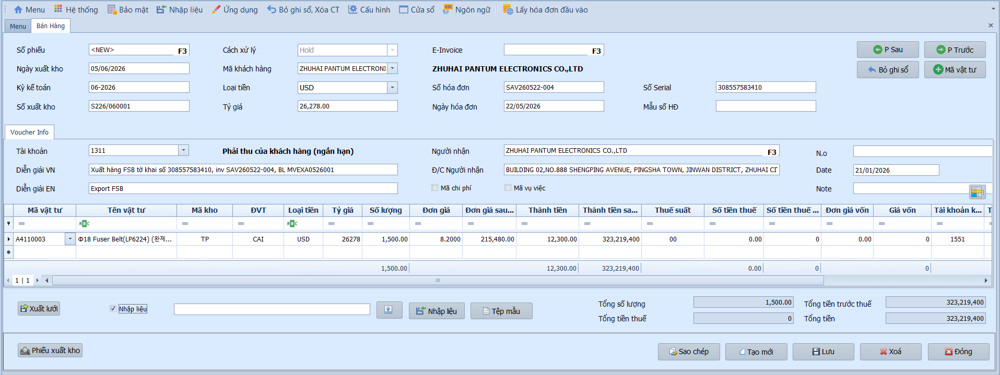
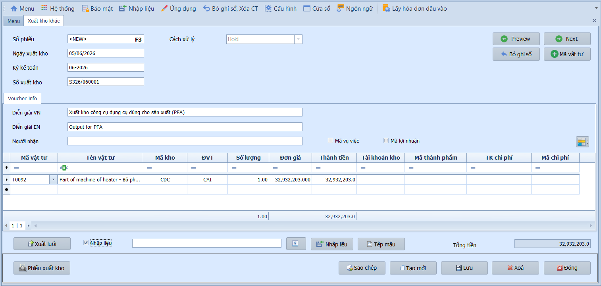
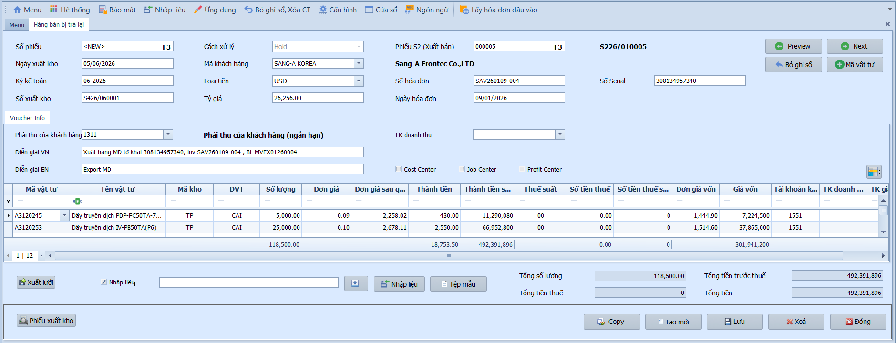
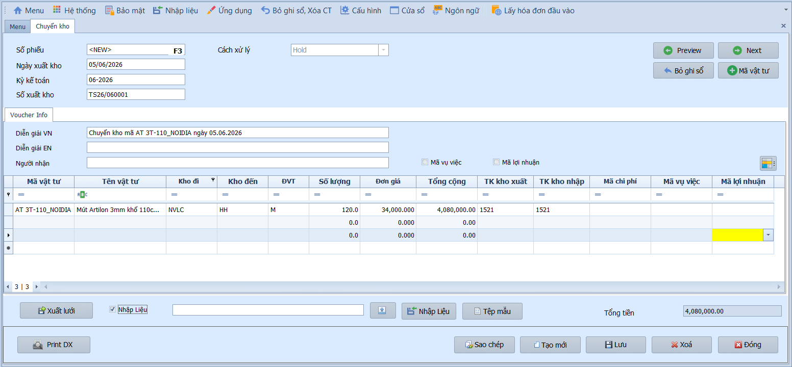
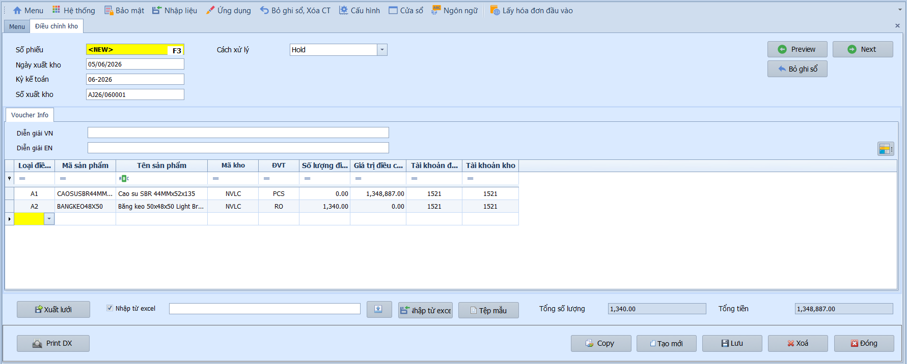

# 6.2 Nhập chứng từ

### Quy tắc kiểm tra khi nhập từ Excel

**Nghiệp vụ áp dụng:** Khi sử dụng chức năng **Nhập liệu** từ file Excel cho các phiếu kho (Nhập kho, Xuất kho, Chuyển kho), hệ thống thực hiện các bước kiểm tra tự động trước khi nhập dữ liệu.

- **Kiểm tra chặn nhập dữ liệu (nền đỏ):**
  - Chứng từ đã ghi sổ: Số phiếu trong file Excel trùng với chứng từ đã ở trạng thái **Đã ghi sổ** trên hệ thống. Người dùng cần **Bỏ ghi sổ** chứng từ đó trước khi nhập lại.
  - Chứng từ đã ghi sổ GL: Số phiếu đã có bút toán trên **Sổ Cái**. Cần xóa dữ liệu GL liên quan trước khi nhập lại.
  - Chứng từ đã có dữ liệu AR: (Áp dụng cho phiếu xuất bán, trả lại) Số phiếu đã phát sinh chứng từ **phải thu**. Cần xóa dữ liệu AR liên quan trước khi nhập lại.

- **Cảnh báo (nền vàng):**
  - Chứng từ chưa ghi sổ: Số phiếu đang ở trạng thái **Chưa ghi sổ** trên hệ thống. Vẫn được phép nhập dữ liệu; dữ liệu chưa ghi sổ hiện có sẽ bị ghi đè.
  - Kỳ kế toán không khớp: Tháng/năm trong Số phiếu không khớp với **Ngày chứng từ** trên cùng dòng.

- **Thứ tự kiểm tra:**
  1. Hệ thống kiểm tra tất cả số phiếu trong file Excel một lần trước khi bắt đầu nhập dữ liệu.
  2. Nếu có lỗi chặn, hệ thống dừng và hiển thị thông báo — không nhập dòng nào.
  3. Nếu chỉ có cảnh báo, hệ thống hiển thị cảnh báo trên lưới và cho phép tiếp tục nhập dữ liệu.

---

### Nhập kho nguyên vật liệu

**Nghiệp vụ áp dụng:** Khi mua nguyên vật liệu, hàng hóa từ nhà cung cấp và nhập vào kho. Phiếu nhập kho ghi nhận số lượng, đơn giá mua và phân bổ chi phí mua hàng (nếu có). Hệ thống tự động hạch toán Nợ TK 152/156 (Kho NVL/Hàng hóa) / Có TK 331 (Phải trả NCC).

> **Ví dụ:** Nhập kho 100 tấn thép từ NCC — Nợ TK 1521 / Có TK 331: 500.000.000đ. Thuế GTGT đầu vào 10%: Nợ TK 1331 / Có TK 331: 50.000.000đ.

Để lập phiếu nhập kho nguyên vật liệu, người dùng thực hiện như sau:

1. Nhấn **Tạo mới** để tạo phiếu nhập kho.
2. Nhập thông tin chung: Ngày nhập kho, Kỳ kế toán, Nhà cung cấp, Số hóa đơn.
3. Tại lưới chi tiết, chọn **Mã vật tư**, nhập **Số lượng** và **Đơn giá**.
4. Nếu có chi phí mua hàng cần phân bổ, chuyển sang tab **Phân bổ chi phí**.
5. Nhấn **Lưu** — chứng từ ở trạng thái Chưa ghi sổ hoặc Ghi sổ tùy Cách xử lý đã chọn.

- **Thông tin chung:**
  - Số phiếu / Ngày nhập kho / Kỳ kế toán / Số chứng từ: Hệ thống tự động sinh theo quy tắc cấu hình.
  - Nhà cung cấp: Chọn NCC từ danh mục — hệ thống tự hiển thị tên và MST.
  - Cách xử lý: Chọn Chưa ghi sổ để giữ lại kiểm tra hoặc Ghi sổ để cập nhật ngay.
  - Loại tiền / Tỷ giá: Mặc định VND; chọn ngoại tệ nếu mua hàng nhập khẩu.
  - Số hóa đơn / Số Serial / Mẫu số HĐ / Ngày hóa đơn: Thông tin hóa đơn GTGT phục vụ bảng kê thuế.
  - Tài khoản công nợ: Tài khoản phải trả NCC (mặc định TK 331).
  - Diễn giải (VN/EN): Mô tả nội dung nhập kho.
  - Tab Mã chi phí: Chọn chứng từ ghi nhận chi phí và nhập số tiền phân bổ.
  - Tab Phân bổ chi phí: Nhấn **Tính** để phân bổ theo giá trị (mặc định) hoặc theo số lượng.

- **Lưới chi tiết:**
  - Mã vật tư: Chọn từ danh mục — hệ thống tự điền tên, tài khoản kho, mã kho, đơn vị tính.
  - Số lượng / Đơn giá: Nhập giá trị — hệ thống tự tính Thành tiền và Tiền thuế theo thuế suất.

- **Các nút chức năng:**
  - Xuất lưới / Nhập liệu: Xuất Excel hoặc nhập dữ liệu từ file ngoài.
  - Phiếu nhập kho: In phiếu theo mẫu.
  - P. Sau / P. Trước: Duyệt chứng từ liền kề.
  - Sao chép / Tạo mới / Lưu / Xóa / Đóng: Các thao tác tiêu chuẩn.

- **Lưu ý khi thao tác:**
  - Chi phí mua hàng (vận chuyển, bốc xếp) có thể phân bổ vào giá trị nhập kho tại tab "Phân bổ chi phí".
  - Thông tin hóa đơn GTGT phải nhập đầy đủ để phục vụ kê khai thuế GTGT đầu vào.

---

### Nhập kho sản xuất

**Nghiệp vụ áp dụng:** Khi thành phẩm hoàn thành quy trình sản xuất và nhập vào kho thành phẩm. Phiếu nhập kho sản xuất ghi nhận Nợ TK 155 (Thành phẩm) / Có TK 154 (Chi phí SXKD dở dang), giá trị tính theo giá thành sản xuất.

> **Ví dụ:** Nhập kho 500 sản phẩm hoàn thành — Nợ TK 155 / Có TK 154: 25.000.000đ.

Để lập phiếu nhập kho thành phẩm từ sản xuất, người dùng thực hiện như sau:

1. Nhấn **Tạo mới** để tạo phiếu nhập kho sản xuất.
2. Nhập thông tin chung: Ngày nhập kho, Kỳ kế toán, TK CPSXDD.
3. Tại lưới chi tiết, chọn **Mã vật tư** và nhập **Số lượng**.
4. Nhấn **Lưu** để hoàn tất.

- **Thông tin chung:**
  - Số phiếu / Ngày nhập kho / Kỳ kế toán / Số chứng từ: Hệ thống tự động sinh.
  - TK CPSXDD: Tài khoản chi phí sản xuất kinh doanh dở dang (TK 154).
  - Cách xử lý: Chọn Chưa ghi sổ hoặc Ghi sổ.
  - Người giao hàng: Nhập tên bộ phận/phân xưởng giao hàng.
  - Diễn giải (VN/EN): Mô tả nội dung nhập kho.
  - Mã vụ việc / Mã lợi nhuận: Gắn với trung tâm chi phí nếu cần.

- **Lưới chi tiết:**
  - Mã vật tư: Chọn thành phẩm — hệ thống tự điền tên, tài khoản kho, mã kho, đơn vị tính.
  - Số lượng: Nhập số lượng nhập kho — hệ thống tự tính đơn giá vốn và tổng cộng.
  - Mã chi phí / Mã vụ việc / Mã lợi nhuận: Phân bổ chi tiết theo từng dòng.

- **Các nút chức năng:**
  - Xuất lưới / Nhập liệu: Xuất Excel hoặc nhập dữ liệu từ file ngoài.
  - Phiếu nhập kho: In phiếu theo mẫu.
  - P. Sau / P. Trước: Duyệt chứng từ liền kề.
  - Bỏ ghi sổ: Hủy bút toán để chỉnh sửa lại chứng từ.
  - Sao chép / Tạo mới / Lưu / Xóa / Đóng: Các thao tác tiêu chuẩn.

---

### Nhập kho khác

**Nghiệp vụ áp dụng:** Khi có các nghiệp vụ nhập kho không thuộc các trường hợp mua hàng hoặc sản xuất: nhập kho do kiểm kê phát hiện thừa, nhận tài trợ, nhận lại hàng gia công. Hệ thống hạch toán Nợ TK 152/155/156 / Có TK 711 (Thu nhập khác) hoặc tài khoản phù hợp.

> **Ví dụ:** Kiểm kê phát hiện thừa 50 bộ linh kiện — Nợ TK 1522 / Có TK 7113: 2.500.000đ.

Để lập phiếu nhập khác, người dùng thực hiện như sau:

1. Nhấn **Tạo mới** để tạo phiếu nhập kho khác.
2. Nhập thông tin chung: Ngày nhập kho, Kỳ kế toán, Tài khoản ghi nhận.
3. Tại lưới chi tiết, chọn **Mã vật tư**, nhập **Số lượng** và **Đơn giá**.
4. Nhấn **Lưu** để hoàn tất.

- **Thông tin chung:**
  - Số phiếu / Ngày nhập kho / Kỳ kế toán / Số chứng từ: Hệ thống tự động sinh.
  - Cách xử lý: Chọn Chưa ghi sổ hoặc Ghi sổ.
  - Tài khoản: Tài khoản đối ứng (mặc định TK 7113 — Thu nhập khác).
  - Diễn giải (VN/EN): Mô tả nội dung nhập kho.
  - Mã vụ việc / Mã lợi nhuận: Gắn với trung tâm chi phí nếu cần.

- **Lưới chi tiết:**
  - Mã vật tư: Chọn từ danh mục — hệ thống tự điền tên, tài khoản kho, mã kho, đơn vị tính.
  - Số lượng / Đơn giá: Nhập giá trị — hệ thống tự tính Tổng cộng.
  - Mã thành phẩm / Mã chi phí / Mã vụ việc / Mã lợi nhuận: Phân bổ chi tiết.

- **Các nút chức năng:**
  - Xuất lưới / Nhập liệu: Xuất Excel hoặc nhập dữ liệu từ file ngoài.
  - Phiếu nhập kho: In phiếu theo mẫu.
  - P. Trước / P. Sau: Duyệt chứng từ liền kề.
  - Bỏ ghi sổ: Hủy bút toán để chỉnh sửa lại chứng từ.
  - Sao chép / Tạo mới / Lưu / Xóa / Đóng: Các thao tác tiêu chuẩn.

---

### Trả hàng nhà cung cấp

**Nghiệp vụ áp dụng:** Khi cần trả lại hàng hóa đã mua cho nhà cung cấp do hàng không đúng quy cách, hư hỏng hoặc thừa. Phiếu trả hàng ghi nhận giảm công nợ phải trả và giảm tồn kho — Nợ TK 331 / Có TK 152/156.

> **Ví dụ:** Trả lại 20 tấn thép lỗi cho NCC — Nợ TK 331 / Có TK 1521: 100.000.000đ. Thuế GTGT điều chỉnh giảm: Nợ TK 331 / Có TK 1331: 10.000.000đ.

Để lập phiếu trả hàng nhà cung cấp, người dùng thực hiện như sau:

1. Nhấn **Tạo mới** để tạo phiếu trả hàng.
2. Chọn **Nhà cung cấp** và nhập thông tin hóa đơn.
3. Tại lưới chi tiết, chọn **Mã vật tư**, nhập **Số lượng** và **Đơn giá**.
4. Nhấn **Lưu** để hoàn tất.

- **Thông tin chung:**
  - Số phiếu / Ngày nhập kho / Kỳ kế toán / Số chứng từ: Hệ thống tự động sinh.
  - Nhà cung cấp: Chọn NCC — hệ thống tự hiển thị tên và MST.
  - Cách xử lý / Loại tiền / Tỷ giá: Mặc định VND, tỷ giá 1.00.
  - Số hóa đơn / Ngày hóa đơn / Số Serial: Thông tin hóa đơn phục vụ bảng kê thuế.
  - Tài khoản công nợ: Mặc định TK 331.
  - Diễn giải (VN/EN): Mô tả lý do trả hàng.

- **Lưới chi tiết:**
  - Mã vật tư: Chọn từ danh mục — hệ thống tự điền thông tin.
  - Số lượng / Đơn giá: Nhập giá trị — hệ thống tự tính thành tiền, tiền thuế theo thuế suất.
  - Mã chi phí / Mã vụ việc: Phân bổ chi tiết nếu cần.

- **Các nút chức năng:**
  - Xuất lưới / Nhập liệu: Xuất Excel hoặc nhập dữ liệu từ file ngoài.
  - Phiếu nhập kho: In phiếu theo mẫu.
  - P. Sau / P. Trước: Duyệt chứng từ liền kề.
  - Bỏ ghi sổ: Hủy bút toán để chỉnh sửa.
  - Sao chép / Tạo mới / Lưu / Xóa / Đóng: Các thao tác tiêu chuẩn.

- **Lưu ý khi thao tác:**
  - Phiếu trả hàng làm giảm công nợ phải trả NCC — cần đối chiếu với NCC trước khi thực hiện.
  - Cần lập hóa đơn điều chỉnh hoặc hóa đơn trả hàng theo quy định thuế GTGT.

---

### Xuất kho cho sản xuất

**Nghiệp vụ áp dụng:** Khi cần xuất nguyên vật liệu, vật tư từ kho để phục vụ sản xuất. Phiếu xuất kho ghi nhận Nợ TK 621/622/627 (Chi phí NVL/Nhân công/SXC) / Có TK 152 (NVL).

> **Ví dụ:** Xuất 200kg vải cho phân xưởng may — Nợ TK 6211 / Có TK 1521: 30.000.000đ.

Để lập phiếu xuất kho cho sản xuất, người dùng thực hiện như sau:

1. Nhấn **Tạo mới** để tạo phiếu xuất kho.
2. Nhập thông tin chung: Ngày xuất kho, Kỳ kế toán.
3. Tại lưới chi tiết, chọn **Mã vật tư** và nhập **Số lượng**.
4. Chọn **TK chi phí** và **Mã thành phẩm** để phân bổ đúng đối tượng sản xuất.
5. Nhấn **Lưu** để hoàn tất.

- **Thông tin chung:**
  - Số phiếu / Ngày xuất kho / Kỳ kế toán / Số xuất kho: Hệ thống tự động sinh.
  - Cách xử lý: Chọn Chưa ghi sổ hoặc Ghi sổ.
  - Diễn giải (VN/EN): Mô tả nội dung xuất kho.
  - Người nhận / Địa chỉ người nhận: Theo dõi bàn giao nội bộ.
  - Mã vụ việc / Mã lợi nhuận: Gắn với trung tâm chi phí nếu cần.

- **Lưới chi tiết:**
  - Mã vật tư: Chọn từ danh mục — hệ thống tự điền tên, mã kho, đơn vị tính.
  - Số lượng: Nhập số lượng xuất — hệ thống tự tính đơn giá và thành tiền theo phương pháp tính giá xuất kho.
  - Tài khoản kho / Mã thành phẩm / TK chi phí / Mã chi phí: Phân bổ đúng đối tượng sản xuất.

- **Các nút chức năng:**
  - Xuất lưới / Nhập liệu: Xuất Excel hoặc nhập dữ liệu từ file ngoài.
  - Phiếu xuất kho: In phiếu theo mẫu.
  - P. Sau / P. Trước: Duyệt chứng từ liền kề.
  - Bỏ ghi sổ: Hủy bút toán để chỉnh sửa.
  - Sao chép / Tạo mới / Lưu / Xóa / Đóng: Các thao tác tiêu chuẩn.

---

### Bán hàng

**Nghiệp vụ áp dụng:** Khi xuất kho hàng hóa, thành phẩm để bán cho khách hàng. Phiếu bán hàng đồng thời ghi nhận doanh thu (Nợ TK 131 / Có TK 511) và giá vốn hàng bán (Nợ TK 632 / Có TK 155/156). Khi ghi sổ, hệ thống tạo/cập nhật chứng từ phải thu (AR) và ghi sổ GL.

> **Ví dụ:** Bán 100 sản phẩm cho KH — Doanh thu: Nợ TK 131 / Có TK 5111: 200.000.000đ. Thuế GTGT: Nợ TK 131 / Có TK 33311: 20.000.000đ. Giá vốn: Nợ TK 632 / Có TK 1551: 120.000.000đ.

> **Ghi sổ:** Lưu ở trạng thái Chưa ghi sổ → khi chuyển Ghi sổ, hệ thống tạo/cập nhật chứng từ phải thu (AR) và ghi sổ GL. Giá vốn được tính ở bước xử lý cuối ngày.

Để lập phiếu bán hàng, người dùng thực hiện như sau:

1. Nhấn **Tạo mới** để tạo phiếu bán hàng.
2. Chọn **Mã khách hàng** và nhập thông tin hóa đơn.
3. Tại lưới chi tiết, chọn **Mã vật tư**, nhập **Số lượng** và **Đơn giá bán**.
4. Nhấn **Lưu** — chứng từ ở trạng thái Chưa ghi sổ.
5. Chuyển **Ghi sổ** để tạo chứng từ AR và ghi sổ GL.

- **Thông tin chung:**
  - Số phiếu / Ngày xuất kho / Kỳ kế toán / Số xuất kho: Hệ thống tự động sinh.
  - Mã khách hàng: Chọn KH — hệ thống tự hiển thị tên công ty.
  - Loại tiền / Tỷ giá: Hỗ trợ ngoại tệ (VD: USD).
  - E-Invoice / Số hóa đơn / Ngày hóa đơn / Số Serial / Mẫu số HĐ: Thông tin phục vụ hóa đơn điện tử và bảng kê thuế.
  - Tài khoản phải thu: Mặc định TK 131.
  - Diễn giải (VN/EN): Mô tả nội dung bán hàng.
  - Người nhận / Địa chỉ / N.o / Date / Note: Thông tin phục vụ chứng từ xuất khẩu.
  - Mã chi phí / Mã vụ việc: Gắn với trung tâm chi phí nếu cần.

- **Lưới chi tiết:**
  - Mã vật tư: Chọn từ danh mục — hệ thống tự điền tên, mã kho, đơn vị tính, loại tiền, tỷ giá.
  - Số lượng / Đơn giá: Nhập giá bán — hệ thống tự tính thành tiền, tiền thuế theo thuế suất.
  - Đơn giá vốn / Giá vốn / Tài khoản kho: Hệ thống tự điền để ghi nhận giá vốn hàng bán.

- **Các nút chức năng:**
  - Xuất lưới / Nhập liệu / Tệp mẫu: Xuất Excel, nhập dữ liệu hoặc tải file mẫu.
  - Phiếu xuất kho: In phiếu theo mẫu.
  - P. Sau / P. Trước: Duyệt chứng từ liền kề.
  - Bỏ ghi sổ: Hủy bút toán để chỉnh sửa.
  - Sao chép / Tạo mới / Lưu / Xóa / Đóng: Các thao tác tiêu chuẩn.

- **Lưu ý khi thao tác:**
  - Giá vốn hàng bán được tính ở bước xử lý cuối ngày, không tính ngay khi lưu phiếu.
  - Phiếu đã ghi sổ sẽ ảnh hưởng đến cả phân hệ AR (công nợ phải thu) — cần kiểm tra kỹ trước khi ghi sổ.
  - Thông tin hóa đơn GTGT phải nhập đầy đủ để phục vụ kê khai thuế GTGT đầu ra.

---

### Xuất kho khác

**Nghiệp vụ áp dụng:** Khi có các nghiệp vụ xuất kho không thuộc các trường hợp sản xuất hoặc bán hàng: xuất cho biếu tặng, hao hụt tự nhiên, kiểm kê phát hiện thiếu. Hệ thống hạch toán Nợ TK chi phí / Có TK 152/155/156.

> **Ví dụ:** Xuất kho vật tư biếu tặng — Nợ TK 811 (Chi phí khác) / Có TK 1521: 5.000.000đ.

Để lập phiếu xuất kho khác, người dùng thực hiện như sau:

1. Nhấn **Tạo mới** để tạo phiếu xuất kho khác.
2. Nhập thông tin chung: Ngày xuất kho, Kỳ kế toán.
3. Tại lưới chi tiết, chọn **Mã vật tư** và nhập **Số lượng**.
4. Chọn **TK chi phí** phù hợp với mục đích xuất kho.
5. Nhấn **Lưu** để hoàn tất.

- **Thông tin chung:**
  - Số phiếu / Ngày xuất kho / Kỳ kế toán / Số xuất kho: Hệ thống tự động sinh.
  - Cách xử lý: Chọn Chưa ghi sổ hoặc Ghi sổ.
  - Diễn giải (VN/EN): Mô tả nội dung xuất kho.
  - Người nhận: Theo dõi bàn giao nội bộ.
  - Mã vụ việc / Mã lợi nhuận: Gắn với trung tâm chi phí nếu cần.

- **Lưới chi tiết:**
  - Mã vật tư: Chọn từ danh mục — hệ thống tự điền tên, mã kho, đơn vị tính.
  - Số lượng: Nhập số lượng — hệ thống tự tính đơn giá và thành tiền.
  - Tài khoản kho / Mã thành phẩm / TK chi phí / Mã chi phí: Phân bổ đúng đối tượng.

- **Các nút chức năng:**
  - Xuất lưới / Nhập liệu / Tệp mẫu: Xuất Excel, nhập dữ liệu hoặc tải file mẫu.
  - Phiếu xuất kho: In phiếu theo mẫu.
  - P. Trước / P. Sau: Duyệt chứng từ liền kề.
  - Bỏ ghi sổ: Hủy bút toán để chỉnh sửa.
  - Sao chép / Tạo mới / Lưu / Xóa / Đóng: Các thao tác tiêu chuẩn.

---

### Hàng bán bị trả lại

**Nghiệp vụ áp dụng:** Khi khách hàng trả lại hàng đã mua do không đúng quy cách, lỗi sản phẩm hoặc thỏa thuận đổi trả. Phiếu này ghi giảm doanh thu và nhập lại hàng vào kho. Hệ thống liên kết với phiếu bán hàng gốc để đối chiếu.

> **Ví dụ:** KH trả lại 20 sản phẩm lỗi — Ghi giảm doanh thu: Nợ TK 5213 / Có TK 131. Nhập lại kho: Nợ TK 155 / Có TK 632.

> **Ghi sổ:** Liên kết tới phiếu bán hàng gốc. Trạng thái Ghi sổ chủ yếu để khóa chứng từ; bút toán GL được sinh ở bước xử lý cuối ngày, không phát sinh ngay khi lưu.

Để lập phiếu hàng bán bị trả lại, người dùng thực hiện như sau:

1. Nhấn **Tạo mới** để tạo phiếu trả lại.
2. Chọn **Mã khách hàng** và nhập **Phiếu bán hàng gốc** để liên kết.
3. Nhập thông tin hóa đơn điều chỉnh.
4. Tại lưới chi tiết, chọn **Mã vật tư**, nhập **Số lượng** và **Đơn giá**.
5. Nhấn **Lưu** để hoàn tất.

- **Thông tin chung:**
  - Số phiếu / Ngày xuất kho / Kỳ kế toán / Số xuất kho: Hệ thống tự động sinh.
  - Mã khách hàng: Chọn KH — hệ thống tự hiển thị tên công ty.
  - Phiếu bán hàng gốc: Liên kết với phiếu bán hàng cần trả lại.
  - Loại tiền / Tỷ giá: Hỗ trợ ngoại tệ.
  - Số hóa đơn / Ngày hóa đơn / Số Serial: Thông tin hóa đơn điều chỉnh.
  - Tài khoản phải thu / TK doanh thu: Tài khoản ghi giảm.
  - Diễn giải (VN/EN): Mô tả lý do trả hàng.

- **Lưới chi tiết:**
  - Mã vật tư: Chọn từ danh mục — hệ thống tự điền thông tin.
  - Số lượng / Đơn giá: Nhập giá trị — hệ thống tự tính thành tiền, tiền thuế.
  - Đơn giá vốn / Giá vốn / TK kho / TK doanh thu: Hệ thống tự điền.

- **Các nút chức năng:**
  - Xuất lưới / Nhập liệu / Tệp mẫu: Xuất Excel, nhập dữ liệu hoặc tải file mẫu.
  - Phiếu xuất kho: In phiếu theo mẫu.
  - P. Trước / P. Sau: Duyệt chứng từ liền kề.
  - Bỏ ghi sổ: Hủy bút toán để chỉnh sửa.
  - Sao chép / Tạo mới / Lưu / Xóa / Đóng: Các thao tác tiêu chuẩn.

- **Lưu ý khi thao tác:**
  - Cần lập hóa đơn điều chỉnh giảm doanh thu theo quy định thuế GTGT.
  - Bút toán GL được sinh ở bước xử lý cuối ngày, không phát sinh ngay khi lưu.

---

### Chuyển kho

**Nghiệp vụ áp dụng:** Khi cần di chuyển hàng hóa, vật tư giữa các kho trong cùng doanh nghiệp: từ kho nguyên liệu sang kho sản xuất, từ kho chính sang kho chi nhánh. Hệ thống ghi nhận Nợ TK kho đến / Có TK kho đi cùng loại vật tư.

> **Ví dụ:** Chuyển 100kg vải từ kho NVL sang kho sản xuất — Nợ TK 1521 (Kho SX) / Có TK 1521 (Kho NVL): 15.000.000đ.

Để lập phiếu chuyển kho, người dùng thực hiện như sau:

1. Nhấn **Tạo mới** để tạo phiếu chuyển kho.
2. Nhập thông tin chung: Ngày xuất kho, Kỳ kế toán.
3. Tại lưới chi tiết, chọn **Mã vật tư**, chọn **Kho đi** và **Kho đến**, nhập **Số lượng**.
4. Nhấn **Lưu** để hoàn tất.

- **Thông tin chung:**
  - Số phiếu / Ngày xuất kho / Kỳ kế toán / Số xuất kho: Hệ thống tự động sinh.
  - Cách xử lý: Chọn Chưa ghi sổ hoặc Ghi sổ.
  - Diễn giải (VN/EN): Mô tả nội dung chuyển kho.
  - Người nhận: Theo dõi bàn giao nội bộ.
  - Mã vụ việc / Mã lợi nhuận: Gắn với trung tâm chi phí nếu cần.

- **Lưới chi tiết:**
  - Mã vật tư: Chọn từ danh mục — hệ thống tự điền tên, đơn vị tính.
  - Kho đi / Kho đến: Xác định nguồn xuất và đích nhập.
  - Số lượng: Nhập số lượng — hệ thống tự tính đơn giá và tổng cộng theo giá trị tồn kho.
  - TK kho xuất / TK kho nhập: Tài khoản ghi nhận bút toán chuyển kho.
  - Mã chi phí / Mã vụ việc / Mã lợi nhuận: Phân bổ chi tiết nếu cần.

- **Các nút chức năng:**
  - Xuất lưới / Nhập liệu: Xuất Excel hoặc nhập dữ liệu từ file ngoài.
  - In phiếu chuyển kho: In phiếu theo mẫu.
  - P. Trước / P. Sau: Duyệt chứng từ liền kề.
  - Bỏ ghi sổ: Hủy bút toán để chỉnh sửa.
  - Sao chép / Tạo mới / Lưu / Xóa / Đóng: Các thao tác tiêu chuẩn.

---

### Điều chỉnh kho

**Nghiệp vụ áp dụng:** Khi kết quả kiểm kê chỉnh số lượng hoặc giá trị tồn kho sau kiểm kê: phát hiện thừa/thiếu, điều chỉnh giá vốn, hoặc cập nhật giá trị tồn kho theo thực tế. Hệ thống hỗ trợ hai loại điều chỉnh: theo giá trị (A1) và theo số lượng (A2).

> **Ví dụ:** Kiểm kê phát hiện thiếu 10 sản phẩm — Điều chỉnh giảm: Nợ TK 6421 (Chi phí quản lý) / Có TK 1551: 5.000.000đ.

Để lập phiếu điều chỉnh kho, người dùng thực hiện như sau:

1. Nhấn **Tạo mới** để tạo phiếu điều chỉnh.
2. Nhập thông tin chung: Ngày xuất kho, Kỳ kế toán, Diễn giải lý do điều chỉnh.
3. Tại lưới chi tiết, chọn **Loại điều chỉnh** (A1 hoặc A2), chọn **Mã sản phẩm**.
4. Nhập **Số lượng điều chỉnh** hoặc **Giá trị điều chỉnh** tương ứng.
5. Nhấn **Lưu** để hoàn tất.

- **Thông tin chung:**
  - Số phiếu / Ngày xuất kho / Kỳ kế toán / Số xuất kho: Hệ thống tự động sinh.
  - Cách xử lý: Chọn Chưa ghi sổ hoặc Ghi sổ.
  - Diễn giải (VN/EN): Mô tả lý do điều chỉnh.

- **Lưới chi tiết:**
  - Loại điều chỉnh: A1 — điều chỉnh giá trị, A2 — điều chỉnh số lượng.
  - Mã sản phẩm: Chọn từ danh mục — hệ thống tự điền tên, mã kho, đơn vị tính.
  - Số lượng / Giá trị điều chỉnh: Nhập tương ứng với loại điều chỉnh.
  - Tài khoản điều chỉnh / Tài khoản kho: Ghi nhận bút toán điều chỉnh.

- **Các nút chức năng:**
  - Xuất lưới / Nhập từ Excel / Tệp mẫu: Xuất Excel, nhập dữ liệu hoặc tải file mẫu.
  - In phiếu điều chỉnh: In phiếu theo mẫu.
  - P. Trước / P. Sau: Duyệt chứng từ liền kề.
  - Bỏ ghi sổ: Hủy bút toán để chỉnh sửa.
  - Sao chép / Tạo mới / Lưu / Xóa / Đóng: Các thao tác tiêu chuẩn.

- **Lưu ý khi thao tác:**
  - Điều chỉnh kho cần có biên bản kiểm kê hoặc quyết định của cấp có thẩm quyền.
  - Loại A1 (giá trị) chỉ thay đổi đơn giá, không thay đổi số lượng tồn kho.
  - Loại A2 (số lượng) thay đổi cả số lượng và giá trị tồn kho.

> **Lưu ý:** Phiếu điều chỉnh kho ảnh hưởng trực tiếp đến giá vốn hàng bán và giá trị tồn kho cuối kỳ. Cần thực hiện trước khi chạy tính giá thành và báo cáo kho.
