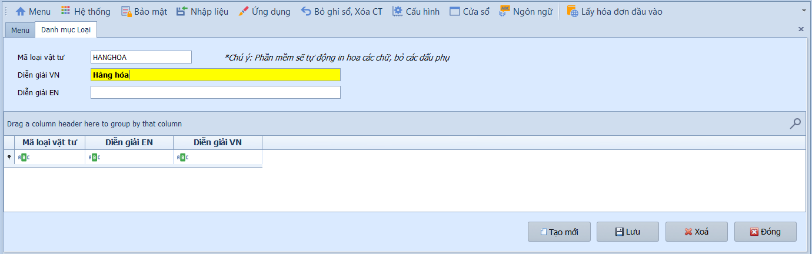
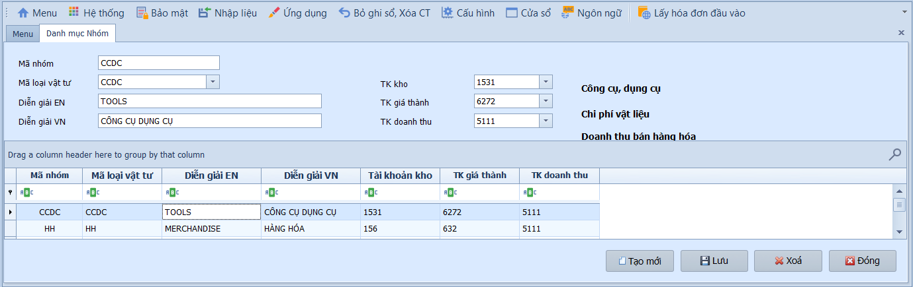
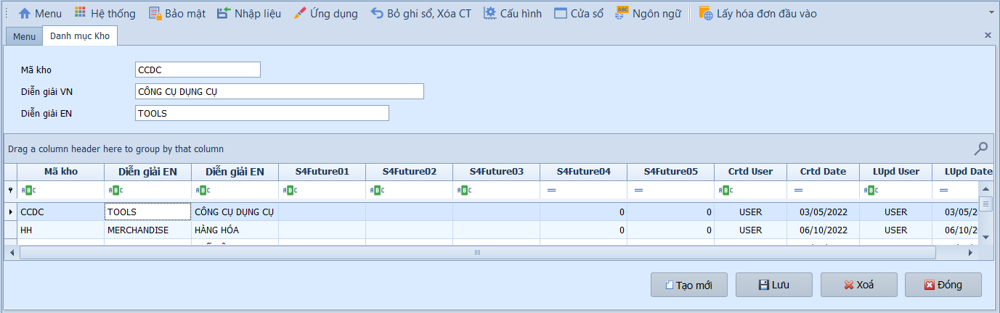
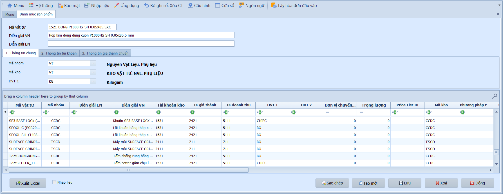
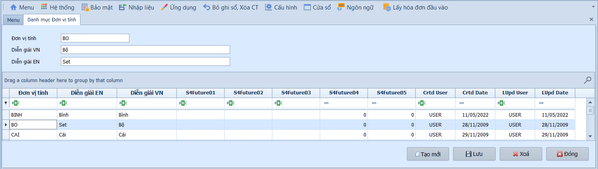
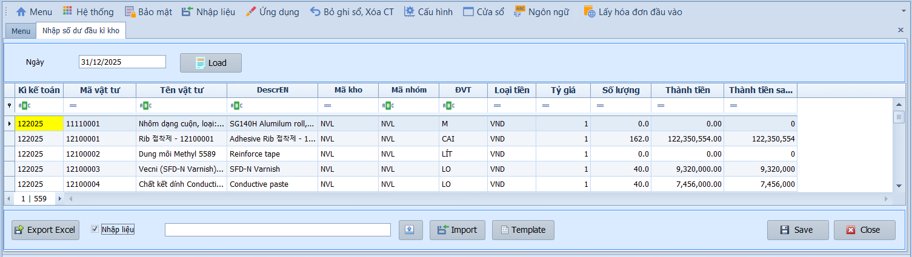

# 6.1 Thiết lập

### Danh mục loại

**Nghiệp vụ áp dụng:** Khi cần phân loại vật tư, hàng hóa theo nhóm lớn (VD: Nguyên vật liệu, Thành phẩm, Hàng hóa, Công cụ dụng cụ) để quản lý kho theo từng nhóm chức năng.

Để khai báo danh mục loại, người dùng thực hiện:

1. Nhấn **Thêm mới** để tạo loại vật tư.
2. Nhập **Mã** và **Tên loại**.
3. Nhấn **Lưu** để hoàn tất.

---

### Danh mục nhóm

**Nghiệp vụ áp dụng:** Khi cần phân loại vật tư chi tiết hơn theo nhóm con trong từng loại, đồng thời gắn tài khoản kho, tài khoản giá thành và tài khoản doanh thu mặc định cho nhóm. Các tài khoản này sẽ tự động áp dụng khi lập chứng từ kho.

> **Ví dụ:** Khai báo nhóm "NVL chính" thuộc loại Nguyên vật liệu — TK kho 1521, TK giá thành 6211, TK doanh thu 5111.

Để khai báo danh mục nhóm, người dùng thực hiện:

1. Nhấn **Thêm mới** để tạo nhóm vật tư.
2. Nhập **Mã** và **Tên nhóm**.
3. Chọn **Loại vật tư** từ danh mục loại đã khai báo.
4. Chọn **Tài khoản kho**, **Tài khoản giá thành**, **Tài khoản doanh thu**.
5. Nhấn **Lưu** để hoàn tất.

---

### Danh mục kho

**Nghiệp vụ áp dụng:** Khi cần khai báo các vị trí lưu trữ vật tư, hàng hóa trong doanh nghiệp: kho nguyên liệu, kho thành phẩm, kho chi nhánh. Mã kho được sử dụng trong tất cả chứng từ nhập/xuất kho.

Để khai báo danh mục kho, người dùng thực hiện:

1. Nhấn **Thêm mới** để tạo kho.
2. Nhập **Mã** và **Tên kho**.
3. Nhấn **Lưu** để hoàn tất.

---

### Danh mục sản phẩm

**Nghiệp vụ áp dụng:** Khi cần khai báo thông tin chi tiết của từng mặt hàng, vật tư trong kho: mã, tên, nhóm, kho mặc định, đơn vị tính và tài khoản hạch toán. Đây là danh mục cốt lõi phục vụ cho toàn bộ chứng từ kho và tính giá thành.

> **Ví dụ:** Khai báo sản phẩm "Vải cotton 100%" — Mã: VC100, Nhóm: NVL chính, Kho: Kho NVL, ĐVT: mét, TK kho 1521.

Để khai báo danh mục sản phẩm, người dùng thực hiện như sau:

1. Nhấn **Tạo mới** để tạo sản phẩm.
2. Nhập **Mã vật tư** và **Diễn giải** bằng tiếng Việt và tiếng Anh.
3. Chọn **Mã nhóm**, **Mã kho** và **Đơn vị tính** tại tab Thông tin chung.
4. Tại tab Thông tin tài khoản, khai báo tài khoản kho, giá thành và doanh thu.
5. Nhấn **Lưu** để hoàn tất.

- **Thông tin chung:**
  - Mã vật tư / Diễn giải (VN/EN): Mã định danh và tên mô tả sản phẩm.
  - Mã nhóm: Chọn nhóm đã khai báo — hệ thống tự động gán tài khoản mặc định.
  - Mã kho: Kho lưu trữ mặc định cho sản phẩm.
  - Đơn vị tính: Đơn vị đo lường (VD: kg, mét, cái, bộ).

- **Thông tin tài khoản:**
  - TK kho / TK giá thành / TK doanh thu: Tài khoản hạch toán mặc định cho sản phẩm. Nếu bỏ trống, hệ thống lấy từ nhóm sản phẩm.

- **Các nút chức năng:**
  - Xuất Excel / Nhập liệu: Xuất dữ liệu ra Excel hoặc nhập dữ liệu từ file ngoài.
  - Sao chép / Tạo mới / Lưu / Xóa / Đóng: Các thao tác tiêu chuẩn.

> **Lưu ý:** Danh mục sản phẩm nên khai báo đầy đủ trước khi lập chứng từ nhập/xuất kho. Có thể nhập dữ liệu hàng loạt từ Excel nếu số lượng sản phẩm lớn.

---

### Danh mục đơn vị tính

**Nghiệp vụ áp dụng:** Khi cần khai báo các đơn vị đo lường sử dụng trong quản lý kho: kg, mét, cái, bộ, thùng, lít...

Để khai báo danh mục đơn vị tính, người dùng thực hiện:

1. Nhấn **Thêm mới** để tạo đơn vị tính.
2. Nhập **Mã** và **Tên** đơn vị tính.
3. Nhấn **Lưu** để hoàn tất.

---

### Khai báo số dư đầu kỳ kho

**Nghiệp vụ áp dụng:** Khi bắt đầu sử dụng phần mềm hoặc khi chuyển đổi từ hệ thống cũ, cần nhập số dư tồn kho đầu kỳ (tính đến ngày 31/12 năm trước) để hệ thống có cơ sở tính giá xuất kho và đối chiếu tồn kho.

> **Ví dụ:** Nhập số dư đầu kỳ kho NVL tại 31/12/2025 — VD: Vải cotton tồn 500 mét, giá trị 75.000.000đ.

Để khai báo số dư đầu kỳ kho, người dùng thực hiện như sau:

1. Nhập **Ngày đầu kỳ** (31/12 năm trước).
2. Nhấn **Nạp dữ liệu** để tải danh sách sản phẩm lên lưới.
3. Nhập số lượng và giá trị tồn kho cho từng sản phẩm.
4. Nhấn **Lưu** để hoàn tất.

- **Các nút chức năng:**
  - Xuất Excel / Nhập liệu: Xuất dữ liệu ra Excel hoặc nhập dữ liệu từ file ngoài.
  - Lưu / Đóng: Các thao tác tiêu chuẩn.

- **Lưu ý khi thao tác:**
  - Số dư đầu kỳ kho phải khớp với số dư cuối kỳ trước của TK 152/155/156 trên sổ cái.
  - Nên nhập số dư đầu kỳ trước khi bắt đầu nhập chứng từ kho trong kỳ mới.

> **Lưu ý:** Số dư đầu kỳ kho là cơ sở để hệ thống tính giá xuất kho (bình quân gia quyền, FIFO). Nếu nhập sai, giá vốn hàng bán sẽ bị ảnh hưởng.
