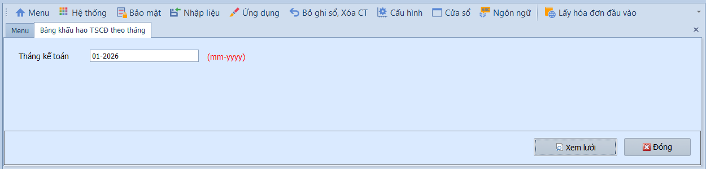
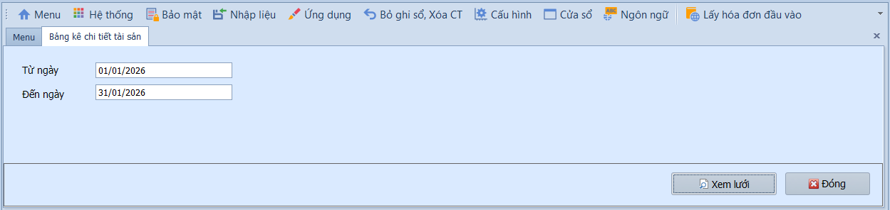
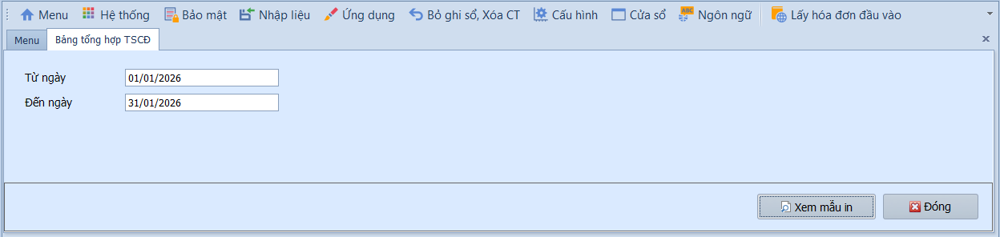
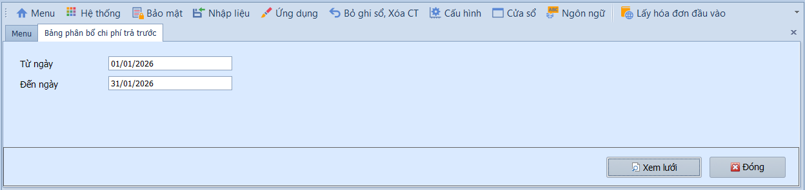
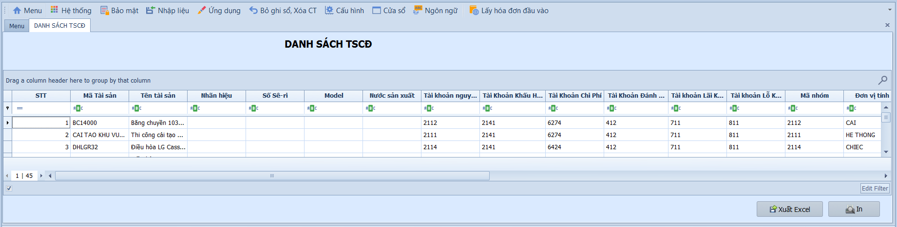

# 5.5 Phân mục báo cáo

### Nút và tùy chọn chung trên báo cáo tài sản cố định

**Nghiệp vụ áp dụng:** Các báo cáo tài sản cố định dùng để đối chiếu nguyên giá, khấu hao, phân bổ chi phí trả trước và tình trạng tài sản. Người dùng cần chọn đúng kỳ/thời gian trước khi lên báo cáo.

- **Điều kiện lọc thường gặp:**
  - Ngày / Tháng - Năm: Kỳ cần xem khấu hao hoặc phân bổ.
  - Từ ngày / Đến ngày: Khoảng thời gian xem tăng/giảm hoặc danh sách tài sản.
  - Nhóm tài sản / trạng thái: Lọc tài sản theo nhóm hoặc tình trạng nếu màn hình hỗ trợ.

- **Các nút chức năng:**
  - Xem lưới: Tải dữ liệu báo cáo.
  - In: In báo cáo theo mẫu.
  - Xuất lưới/Xuất Excel: Xuất danh sách tài sản, khấu hao hoặc phân bổ để lưu hồ sơ.
  - Đóng: Thoát khỏi màn hình báo cáo.

- **Lưu ý khi thao tác:**
  - Trước khi xem bảng khấu hao, cần đảm bảo tháng đó đã tính khấu hao.
  - Trước khi xem bảng phân bổ, cần đảm bảo khoản chi phí trả trước đã được khai báo và phân bổ đúng kỳ.
  - Nếu số liệu không khớp sổ cái, đối chiếu chứng từ ghi tăng/giảm, bảng khấu hao và bút toán GL phát sinh.

> **Hệ thống tự kiểm tra khi xem báo cáo:** Kỳ báo cáo phải hợp lệ; dữ liệu báo cáo phụ thuộc vào các bước tính khấu hao/phân bổ đã thực hiện.

---

### Bảng khấu hao TSCĐ theo tháng

**Nghiệp vụ áp dụng:** Khi cần xem tổng hợp số liệu khấu hao của toàn bộ tài sản cố định trong một tháng cụ thể: nguyên giá, khấu hao lũy kế, khấu hao trong tháng và giá trị còn lại. Báo cáo này phục vụ cho việc đối chiếu bút toán khấu hao và lập báo cáo tài chính.

> **Ví dụ:** Xem bảng khấu hao tháng 06/2026 để kiểm tra tổng chi phí khấu hao trước khi lập bảng cân đối kế toán.

Để xem báo cáo, người dùng thực hiện như sau:

1. Nhập kỳ kế toán vào ô **Ngày** (Tháng – Năm).
2. Nhấn **Xem lưới** để hiển thị báo cáo.

---

### Bảng kê chi tiết tài sản

**Nghiệp vụ áp dụng:** Khi cần xem danh sách chi tiết từng tài sản cố định đã ghi tăng/giảm trong một khoảng thời gian, bao gồm thông tin: mã tài sản, tên, nhóm, nguyên giá, ngày mua, trạng thái.

> **Ví dụ:** Lập bảng kê TSCĐ từ 01/01/2026 đến 30/06/2026 để phục vụ kiểm kê tài sản giữa năm.

Để xem báo cáo, người dùng thực hiện như sau:

1. Nhập khoảng thời gian vào ô **Từ ngày / Đến ngày**.
2. Nhấn **Xem lưới** để hiển thị báo cáo.

---

### Bảng tổng hợp TSCĐ

**Nghiệp vụ áp dụng:** Khi cần xem báo cáo tổng hợp tình hình tài sản cố định trong kỳ: số đầu kỳ, tăng trong kỳ, giảm trong kỳ, số cuối kỳ — phân theo nhóm tài sản. Đây là báo cáo bắt buộc trong thuyết minh báo cáo tài chính theo TT200.

> **Ví dụ:** Lập bảng tổng hợp TSCĐ năm 2026 để phục vụ thuyết minh BCTC — biểu B09-DN.

Để xem báo cáo, người dùng thực hiện như sau:

1. Nhập khoảng thời gian vào ô **Từ ngày / Đến ngày**.
2. Nhấn **Xem lưới** để hiển thị báo cáo.

---

### Bảng phân bổ chi phí trả trước

**Nghiệp vụ áp dụng:** Khi cần xem tổng hợp số liệu phân bổ CCDC/chi phí trả trước trong kỳ: nguyên giá, đã phân bổ lũy kế, phân bổ trong tháng và giá trị còn lại. Phục vụ đối chiếu số dư TK 242.

> **Ví dụ:** Xem bảng phân bổ chi phí trả trước quý 2/2026 để đối chiếu số dư TK 242 trên sổ cái.

Để xem báo cáo, người dùng thực hiện như sau:

1. Nhập khoảng thời gian vào ô **Từ ngày / Đến ngày**.
2. Nhấn **Xem lưới** để hiển thị báo cáo.

---

### Danh sách tài sản cố định

**Nghiệp vụ áp dụng:** Khi cần xem toàn bộ danh sách tài sản cố định hiện có trong hệ thống, bao gồm cả tài sản đang sử dụng, đã thanh lý, hoặc đang chờ xử lý.

> **Lưu ý:** Tất cả báo cáo đều có thể xuất ra Excel bằng nút **Xuất lưới** để phục vụ in ấn và lưu trữ.
