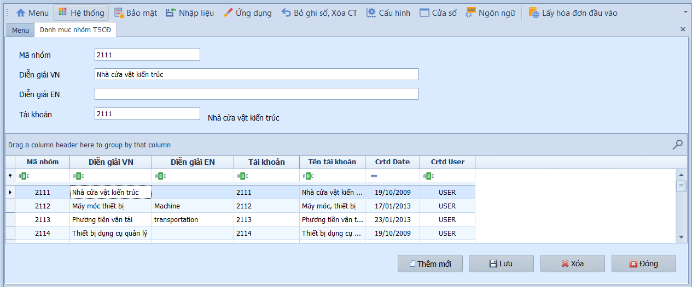
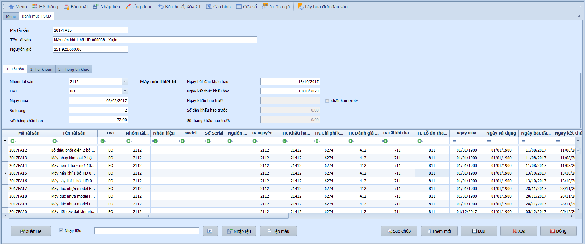
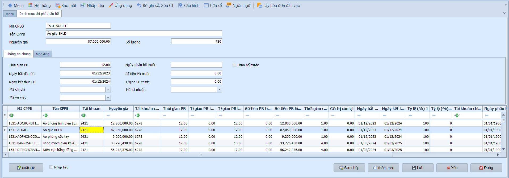

# 5.1 Phân mục cài đặt

### Danh mục nhóm TSCĐ

**Nghiệp vụ áp dụng:** Khi cần phân loại tài sản cố định theo nhóm để quản lý và trích khấu hao theo đúng quy định. Mỗi nhóm TSCĐ được gắn tài khoản hạch toán mặc định, giúp tự động hóa bút toán khi ghi tăng, khấu hao hoặc thanh lý tài sản.

> **Ví dụ:** Khai báo nhóm "Máy móc thiết bị" — TK nguyên giá 211, TK khấu hao lũy kế 2141, TK chi phí khấu hao 6274.

Để khai báo nhóm tài sản cố định, người dùng thực hiện như sau:

1. Nhấn **Thêm mới** để tạo nhóm TSCĐ.
2. Nhập **Mã nhóm** và **Tên nhóm** bằng tiếng Việt và tiếng Anh.
3. Chọn **Tài khoản** hạch toán tương ứng cho nhóm.
4. Nhấn **Lưu** để hoàn tất.

- **Các trường thông tin:**
  - Mã nhóm: Mã định danh duy nhất cho nhóm TSCĐ (VD: MM – Máy móc, PT – Phương tiện).
  - Tên nhóm (VN/EN): Tên mô tả nhóm bằng tiếng Việt và tiếng Anh.
  - Tài khoản: Tài khoản nguyên giá TSCĐ gắn với nhóm (VD: TK 211, TK 213).

- **Các nút chức năng:**
  - Sao chép: Tạo bản sao từ nhóm hiện tại.
  - Thêm mới / Lưu / Xóa / Đóng: Các thao tác tiêu chuẩn.

> **Lưu ý:** Nhóm TSCĐ là cơ sở để hệ thống gán tài khoản mặc định khi ghi tăng tài sản. Nên khai báo đầy đủ trước khi nhập danh mục TSCĐ chi tiết.

---

### Danh mục tài sản cố định

**Nghiệp vụ áp dụng:** Khi cần khai báo thông tin quản lý chi tiết của từng tài sản cố định trong doanh nghiệp: thông tin nhận diện, giá trị nguyên giá, thời gian khấu hao và tài khoản hạch toán. Đây là danh mục cốt lõi phục vụ cho việc trích khấu hao hàng tháng và lập báo cáo TSCĐ.

> **Ví dụ:** Khai báo TSCĐ "Máy photocopy Ricoh MP3055" — nguyên giá 45.000.000đ, khấu hao 60 tháng, TK nguyên giá 2111, TK khấu hao lũy kế 21411, TK chi phí khấu hao 6424.

Để khai báo tài sản cố định, người dùng thực hiện như sau:

1. Nhấn **Thêm mới** để tạo TSCĐ.
2. Nhập thông tin cơ bản: Mã, Tên tài sản, Nhóm, Số lượng, Nguyên giá.
3. Nhập thông tin khấu hao: Số tháng khấu hao, Ngày bắt đầu.
4. Khai báo tài khoản hạch toán cho tài sản.
5. Nhấn **Lưu** để hoàn tất.

- **Thông tin cơ bản:**
  - Mã / Tên tài sản: Mã định danh và tên đầy đủ của TSCĐ.
  - Nhóm tài sản: Chọn nhóm đã khai báo ở danh mục nhóm TSCĐ.
  - Đơn vị tính / Số lượng: Đơn vị đo lường và số lượng tài sản.
  - Ngày mua: Ngày mua hoặc ngày đưa vào sử dụng.
  - Nguyên giá: Tổng giá trị tài sản (bao gồm chi phí mua, vận chuyển, lắp đặt).
  - Số serial / Nhãn hiệu / Model / Nguồn gốc: Thông tin nhận diện thiết bị.

- **Thông tin khấu hao:**
  - Số tháng khấu hao: Thời gian sử dụng hữu ích theo quy định (VD: 36, 60, 120 tháng).
  - Ngày bắt đầu: Ngày bắt đầu trích khấu hao — hệ thống tự tính **Ngày kết thúc**.
  - Ngày / Số tiền / Số tháng khấu hao trước: Nhập nếu tài sản đã có khấu hao kỳ trước (trường hợp nhập dữ liệu giữa chừng).

- **Tài khoản hạch toán:**
  - TK nguyên giá: Tài khoản ghi nhận giá trị ban đầu (VD: TK 211).
  - TK khấu hao lũy kế: Tài khoản ghi nhận khấu hao tích lũy (VD: TK 2141).
  - TK chi phí khấu hao 1 & 2: Tài khoản chi phí khấu hao, kèm tỷ lệ % phân bổ nếu phân bổ cho nhiều bộ phận.
  - TK đánh giá lại tài sản / TK lãi-lỗ thanh lý: Tài khoản dùng khi đánh giá lại hoặc thanh lý TSCĐ.
  - Mã chi phí / Vụ việc / Lợi nhuận: Chọn mã phân bổ tương ứng cho mục đích quản trị.

- **Các nút chức năng:**
  - Xuất lưới / Nhập liệu: Xuất dữ liệu ra Excel hoặc nhập dữ liệu từ file ngoài.
  - In chứng từ: In hoặc xuất PDF theo mẫu.
  - Lưu / Sao chép / Thêm mới / Xóa / Đóng: Các thao tác tiêu chuẩn.

- **Lưu ý khi thao tác:**
  - Nguyên giá TSCĐ phải bao gồm toàn bộ chi phí liên quan đến việc đưa tài sản vào trạng thái sẵn sàng sử dụng (theo TT200 — Chuẩn mực VAS 03).
  - Nếu tài sản được phân bổ chi phí khấu hao cho nhiều bộ phận, nhập tỷ lệ % tại TK chi phí khấu hao 1 và 2 sao cho tổng bằng 100%.
  - Khi nhập dữ liệu từ Excel, đảm bảo mã nhóm TSCĐ đã tồn tại trong danh mục.

> **Lưu ý:** Sau khi khai báo, TSCĐ sẽ được đưa vào bảng tính khấu hao hàng tháng tại màn hình **Xử lý → Tính khấu hao TSCĐ**.

---

### Danh mục chi phí phân bổ

**Nghiệp vụ áp dụng:** Khi cần theo dõi và trích phân bổ định kỳ hàng tháng đối với công cụ dụng cụ (CCDC) hoặc chi phí trả trước dài hạn — tức các khoản chi có giá trị nhỏ hơn tiêu chuẩn TSCĐ nhưng được phân bổ dần vào chi phí (TK 242 — Chi phí trả trước theo TT200).

> **Ví dụ:** Khai báo CCDC "Bộ bàn ghế văn phòng" — nguyên giá 12.000.000đ, phân bổ 12 tháng, TK CCDC 242, TK chi phí phân bổ 6423.

Để khai báo chi phí trả trước, người dùng thực hiện như sau:

1. Nhấn **Thêm mới** để tạo khoản chi phí phân bổ.
2. Nhập thông tin cơ bản: Mã, Tên chi phí, Số lượng, Nguyên giá.
3. Nhập thông tin phân bổ: Số tháng phân bổ, Ngày bắt đầu.
4. Khai báo tài khoản hạch toán.
5. Nhấn **Lưu** để hoàn tất.

- **Thông tin cơ bản:**
  - Mã / Tên chi phí: Mã định danh và tên mô tả khoản chi phí phân bổ.
  - Số lượng: Số lượng CCDC hoặc đơn vị chi phí.
  - Nguyên giá: Tổng giá trị chi phí cần phân bổ.

- **Thông tin phân bổ:**
  - Số tháng phân bổ: Thời gian phân bổ dần vào chi phí (VD: 6, 12, 24 tháng).
  - Ngày bắt đầu: Ngày bắt đầu phân bổ — hệ thống tự tính **Ngày kết thúc**.
  - Ngày / Số tiền / Số tháng phân bổ trước: Nhập nếu chi phí đã có phân bổ kỳ trước.

- **Tài khoản hạch toán:**
  - TK CCDC: Tài khoản ghi nhận giá trị CCDC/chi phí trả trước (VD: TK 242).
  - TK chi phí phân bổ 1 & 2: Tài khoản chi phí được phân bổ, kèm tỷ lệ % nếu phân bổ cho nhiều bộ phận.
  - Mã chi phí / Vụ việc / Lợi nhuận: Chọn mã phân bổ tương ứng.

- **Các nút chức năng:**
  - Xuất lưới / Nhập liệu: Xuất dữ liệu ra Excel hoặc nhập dữ liệu từ file ngoài.
  - In chứng từ: In hoặc xuất PDF theo mẫu.
  - Lưu / Sao chép / Thêm mới / Xóa / Đóng: Các thao tác tiêu chuẩn.

- **Lưu ý khi thao tác:**
  - Chi phí trả trước theo TT200 sử dụng TK 242; theo TT133 cũng sử dụng TK 242.
  - Số tháng phân bổ nên phù hợp với thời gian sử dụng thực tế của CCDC hoặc thời hạn hợp đồng.
  - Khi phân bổ cho nhiều bộ phận, tổng tỷ lệ % tại TK chi phí 1 và 2 phải bằng 100%.

> **Lưu ý:** Sau khi khai báo, chi phí phân bổ sẽ được đưa vào bảng tính phân bổ hàng tháng tại màn hình **Xử lý → Phân bổ chi phí trả trước**.
