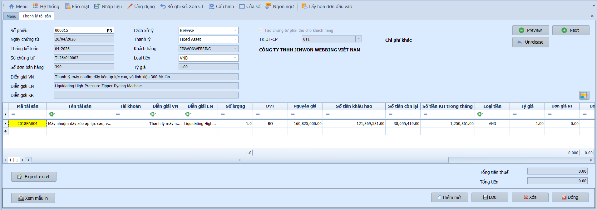

# 5.2 Phân mục nhập liệu

### Ghi tăng TSCĐ

**Nghiệp vụ áp dụng:** Khi doanh nghiệp mua mới, được cấp, được tặng hoặc phát hiện thừa tài sản cố định cần ghi nhận vào sổ sách. Phiếu ghi tăng TSCĐ cập nhật danh mục tài sản và có thể đồng thời sinh chứng từ phải trả (AP) nếu mua từ nhà cung cấp.

> **Ví dụ:** Mã TS 2017FA15 — Máy nén khí 1 bộ-HĐ 0000381-Yujin, nguyên giá 251.923.600đ, nhóm tài sản 2112 (Máy móc thiết bị), ĐVT: Bộ, số lượng 2, số tháng khấu hao 72 tháng. TK nguyên giá 2112 / TK khấu hao 21412 / TK chi phí KH 6274.

Để lập phiếu ghi tăng tài sản cố định, người dùng thực hiện như sau:

1. Nhấn **Thêm mới** hoặc nhấn **F3** để chọn phiếu cũ.
2. Nhập thông tin chung: Số phiếu, Ngày chứng từ, Kỳ kế toán.
3. Tại lưới chi tiết, nhập **Mã TSCĐ**, **Số lượng**, **Đơn giá** và **Thuế**.
4. Nhấn **Lưu** — chứng từ ở trạng thái **Chưa ghi sổ**.
5. Chuyển **Ghi sổ** để cập nhật danh mục TSCĐ vào hệ thống.

- **Thông tin chung:**
  - Số phiếu / Ngày chứng từ / Kỳ kế toán: Hệ thống tự động sinh theo quy tắc cấu hình.
  - Cách xử lý: Chọn trạng thái Chưa ghi sổ để giữ lại kiểm tra hoặc Ghi sổ để cập nhật ngay.

- **Lưới chi tiết:**
  - Mã TSCĐ: Chọn tài sản từ danh mục đã khai báo — hệ thống tự động hiển thị tên, tài khoản.
  - Số lượng / Đơn giá / Thuế: Nhập giá trị ghi tăng và thuế GTGT (nếu có).

- **Tab Phân bổ chi phí mua:**
  - Dùng để phân bổ các chi phí liên quan đến việc mua TSCĐ (vận chuyển, lắp đặt, chạy thử) vào nguyên giá tài sản.

- **Các nút chức năng:**
  - Tạo công nợ (AP): Tích chọn để đồng thời sinh chứng từ phải trả sang phân hệ AP.
  - Lưu / Sao chép / Thêm mới / Xóa / Đóng: Các thao tác tiêu chuẩn.

- **Lưu ý khi thao tác:**
  - Khi chuyển **Ghi sổ**, hệ thống cập nhật danh mục TSCĐ và không thể sửa phiếu — nếu sai phải lập phiếu điều chỉnh.
  - Chi phí mua TSCĐ (vận chuyển, lắp đặt) cần phân bổ tại tab "Phân bổ chi phí mua" để tính đúng nguyên giá theo TT200.
  - Nếu tích "Tạo công nợ (AP)", cần đảm bảo NCC đã được khai báo trong danh mục.

> **Lưu ý:** Phiếu ghi tăng TSCĐ ảnh hưởng đến cả phân hệ FA (danh mục tài sản) và AP (công nợ phải trả). Sau khi ghi sổ, tài sản sẽ xuất hiện trong bảng tính khấu hao hàng tháng.

---

### Đánh giá lại TSCĐ

**Nghiệp vụ áp dụng:** Khi cần điều chỉnh nguyên giá hoặc giá trị còn lại của tài sản cố định / CCDC theo quyết định đánh giá lại (do thay đổi giá thị trường, nâng cấp, hoặc theo yêu cầu của cơ quan nhà nước).

> **Ví dụ:** Đánh giá lại máy móc do nâng cấp — tăng nguyên giá thêm 10.000.000đ, Nợ TK 211 / Có TK 412 (Chênh lệch đánh giá lại tài sản).

Để lập phiếu đánh giá lại TSCĐ, người dùng thực hiện như sau:

1. Nhấn **Thêm mới** để tạo phiếu đánh giá lại.
2. Chọn **Loại đối tượng**: TSCĐ hoặc CCDC/chi phí trả trước.
3. Chọn mã tài sản cần đánh giá lại từ danh mục.
4. Nhập giá trị điều chỉnh (tăng/giảm nguyên giá hoặc giá trị còn lại).
5. Nhấn **Lưu** — chứng từ ở trạng thái **Chưa ghi sổ**.
6. Chuyển **Ghi sổ** để cập nhật giá trị TSCĐ và ghi bút toán chênh lệch.

- **Thông tin chung:**
  - Loại đối tượng: Chọn **TSCĐ** hoặc **CCDC/chi phí trả trước** tùy theo đối tượng cần đánh giá lại.

- **Lưu ý khi thao tác:**
  - Khi ghi sổ, hệ thống đồng thời cập nhật giá trị TSCĐ trong danh mục và ghi bút toán chênh lệch đánh giá lại vào sổ kế toán.
  - Đánh giá lại TSCĐ phải có quyết định của cấp có thẩm quyền hoặc biên bản kiểm kê đánh giá lại.

> **Lưu ý:** Chênh lệch đánh giá lại TSCĐ được ghi nhận vào TK 412 (Chênh lệch đánh giá lại tài sản) theo TT200.

---

### Thanh lý TSCĐ / CCDC

**Nghiệp vụ áp dụng:** Khi tài sản cố định hoặc CCDC được thanh lý, nhượng bán hoặc loại bỏ khỏi sổ sách do hết thời gian sử dụng, hư hỏng không sửa chữa được, hoặc không còn nhu cầu sử dụng. Hệ thống tự động tính giá trị còn lại và ghi nhận lãi/lỗ thanh lý.

> **Ví dụ:** Thanh lý máy in cũ — nguyên giá 15.000.000đ, khấu hao lũy kế 12.000.000đ, giá trị còn lại 3.000.000đ. Bán thanh lý được 2.000.000đ → Lỗ thanh lý 1.000.000đ.

Để lập phiếu ghi giảm tài sản do thanh lý hoặc nhượng bán, người dùng thực hiện như sau:

1. Nhấn **Thêm mới** để tạo phiếu thanh lý.
2. Nhập **Số phiếu**, **Ngày chứng từ**, **Kỳ kế toán**.
3. Chọn **Cách xử lý**, **Loại tài sản**, **Loại tiền / Tỷ giá**.
4. Nhập **Khách hàng** (nếu nhượng bán), **TK Doanh thu - Chi phí** và **Diễn giải**.
5. Tại lưới chi tiết, chọn **Mã tài sản** — hệ thống tự động hiển thị thông tin tài sản.
6. Nhấn **Lưu** để hoàn tất.

- **Thông tin chung:**
  - Số phiếu / Ngày chứng từ / Kỳ kế toán / Số chứng từ: Hệ thống tự động sinh theo quy tắc cấu hình.
  - Cách xử lý: Chọn trạng thái Chưa ghi sổ hoặc Ghi sổ.
  - Loại tài sản: Chọn TSCĐ hoặc CCDC.
  - Loại tiền / Tỷ giá: Mặc định VND, tỷ giá 1.00.
  - Khách hàng: Chọn khách hàng nếu nhượng bán tài sản.
  - TK DT-CP: Tài khoản doanh thu – chi phí thanh lý (VD: TK 711 – Thu nhập khác, TK 811 – Chi phí khác).
  - Diễn giải (VN/EN): Mô tả lý do thanh lý.

- **Lưới chi tiết:**
  - Mã tài sản: Chọn tài sản cần thanh lý — hệ thống tự động hiển thị: tên tài sản, tài khoản, số lượng, nguyên giá, khấu hao lũy kế, giá trị còn lại và số tiền khấu hao trong tháng.

- **Các nút chức năng:**
  - Xem mẫu in / Xuất Excel: Xem trước hoặc xuất dữ liệu ra file Excel.
  - Thêm mới / Lưu / Xóa / Đóng: Các thao tác tiêu chuẩn.

- **Lưu ý khi thao tác:**
  - Tài sản đã thanh lý sẽ bị loại khỏi bảng tính khấu hao kể từ tháng kế toán của phiếu thanh lý.
  - Chênh lệch giữa thu nhập thanh lý và giá trị còn lại được ghi nhận vào TK 711 (lãi) hoặc TK 811 (lỗ).
  - Cần lập biên bản thanh lý TSCĐ trước khi ghi nhận trên phần mềm.

> **Lưu ý:** Phiếu thanh lý ảnh hưởng đến danh mục TSCĐ (ghi giảm), sổ kế toán (bút toán thanh lý), và báo cáo TSCĐ. Đảm bảo kỳ kế toán chưa đóng trước khi thực hiện.
