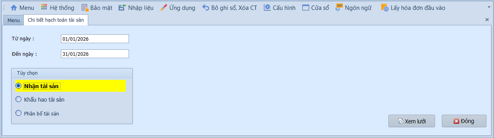

# 5.4 Phân mục thông tin tài sản cố định

### Chi tiết hạch toán tài sản

**Nghiệp vụ áp dụng:** Khi cần tra cứu chi tiết các bút toán liên quan đến tài sản cố định trong một khoảng thời gian: ghi tăng, khấu hao, đánh giá lại, thanh lý. Báo cáo này giúp kế toán kiểm tra đối chiếu số liệu TSCĐ với sổ cái và xác nhận các nghiệp vụ đã phát sinh.

> **Ví dụ:** Xem chi tiết hạch toán khấu hao tháng 06/2026 để đối chiếu số dư TK 214 trên sổ cái tổng hợp.

Để xem báo cáo chi tiết hạch toán tài sản, người dùng thực hiện như sau:

1. Nhập khoảng thời gian vào ô **Từ ngày / Đến ngày**.
2. Chọn loại báo cáo cần xem: **Nhận tài sản**, **Khấu hao tài sản** hoặc **Phân bổ tài sản**.
3. Nhấn **Xem lưới** để hiển thị báo cáo.

- **Các loại báo cáo:**
  - Nhận tài sản: Liệt kê các phiếu ghi tăng TSCĐ trong kỳ — số tiền, tài khoản Nợ/Có, mã tài sản.
  - Khấu hao tài sản: Liệt kê bút toán khấu hao đã trích trong kỳ — chi phí khấu hao, khấu hao lũy kế.
  - Phân bổ tài sản: Liệt kê bút toán phân bổ chi phí trả trước (CCDC) đã trích trong kỳ.

- **Lưu ý khi thao tác:**
  - Có thể xuất dữ liệu ra Excel để đối chiếu với sổ cái hoặc báo cáo tài chính.
  - Dữ liệu chỉ hiển thị các bút toán đã ghi sổ — chứng từ Chưa ghi sổ không xuất hiện.

> **Lưu ý:** Sử dụng báo cáo này để đối chiếu với sổ cái tài khoản 211, 214, 242 nhằm đảm bảo tính chính xác của số liệu TSCĐ.
