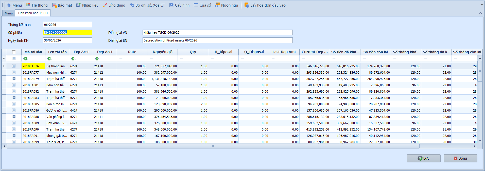
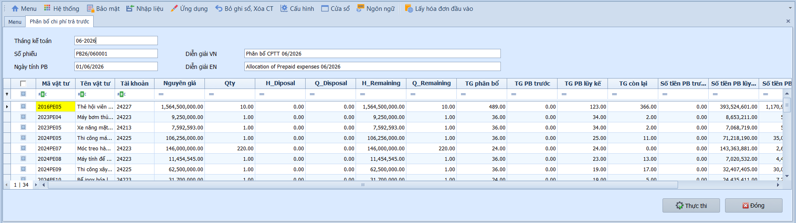

# 5.3 Phân mục xử lý

### Tính khấu hao TSCĐ

**Nghiệp vụ áp dụng:** Cuối mỗi tháng, kế toán cần trích khấu hao cho toàn bộ tài sản cố định đang sử dụng. Hệ thống tự động tính số tiền khấu hao theo phương pháp đường thẳng dựa trên nguyên giá và số tháng khấu hao đã khai báo, sau đó ghi bút toán khấu hao vào sổ kế toán.

> **Ví dụ:** Trích khấu hao tháng 06/2026 cho toàn bộ TSCĐ — Nợ TK 642/627 (Chi phí quản lý/sản xuất) / Có TK 214 (Khấu hao lũy kế). Ví dụ: Máy photocopy nguyên giá 45.000.000đ, khấu hao 60 tháng → mỗi tháng trích 750.000đ.

Để thực hiện tính khấu hao TSCĐ hàng tháng, người dùng thực hiện như sau:

1. Nhập **Tháng kế toán** cần tính khấu hao — hệ thống tự động tải danh sách toàn bộ tài sản lên lưới.
2. Kiểm tra danh sách tài sản và số tiền khấu hao trên lưới.
3. Tích chọn các tài sản cần trích khấu hao (hoặc chọn tất cả).
4. Nhấn **Thực hiện** để ghi nhận bút toán khấu hao vào sổ kế toán.

- **Lưu ý khi thao tác:**
  - Chỉ những TSCĐ đang trong thời gian khấu hao (chưa hết thời hạn, chưa thanh lý) mới xuất hiện trên lưới.
  - Nếu tháng đã được tính khấu hao trước đó, hệ thống sẽ cảnh báo — cần kiểm tra trước khi tính lại.
  - Bút toán khấu hao được ghi theo tài khoản đã khai báo tại danh mục TSCĐ.

> **Lưu ý:** Việc tính khấu hao nên thực hiện sau khi đã hoàn tất các phiếu ghi tăng/thanh lý TSCĐ trong tháng để đảm bảo số liệu chính xác.

---

### Phân bổ chi phí trả trước

**Nghiệp vụ áp dụng:** Cuối mỗi tháng, kế toán cần trích phân bổ các khoản chi phí trả trước (CCDC, bảo hiểm trả trước, tiền thuê trả trước...) vào chi phí trong kỳ. Hệ thống tự động tính số tiền phân bổ theo phương pháp đường thẳng dựa trên nguyên giá và số tháng phân bổ đã khai báo.

> **Ví dụ:** Phân bổ chi phí bảo hiểm trả trước tháng 06/2026 — Nợ TK 642 (Chi phí quản lý) / Có TK 242 (Chi phí trả trước). Ví dụ: Bảo hiểm 12.000.000đ phân bổ 12 tháng → mỗi tháng trích 1.000.000đ.

Để thực hiện phân bổ chi phí trả trước hàng tháng, người dùng thực hiện như sau:

1. Nhập **Tháng kế toán** cần phân bổ — hệ thống tự động tải danh sách toàn bộ chi phí lên lưới.
2. Kiểm tra danh sách chi phí và số tiền phân bổ trên lưới.
3. Tích chọn các khoản chi phí cần phân bổ (hoặc chọn tất cả).
4. Nhấn **Thực hiện** để ghi nhận bút toán phân bổ vào sổ kế toán.

- **Lưu ý khi thao tác:**
  - Chỉ những khoản chi phí đang trong thời gian phân bổ (chưa hết thời hạn) mới xuất hiện trên lưới.
  - Tháng cuối cùng phân bổ, hệ thống sẽ tính phần còn lại để đảm bảo tổng phân bổ bằng nguyên giá.
  - Nên thực hiện sau khi đã khai báo đầy đủ chi phí phân bổ mới trong tháng.

> **Lưu ý:** Chi phí trả trước (TK 242) và khấu hao TSCĐ (TK 214) là hai quy trình xử lý cuối tháng quan trọng — nên thực hiện cả hai trước khi chạy báo cáo tài chính.
