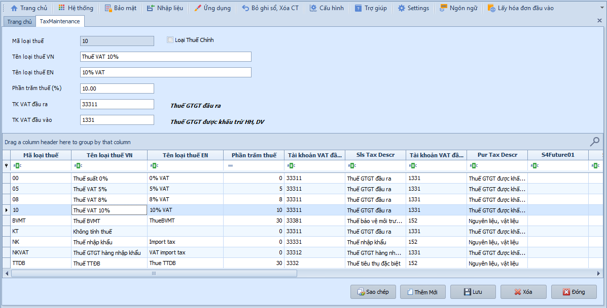
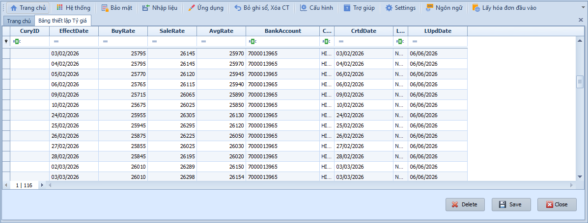
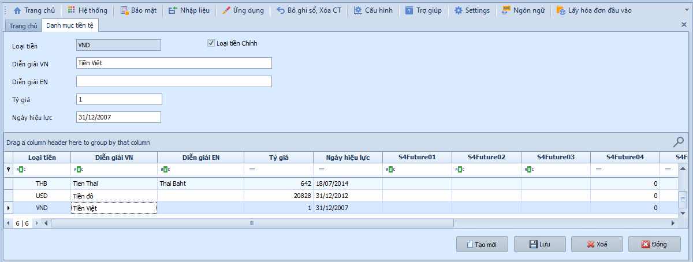
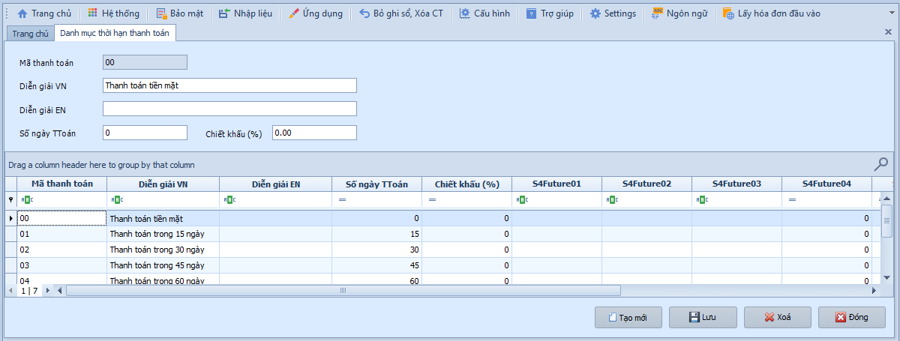
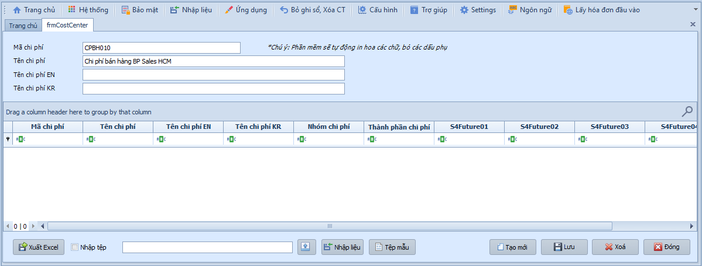
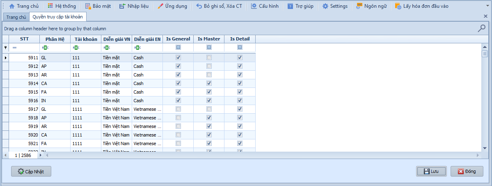
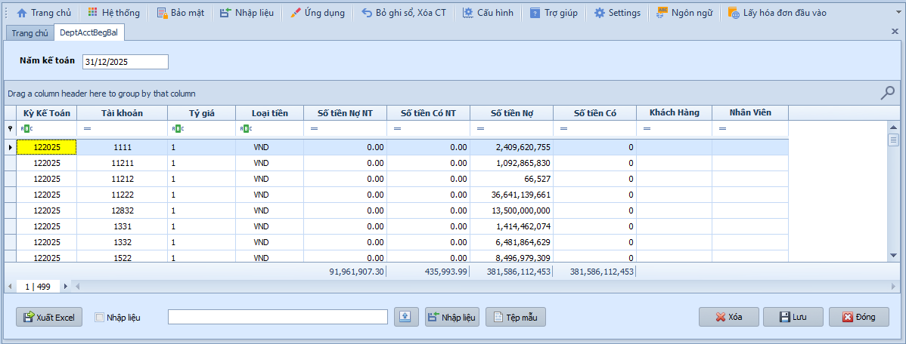

# 11.1 Cài đặt

### Danh mục thuế suất

Khi cần khai báo các loại thuế VAT áp dụng trong doanh nghiệp, bao gồm mức thuế suất và tài khoản hạch toán thuế mua vào – bán ra. Hệ thống sẽ tự động lấy thông tin này khi lập chứng từ có liên quan đến thuế GTGT.

> **Ví dụ:** Mã "10" — Thuế VAT 10%, TK đầu ra 33311 (Thuế GTGT đầu ra), TK đầu vào 1331 (Thuế GTGT được khấu trừ HH, DV). Ngoài ra hệ thống hỗ trợ các mã: 00 (0%), 05 (5%), 08 (8%), BVMT (Thuế BVMT 30%), NK (Thuế nhập khẩu), NKVAT (Thuế GTGT hàng NK), TTDB (Thuế tiêu thụ đặc biệt).

Để khai báo danh mục thuế suất, người dùng thực hiện:

1. Nhấn **Thêm mới** để tạo loại thuế.
2. Nhập **Mã** và **Tên loại thuế**.
3. Nhập **Phần trăm thuế suất**.
4. Chọn **TK thuế VAT đầu ra** và **TK thuế VAT đầu vào**.
5. Nhấn **Lưu** để hoàn tất.

---

### Bảng thiết lập tỷ giá

Khi doanh nghiệp có giao dịch ngoại tệ, cần khai báo tỷ giá theo từng ngày. Hệ thống sẽ tự động lấy tỷ giá tương ứng với ngày phát sinh của chứng từ để áp dụng vào nghiệp vụ.

> **Ví dụ:** Khai báo tỷ giá USD ngày 01/06/2026 — Tỷ giá mua: 25.450, Tỷ giá bán: 25.520, Tỷ giá bình quân: 25.485.

Để tạo mới tỷ giá, người dùng thực hiện như sau:

1. Nhập **Ngày hiệu lực** của tỷ giá.
2. Nhập **Tỷ giá mua**, **Tỷ giá bán**, **Tỷ giá bình quân**.
3. Nhấn **Lưu** để hoàn tất.

- **Lưu ý khi thao tác:**
  - Tỷ giá phải được cập nhật thường xuyên, đặc biệt vào các ngày phát sinh giao dịch ngoại tệ.
  - Hệ thống lấy tỷ giá gần nhất với ngày chứng từ nếu ngày đó chưa có tỷ giá.

---

### Danh mục tiền tệ

Khi cần khai báo các loại tiền tệ sử dụng trong doanh nghiệp (VND, USD, EUR, JPY...), làm cơ sở cho việc hạch toán các nghiệp vụ có liên quan đến ngoại tệ.

Để tạo danh mục tiền tệ, người dùng thực hiện như sau:

1. Nhập **Loại tiền** và **Diễn giải**.
2. Tích chọn nếu đó là **đồng tiền chính** của doanh nghiệp (thường là VND).
3. Nhấn **Lưu** để hoàn tất.

---

### Danh mục thời hạn thanh toán

Khi cần khai báo các kỳ hạn thanh toán áp dụng cho giao dịch với khách hàng và nhà cung cấp, làm cơ sở theo dõi và nhắc nhở công nợ đến hạn.

> **Ví dụ:** Khai báo "NET 30" — Thanh toán trong vòng 30 ngày, chiết khấu 0%.

Để tạo danh mục thời hạn thanh toán, người dùng thực hiện như sau:

1. Nhập **Mã** và **Diễn giải** thanh toán.
2. Nhập **Số ngày thanh toán** và tỷ lệ **Chiết khấu** (nếu có).
3. Nhấn **Lưu** để hoàn tất.

---

### Mã chi phí / Mã vụ việc / Mã lợi nhuận

Khi cần khai báo các mã phân bổ chi phí phục vụ cho việc theo dõi chi phí theo trung tâm chi phí (Cost Center), dự án (Job/Project) hoặc trung tâm lợi nhuận (Profit Center). Các mã này được sử dụng xuyên suốt trong các phân hệ khi hạch toán.

Để tạo mã chi phí / vụ việc / lợi nhuận, người dùng thực hiện như sau:

1. Nhập **Mã** và **Tên** chi phí / vụ việc / lợi nhuận.
2. Nhấn **Lưu** để hoàn tất.

- **Các nút chức năng:**
  - Xuất Excel / Nhập liệu: Xuất dữ liệu ra file Excel hoặc nhập dữ liệu từ file ngoài.
  - Lưu / Sao chép / Thêm mới / Xóa / Đóng: Các thao tác tiêu chuẩn.

---

### Quyền truy cập tài khoản

Khi cần phân quyền hạch toán cho từng tài khoản kế toán: xác định tài khoản nào được phép hạch toán chi tiết, tài khoản nào chỉ dùng để tổng hợp, và tài khoản áp dụng cho phân hệ nào.

Để phân quyền truy cập tài khoản, người dùng thực hiện như sau:

1. Nhấn **Cập nhật** để chuyển sang chế độ chỉnh sửa.
2. Tích chọn quyền truy cập phân hệ cho từng tài khoản.
3. Nhấn **Lưu** để hoàn tất.

- **Lưu ý khi thao tác:**
  - Tài khoản mẹ (tài khoản tổng hợp) không nên được phép hạch toán trực tiếp — chỉ dùng để tổng hợp số liệu.
  - Phân quyền đúng phân hệ giúp tránh sai sót khi hạch toán (VD: TK 111 chỉ dùng ở phân hệ CA, TK 131 chỉ dùng ở AR).

---

### Số dư đầu kỳ

Khi bắt đầu sử dụng phần mềm hoặc chuyển đổi từ hệ thống cũ, cần khai báo số dư đầu kỳ của các tài khoản kế toán tính đến ngày 31/12 năm trước. Đây là bước bắt buộc để hệ thống có số liệu gốc cho các báo cáo và đối chiếu.

> **Lưu ý:** Có thể nhập liệu trực tiếp trên hệ thống hoặc nhập dữ liệu từ file Excel. Số dư đầu kỳ phải khớp với bảng cân đối kế toán cuối năm trước.
