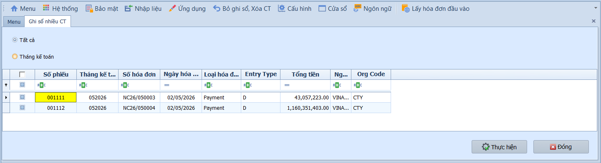
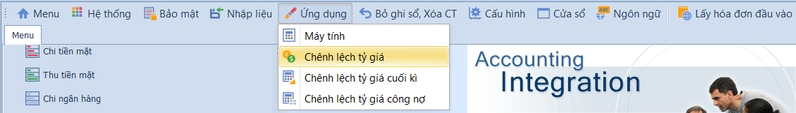
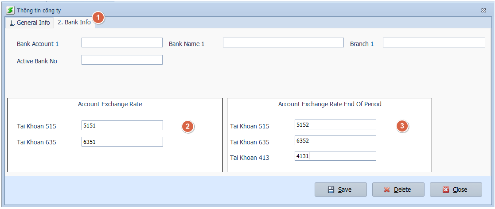
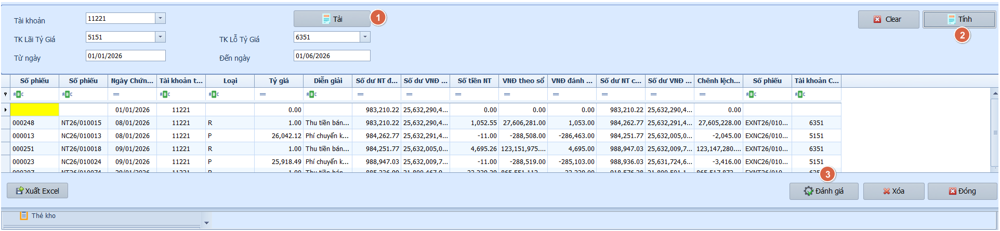
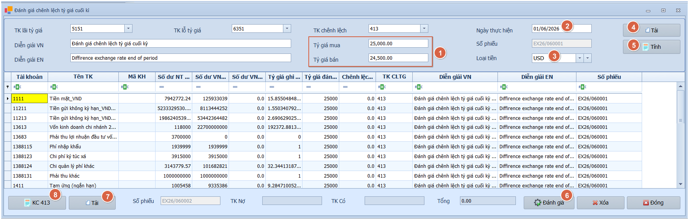
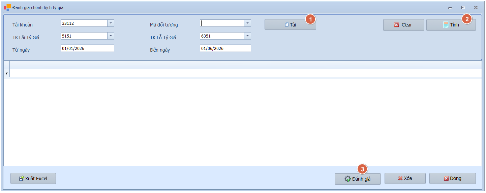

# 4.3 Xử lý chứng từ

### Ghi sổ nhiều chứng từ

**Nghiệp vụ áp dụng:** Khi cần ghi sổ hoặc bỏ ghi sổ hàng loạt các phiếu thu/chi trong kỳ — thay vì phải mở từng phiếu để xử lý riêng lẻ.

> **Ví dụ:** Cuối ngày, kế toán trưởng ghi sổ hàng loạt tất cả phiếu chi/thu tiền mặt tháng 01/2026 đang ở trạng thái Chưa ghi sổ.

Để xử lý hàng loạt chứng từ, người dùng thực hiện như sau:

1. Chọn phạm vi hiển thị: **Tất cả** để lấy toàn bộ chứng từ, hoặc **Tháng kế toán** để lọc theo tháng cụ thể.
2. Tích chọn từng chứng từ cần xử lý, hoặc tích ô đầu cột để chọn tất cả.
3. Nhấn **Thực hiện** để chạy xử lý hàng loạt, sau đó nhấn **Đóng** để thoát.

- **Ô chọn và bộ lọc:**
  - Tất cả: Hiển thị phiếu thu/chi theo phạm vi hệ thống cho phép.
  - Tháng kế toán: Chỉ hiển thị phiếu thuộc kỳ được chọn.
  - Ô chọn từng dòng: Chọn phiếu cần ghi sổ hoặc hủy ghi sổ.
  - Ô chọn đầu cột: Chọn nhanh toàn bộ phiếu đang hiển thị.

- **Các nút chức năng:**
  - Xem lưới/Tải dữ liệu: Lấy danh sách phiếu theo điều kiện lọc.
  - Thực hiện: Xử lý các phiếu đã chọn.
  - Đóng: Thoát khỏi màn hình.

- **Lưu ý khi thao tác:**
  - Chỉ ghi sổ sau khi đã kiểm tra tài khoản tiền, tài khoản đối ứng, đối tượng công nợ và tổng tiền.
  - Với phiếu liên quan AR/AP, cần chắc chắn chứng từ gốc đã đối chiếu đúng.
  - Chứng từ thuộc kỳ đã khóa hoặc thiếu dữ liệu bắt buộc có thể không ghi sổ được.

> **Hệ thống tự kiểm tra khi xử lý:** Phiếu phải hợp lệ, kỳ kế toán còn mở và người dùng phải có quyền ghi sổ/bỏ ghi sổ.

---

### Đánh giá chênh lệch tỷ giá

**Nghiệp vụ áp dụng:** Khi doanh nghiệp có giao dịch bằng ngoại tệ (USD, EUR, KRW…) và cần xử lý chênh lệch tỷ giá theo các thời điểm khác nhau — phục vụ hạch toán đúng theo chuẩn mực kế toán Việt Nam.

> **Ví dụ:** Cuối tháng 01/2026, tỷ giá USD/VND thay đổi từ 24.500 lên 24.800 — cần đánh giá lại số dư TK 112 (USD) và ghi nhận chênh lệch tỷ giá vào TK 413 hoặc TK 515/635.

Trước khi đánh giá, cần thiết lập tài khoản đánh giá chênh lệch tỷ giá:

- **Tài khoản tỷ giá phát sinh hàng ngày:** Tài khoản ghi nhận chênh lệch tỷ giá phát sinh trong kỳ (thường dùng TK 515 — Lãi tỷ giá, TK 635 — Lỗ tỷ giá).
- **Tài khoản đánh giá lại cuối kỳ:** Tài khoản ghi nhận chênh lệch đánh giá lại cuối tháng/cuối năm (thường dùng TK 413 — Chênh lệch tỷ giá hối đoái).

#### Chênh lệch tỷ giá phát sinh

Khi cần tính chênh lệch tỷ giá phát sinh hàng ngày cho các giao dịch tiền mặt/ngân hàng ngoại tệ.

Nhấn **Nạp dữ liệu** để tải danh sách giao dịch ngoại tệ, tích chọn dòng cần xử lý → nhấn **Thực hiện** để ghi bút toán chênh lệch tỷ giá vào sổ.

> **Lưu ý:** Hệ thống tự động xóa kết quả đánh giá cũ trước khi ghi lại.

#### Chênh lệch tỷ giá theo tài khoản

Khi cần đánh giá chênh lệch tỷ giá theo khoảng ngày và theo từng tài khoản tiền cụ thể (VD: TK 1121 — USD, TK 1122 — EUR).

Nhập khoảng ngày và chọn tài khoản, nhấn **Nạp dữ liệu** để tải danh sách, rồi nhấn **Thực hiện** để cập nhật chênh lệch vào sổ tiền và ghi sổ Sổ Cái.

#### Chênh lệch tỷ giá cuối kỳ

Cuối tháng hoặc cuối năm, khi cần đánh giá lại toàn bộ số dư ngoại tệ theo tỷ giá tại thời điểm báo cáo — theo quy định chuẩn mực kế toán.

Nhấn **Nạp dữ liệu** để tải danh sách, nhấn **Thực hiện** để ghi sổ; hệ thống tự sinh số chứng từ.

#### Chênh lệch tỷ giá công nợ

Khi cần đánh giá lại chênh lệch tỷ giá cho các khoản công nợ phải thu/phải trả bằng ngoại tệ theo từng đối tượng (KH/NCC).

Nhấn **Nạp dữ liệu** để tải danh sách, nhấn **Thực hiện** để ghi sổ chênh lệch theo từng đối tượng.

- **Các nút chức năng chung cho đánh giá tỷ giá:**
  - Nạp dữ liệu: Tải danh sách giao dịch hoặc số dư ngoại tệ cần đánh giá.
  - Ô chọn từng dòng: Chọn giao dịch/số dư cần xử lý.
  - Thực hiện: Ghi nhận bút toán chênh lệch tỷ giá.
  - Xuất Excel: Xuất danh sách trước/sau xử lý để đối chiếu nếu màn hình hỗ trợ.
  - Đóng: Thoát khỏi màn hình.

- **Lưu ý khi thao tác:**
  - Cần thiết lập đúng tài khoản lãi/lỗ tỷ giá trước khi chạy.
  - Nên chạy thử/xem danh sách trước, đối chiếu tỷ giá cuối kỳ rồi mới nhấn **Thực hiện**.
  - Nếu chạy lại cùng kỳ, kiểm tra kết quả cũ đã được xóa hoặc điều chỉnh đúng theo cảnh báo hệ thống.

> **Hệ thống tự kiểm tra khi xử lý:** Chỉ các giao dịch ngoại tệ hợp lệ mới được đưa vào danh sách. Nếu thiếu tài khoản chênh lệch tỷ giá hoặc kỳ đã khóa, hệ thống có thể không cho ghi bút toán.
