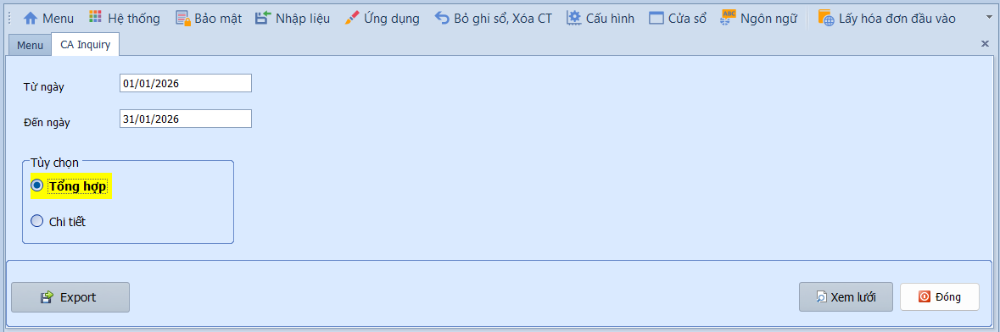

# 4.4 Chi tiết hạch toán tiền mặt

### Chi tiết hạch toán tiền mặt

**Nghiệp vụ áp dụng:** Khi cần tổng hợp hoặc kiểm tra chi tiết các bút toán hạch toán liên quan đến tiền mặt và tiền gửi ngân hàng trong kỳ — phục vụ đối chiếu sổ quỹ, kiểm tra số dư tiền.

> **Ví dụ:** Kiểm tra chi tiết phát sinh TK 111 (Tiền mặt) tháng 01/2026 để đối chiếu với biên bản kiểm kê quỹ cuối tháng.

Để xem báo cáo, người dùng thực hiện như sau:

1. Nhập khoảng thời gian vào ô **Từ ngày / Đến ngày**.
2. Chọn **Tổng hợp** để xem số dư và tổng phát sinh, hoặc **Chi tiết** để xem từng chứng từ phát sinh.
3. Nhấn **Xem lưới** để hiển thị báo cáo.

