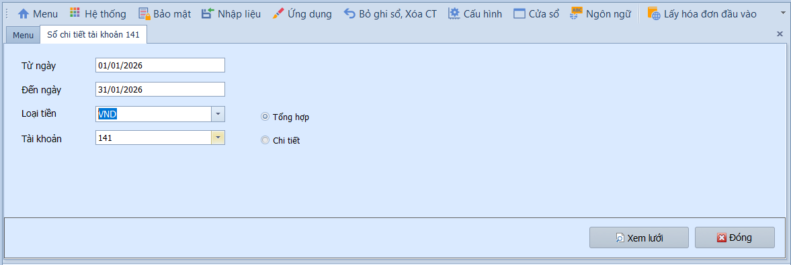
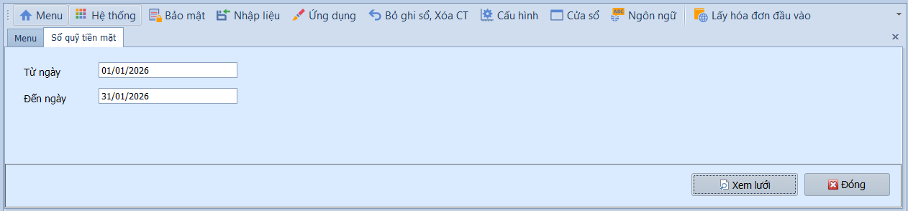
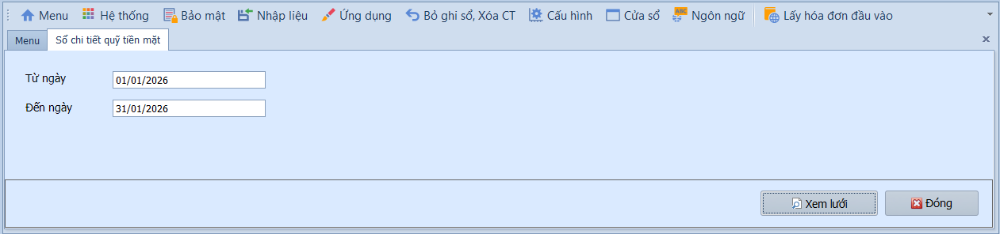
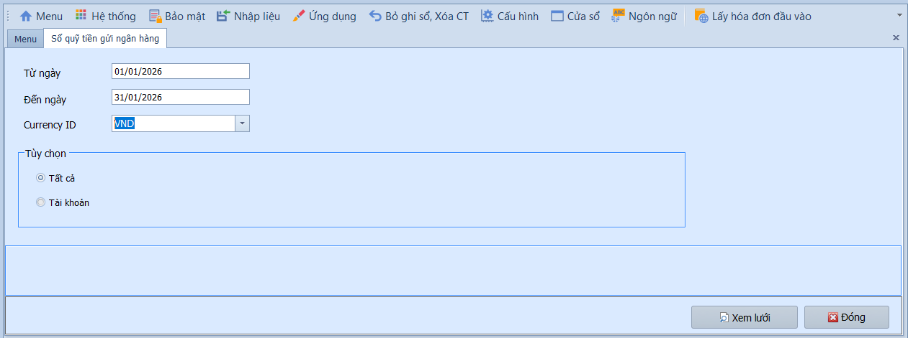
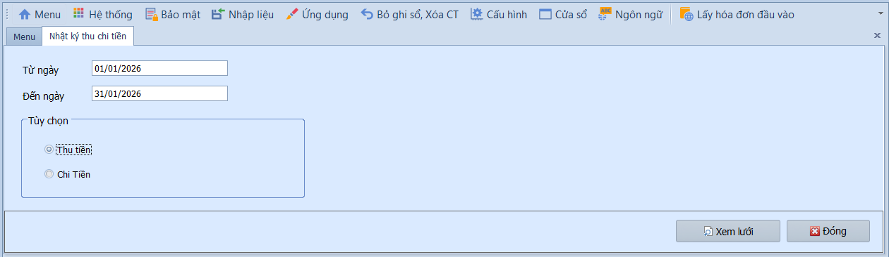
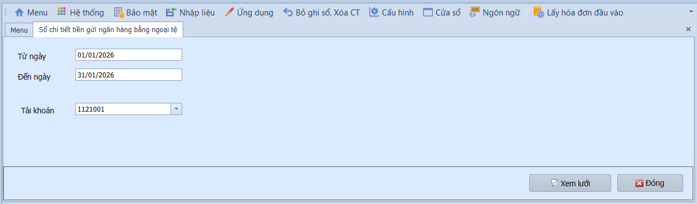
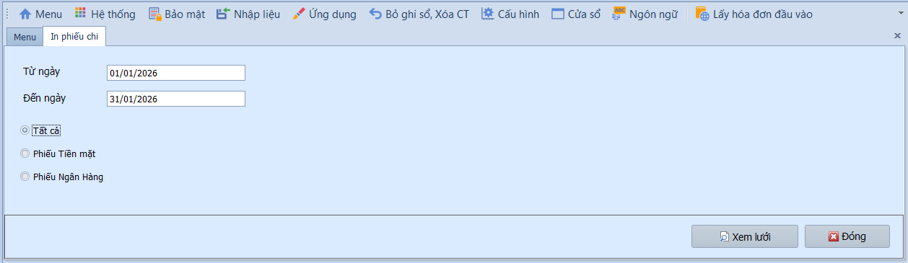
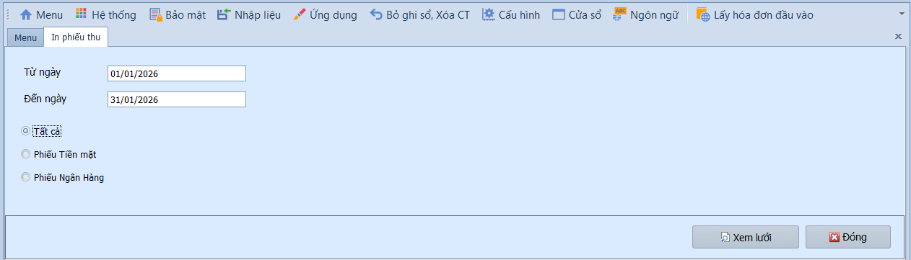

# 4.5 Phân mục báo cáo

### Nút và tùy chọn chung trên báo cáo tiền

**Nghiệp vụ áp dụng:** Các báo cáo tiền dùng để đối chiếu quỹ tiền mặt, tiền gửi ngân hàng, tạm ứng nhân viên và nhật ký thu chi. Người dùng cần chọn đúng kỳ, loại tiền, tài khoản tiền và loại báo cáo trước khi in/xuất.

- **Điều kiện lọc thường gặp:**
  - Từ ngày / Đến ngày: Khoảng thời gian lấy số liệu.
  - Loại tiền: Chọn VND hoặc ngoại tệ.
  - Tài khoản: Chọn tài khoản tiền mặt, tiền gửi hoặc tài khoản tạm ứng cần theo dõi.
  - Tất cả / Chi tiết / Theo từng tài khoản: Chọn mức độ tổng hợp hoặc lọc cụ thể.

- **Các nút chức năng:**
  - Xem lưới: Tải dữ liệu báo cáo theo điều kiện lọc.
  - In: In sổ quỹ, sổ ngân hàng hoặc phiếu thu/chi.
  - Xuất Excel: Xuất dữ liệu để đối chiếu với thủ quỹ/ngân hàng.
  - Đóng: Thoát khỏi màn hình báo cáo.

- **Lưu ý khi thao tác:**
  - Sổ quỹ tiền mặt cần đối chiếu với tồn quỹ thực tế và phiếu thu/chi đã ký.
  - Sổ tiền gửi ngân hàng cần đối chiếu với sao kê ngân hàng theo từng tài khoản.
  - Nếu số liệu lệch, kiểm tra phiếu thu/chi còn Chưa ghi sổ hoặc kỳ chứng từ nhập sai.

> **Hệ thống tự kiểm tra khi xem báo cáo:** Khoảng ngày và tài khoản lọc phải hợp lệ. Báo cáo chỉ phản ánh đúng khi phiếu thu/chi đã ghi sổ.

---

### Sổ chi tiết tài khoản 141

**Nghiệp vụ áp dụng:** Khi cần theo dõi chi tiết các khoản tạm ứng của nhân viên (TK 141) — xem ai đang tạm ứng bao nhiêu, đã hoàn ứng chưa, số dư tạm ứng còn lại.

> **Ví dụ:** Kiểm tra tạm ứng nhân viên Nguyễn Văn A tháng 01/2026: tạm ứng 10.000.000đ, đã hoàn ứng 7.000.000đ → còn tạm ứng 3.000.000đ.

Để xem báo cáo, người dùng thực hiện như sau:

1. Nhập khoảng thời gian vào ô **Từ ngày / Đến ngày**, chọn **Loại tiền**.
2. Chọn **Tài khoản** cần xem, chọn **Tất cả** xem tổng hợp hoặc **Chi tiết** xem từng lần phát sinh.
3. Nhấn **Xem lưới** để hiển thị báo cáo.

---

### Sổ quỹ tiền mặt

**Nghiệp vụ áp dụng:** Khi cần xem tổng thu/chi tiền mặt hàng ngày và số dư tồn quỹ — đây là sổ sách bắt buộc, phục vụ đối chiếu với biên bản kiểm kê quỹ tiền mặt.

Để xem báo cáo, người dùng thực hiện như sau:

1. Nhập khoảng thời gian vào ô **Từ ngày / Đến ngày**.
2. Nhấn **Xem lưới** để hiển thị báo cáo.

---

### Sổ chi tiết quỹ tiền mặt

**Nghiệp vụ áp dụng:** Khi cần xem chi tiết từng phiếu thu/chi tiền mặt trong kỳ — phục vụ kiểm tra, đối chiếu và truy xuất nguồn gốc từng giao dịch tiền mặt.

Để xem báo cáo, người dùng thực hiện như sau:

1. Nhập khoảng thời gian vào ô **Từ ngày / Đến ngày**.
2. Nhấn **Xem lưới** để hiển thị báo cáo.

---

### Sổ quỹ tiền gửi ngân hàng

**Nghiệp vụ áp dụng:** Khi cần xem số dư và biến động tiền gửi tại từng tài khoản ngân hàng — phục vụ đối chiếu sao kê ngân hàng hàng tháng.

> **Ví dụ:** Đối chiếu số dư TK tiền gửi VND tại Vietcombank cuối tháng 01/2026 với sao kê ngân hàng.

Để xem báo cáo, người dùng thực hiện như sau:

1. Nhập khoảng thời gian vào ô **Từ ngày / Đến ngày** và chọn **Loại tiền** (mặc định VND).
2. Chọn xem **Tất cả** tài khoản hoặc lọc **Theo từng tài khoản** cụ thể.
3. Nhấn **Xem lưới** để hiển thị báo cáo.

---

### Nhật ký thu chi tiền

**Nghiệp vụ áp dụng:** Khi cần xem tổng hợp tất cả giao dịch thu tiền hoặc chi tiền trong kỳ — phục vụ quản trị dòng tiền và lập kế hoạch tài chính.

Để xem báo cáo, người dùng thực hiện như sau:

1. Nhập khoảng thời gian vào ô **Từ ngày / Đến ngày**.
2. Chọn loại báo cáo: **Thu tiền** hoặc **Chi tiền**.
3. Nhấn **Xem lưới** để hiển thị báo cáo.

---

### Sổ quỹ tiền gửi ngân hàng bằng ngoại tệ

**Nghiệp vụ áp dụng:** Khi doanh nghiệp có tài khoản ngân hàng ngoại tệ (USD, EUR…) và cần theo dõi biến động số dư theo nguyên tệ — phục vụ đối chiếu sao kê ngân hàng ngoại tệ.

Để xem báo cáo, người dùng thực hiện như sau:

1. Nhập khoảng thời gian vào ô **Từ ngày / Đến ngày**.
2. Lọc **Theo từng tài khoản** cụ thể.
3. Nhấn **Xem lưới** để hiển thị báo cáo.

---

### In phiếu chi

**Nghiệp vụ áp dụng:** Khi cần in phiếu chi tiền mặt hoặc tiền gửi ngân hàng theo khoảng thời gian — phục vụ lưu trữ hồ sơ kế toán, ký duyệt và đính kèm chứng từ gốc.

Để in phiếu chi, người dùng thực hiện như sau:

1. Nhập khoảng thời gian vào ô **Từ ngày / Đến ngày**.
2. Chọn **Tất cả** để xuất cả phiếu chi tiền mặt và tiền gửi ngân hàng, hoặc chọn chi tiết từng loại.
3. Nhấn **Xem lưới** để hiển thị báo cáo.

---

### In phiếu thu

**Nghiệp vụ áp dụng:** Khi cần in phiếu thu tiền mặt hoặc tiền gửi ngân hàng theo khoảng thời gian — phục vụ lưu trữ hồ sơ kế toán, ký duyệt và đính kèm chứng từ gốc.

Để in phiếu thu, người dùng thực hiện như sau:

1. Nhập khoảng thời gian vào ô **Từ ngày / Đến ngày**.
2. Chọn **Tất cả** để xuất cả phiếu thu tiền mặt và tiền gửi ngân hàng, hoặc chọn chi tiết từng loại.
3. Nhấn **Xem lưới** để hiển thị báo cáo.

