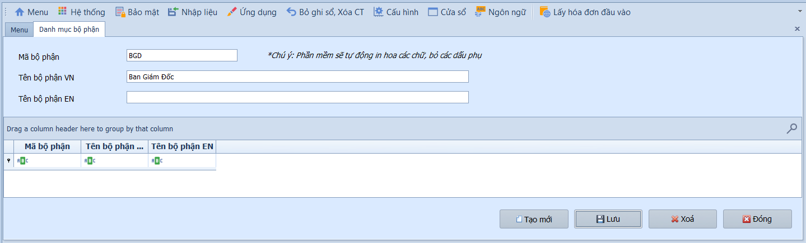
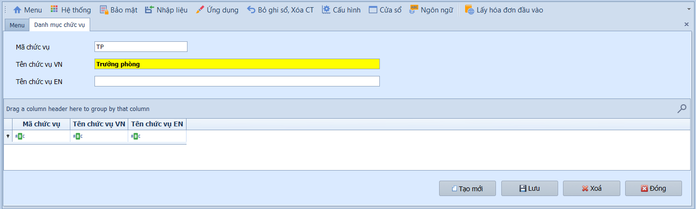
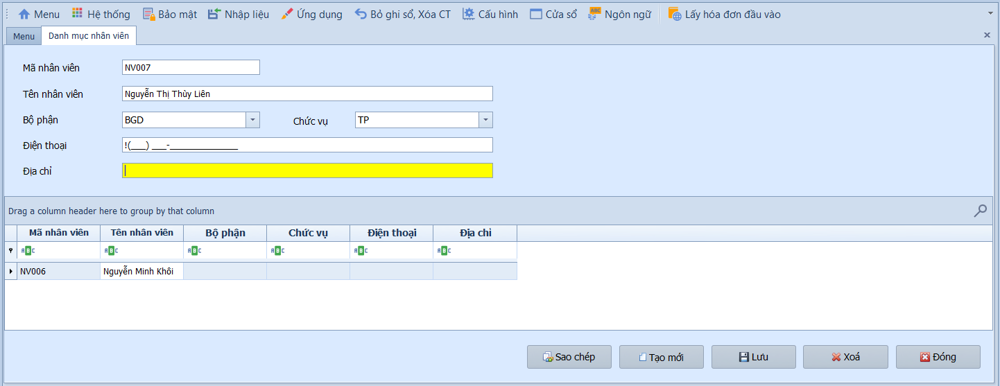

# 4.1 Phân mục cài đặt

### Danh mục bộ phận

**Nghiệp vụ áp dụng:** Khi cần khai báo và tổ chức cơ cấu sơ đồ tổ chức (phòng ban, phân xưởng, bộ phận) trong doanh nghiệp — phục vụ phân loại nhân viên, phân quyền và lập báo cáo theo bộ phận.

Để khai báo danh mục bộ phận, người dùng thực hiện:

1. Nhập mã và tên bộ phận.
2. Nhấn **Lưu** để hoàn tất.

---

### Danh mục chức vụ

**Nghiệp vụ áp dụng:** Khi cần khai báo danh sách các chức danh, chức vụ (Giám đốc, Trưởng phòng, Nhân viên…) áp dụng trong doanh nghiệp — phục vụ quản lý nhân sự, phân quyền hệ thống và ký duyệt chứng từ.

Để khai báo danh mục chức vụ, người dùng thực hiện:

1. Nhập mã và tên chức vụ.
2. Nhấn **Lưu** để hoàn tất.

---

### Danh mục nhân viên

**Nghiệp vụ áp dụng:** Khi cần khai báo và lưu trữ thông tin chi tiết của từng cán bộ, nhân viên — phục vụ theo dõi nhân sự, gán người nhận tiền trên phiếu chi/thu, và quản lý tạm ứng nhân viên (TK 141).

> **Ví dụ:** Khai báo nhân viên Nguyễn Văn A — Bộ phận Kế toán, Chức vụ Kế toán viên, để hệ thống liên kết khi lập phiếu tạm ứng (Nợ 141 / Có 111).

Để khai báo thông tin nhân viên, người dùng thực hiện như sau:

1. Nhập **Mã nhân viên**, **Tên nhân viên**, chọn **Bộ phận / Chức vụ** từ danh sách có sẵn.
2. Nhập **Điện thoại** và **Địa chỉ** liên hệ.
3. Nhấn **Lưu** để hoàn tất.
